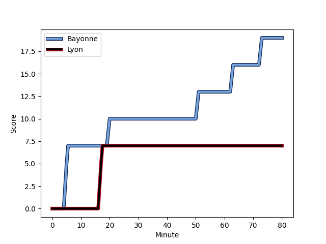
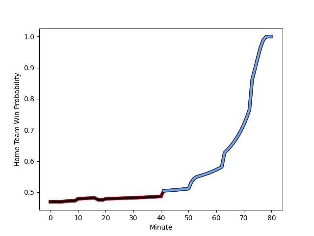

---  
layout: page  
title: Lyon at Bayonne; 7-19  
date: 2022-12-03 17:00:00 18:00:00 -0500  
categories: match review  
---
# Lyon (1552.21) at Bayonne (1498.32); 7-19

# Prediction: Lyon by 2.4

Lyon by 5.4 on a neutral field
## Scores over Time

## Win Probability over Time

# Pre-Match Prediction: Lyon by 6.8

Lyon by 9.8 on a neutral pitch

|   Away Minutes | Away Player                                                                |   Away elo |   Away Percentile |   Number |   Home Percentile |   Home elo | Home Player                                                                  |   Home Minutes |
|---------------:|:---------------------------------------------------------------------------|-----------:|------------------:|---------:|------------------:|-----------:|:-----------------------------------------------------------------------------|---------------:|
|             41 | [Hamza Kaabeche](..//playerfiles//HamzaKaabeche_cleaned.md)                |      93.92 |                41 |        1 |                75 |     101.5  | [Swan Cormenier](..//playerfiles//SwanCormenier_cleaned.md)                  |             65 |
|             41 | [Yanis Charcosset](..//playerfiles//YanisCharcosset_cleaned.md)            |      97.58 |                61 |        2 |                81 |     104.9  | [Facundo Bosch](..//playerfiles//FacundoBosch_cleaned.md)                    |             68 |
|             41 | [Francisco Gomez Kodela](..//playerfiles//FranciscoGomezKodela_cleaned.md) |     113.31 |                93 |        3 |                26 |      90.41 | [Pascal Cotet](..//playerfiles//PascalCotet_cleaned.md)                      |             46 |
|             41 | [Theo William](..//playerfiles//TheoWilliam_cleaned.md)                    |      96.73 |                55 |        4 |                89 |     112.1  | [Denis Marchois](..//playerfiles//DenisMarchois_cleaned.md)                  |             80 |
|             80 | [Romain Taofifenua](..//playerfiles//RomainTaofifenua_cleaned.md)          |     112.23 |                90 |        5 |                91 |     112.63 | [Thomas Ceyte](..//playerfiles//ThomasCeyte_cleaned.md)                      |             60 |
|             80 | [Dylan Cretin](..//playerfiles//DylanCretin_cleaned.md)                    |     104.46 |                75 |        6 |                27 |      90.61 | [Pierre Huguet](..//playerfiles//PierreHuguet_cleaned.md)                    |             60 |
|             53 | [Beka Saghinadze](..//playerfiles//BekaSaghinadze_cleaned.md)              |     109.46 |                87 |        7 |                71 |     102.02 | [Baptiste Heguy](..//playerfiles//BaptisteHeguy_cleaned.md)                  |             80 |
|             53 | [Arno Botha](..//playerfiles//ArnoBotha_cleaned.md)                        |     119.34 |                92 |        8 |                74 |     103.68 | [Uzair Cassiem](..//playerfiles//UzairCassiem_cleaned.md)                    |             80 |
|             77 | [Baptiste Couilloud](..//playerfiles//BaptisteCouilloud_cleaned.md)        |     124.98 |                97 |        9 |                50 |      95.41 | [Guillaume Rouet Piffard](..//playerfiles//GuillaumeRouetPiffard_cleaned.md) |             52 |
|             80 | [Leo Berdeu](..//playerfiles//LeoBerdeu_cleaned.md)                        |      92.44 |                34 |       10 |                97 |     128.04 | [Camille Lopez](..//playerfiles//CamilleLopez_cleaned.md)                    |             80 |
|             80 | [Ethan Dumortier](..//playerfiles//EthanDumortier_cleaned.md)              |     103.35 |                76 |       11 |                33 |      91.7  | [Remy Baget](..//playerfiles//RemyBaget_cleaned.md)                          |             80 |
|             80 | [Kyle Godwin](..//playerfiles//KyleGodwin_cleaned.md)                      |     114.51 |                90 |       12 |                40 |      92.84 | [Yann David](..//playerfiles//YannDavid_cleaned.md)                          |             53 |
|             80 | [Thibault Regard](..//playerfiles//ThibaultRegard_cleaned.md)              |     102.59 |                71 |       13 |                37 |      92.04 | [Sireli Maqala](..//playerfiles//SireliMaqala_cleaned.md)                    |             80 |
|             80 | [Xavier Mignot](..//playerfiles//XavierMignot_cleaned.md)                  |      95.26 |                48 |       14 |                 8 |      81.85 | [Jean-Teiva Jacquelin](..//playerfiles//Jean-TeivaJacquelin_cleaned.md)      |             80 |
|             10 | [Davit Niniashvili](..//playerfiles//DavitNiniashvili_cleaned.md)          |      98.94 |                62 |       15 |                68 |     100.39 | [Martin Bogado](..//playerfiles//MartinBogado_cleaned.md)                    |             80 |
|             70 | [Fletcher Smith](..//playerfiles//FletcherSmith_cleaned.md)                |      83.81 |                11 |       16 |                25 |      90.47 | [Pieter Scholtz](..//playerfiles//PieterScholtz_cleaned.md)                  |             34 |
|             39 | [Jerome Rey](..//playerfiles//JeromeRey_cleaned.md)                        |      59.88 |                 0 |       17 |                92 |     114.94 | [Michael Ruru](..//playerfiles//MichaelRuru_cleaned.md)                      |             28 |
|             39 | [Paulo Tafili](..//playerfiles//PauloTafili_cleaned.md)                    |      92.05 |                21 |       18 |                21 |      88.06 | [Eneriko Buliruarua](..//playerfiles//EnerikoBuliruarua_cleaned.md)          |             27 |
|             39 | [Liam Coltman](..//playerfiles//LiamColtman_cleaned.md)                    |     108.99 |                88 |       19 |                41 |      94.02 | [OJ Noa](..//playerfiles//OJNoa_cleaned.md)                                  |             20 |
|             39 | [Felix Lambey](..//playerfiles//FelixLambey_cleaned.md)                    |     121.98 |                96 |       20 |                 7 |      78.58 | [Kote Mikautadze](..//playerfiles//KoteMikautadze_cleaned.md)                |             20 |
|             27 | [Jordan Taufua](..//playerfiles//JordanTaufua_cleaned.md)                  |     117.26 |                90 |       21 |                38 |      93.33 | [Chris Talakai](..//playerfiles//ChrisTalakai_cleaned.md)                    |             15 |
|             27 | [Mickael Guillard](..//playerfiles//MickaelGuillard_cleaned.md)            |      98.62 |                62 |       22 |                96 |     119.12 | [Thomas Acquier](..//playerfiles//ThomasAcquier_cleaned.md)                  |             12 |
|              3 | [Jean-Marc Doussain](..//playerfiles//Jean-MarcDoussain_cleaned.md)        |     119.62 |                95 |       23 |               nan |     nan    | nan                                                                          |            nan |

