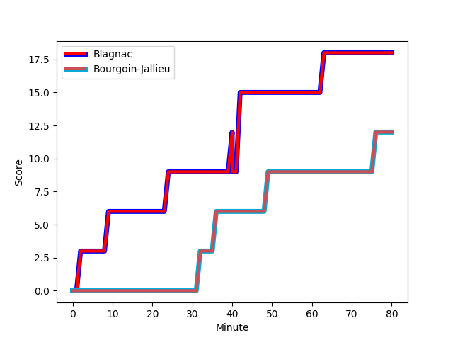
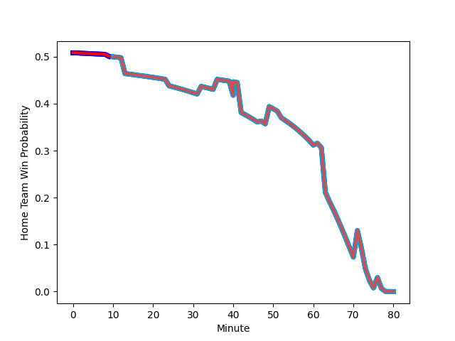

---  
layout: page  
title: Bourgoin-Jallieu at Blagnac; 12-18  
date: 2022-12-03 16:00:00 18:00:00 -0500  
categories: match review  
---
# Bourgoin-Jallieu (1403.5) at Blagnac (1417.58); 12-18

# Prediction: Blagnac by 4.4

Blagnac by 1.4 on a neutral field
## Scores over Time

## Win Probability over Time

# Pre-Match Prediction: Blagnac by 2.7

Bourgoin-Jallieu by 0.3 on a neutral pitch

|   Away Minutes | Away Player                                                               |   Away elo |   Away Percentile |   Number |   Home Percentile |   Home elo | Home Player                                                              |   Home Minutes |
|---------------:|:--------------------------------------------------------------------------|-----------:|------------------:|---------:|------------------:|-----------:|:-------------------------------------------------------------------------|---------------:|
|             59 | [Adrien Devisme](..//playerfiles//AdrienDevisme_cleaned.md)               |      89.17 |                21 |        1 |                22 |      90.82 | [Cesar Biscioni](..//playerfiles//CesarBiscioni_cleaned.md)              |             52 |
|             56 | [Mohamed Khribache](..//playerfiles//MohamedKhribache_cleaned.md)         |      93.71 |                38 |        2 |                70 |     100.29 | [Gabin Villerouge](..//playerfiles//GabinVillerouge_cleaned.md)          |             55 |
|             55 | [Oktay Yilmaz](..//playerfiles//OktayYilmaz_cleaned.md)                   |      99.06 |                58 |        3 |                31 |      91.94 | [Fabien Lorenzon](..//playerfiles//FabienLorenzon_cleaned.md)            |             62 |
|             80 | [Léandre Cotte](..//playerfiles//LéandreCotte_cleaned.md)                 |      98.31 |                60 |        4 |                29 |      91.11 | [Vincent Mutel](..//playerfiles//VincentMutel_cleaned.md)                |             62 |
|             47 | [Jonathan Kpoku](..//playerfiles//JonathanKpoku_cleaned.md)               |      93.6  |                42 |        5 |                62 |      98.49 | [Lilian Rousset](..//playerfiles//LilianRousset_cleaned.md)              |             71 |
|             64 | [Kevin Chaudouard](..//playerfiles//KevinChaudouard_cleaned.md)           |      98.9  |                58 |        6 |                64 |      99.51 | [Loïc Verdy](..//playerfiles//LoïcVerdy_cleaned.md)                      |             80 |
|             61 | [Theophile Cotte](..//playerfiles//TheophileCotte_cleaned.md)             |      80.07 |                 6 |        7 |                72 |     102.35 | [Mateo Ibanez](..//playerfiles//MateoIbanez_cleaned.md)                  |             62 |
|             80 | [Lakisipone Lee](..//playerfiles//LakisiponeLee_cleaned.md)               |      91.94 |                35 |        8 |                58 |      97.71 | [Mathieu Vachon](..//playerfiles//MathieuVachon_cleaned.md)              |             80 |
|             64 | [Tomas Munilla lo Duca](..//playerfiles//TomasMunillaloDuca_cleaned.md)   |      98.9  |                63 |        9 |                58 |      98    | [Paul Ravier](..//playerfiles//PaulRavier_cleaned.md)                    |             80 |
|             80 | [Nicolas Vuillemin](..//playerfiles//NicolasVuillemin_cleaned.md)         |      87.46 |                19 |       10 |                33 |      92.16 | [Ugo Seunes](..//playerfiles//UgoSeunes_cleaned.md)                      |             80 |
|             80 | [Quentin Lefort](..//playerfiles//QuentinLefort_cleaned.md)               |     100.11 |                67 |       11 |                 5 |      77.99 | [Benjamin Daurau Bedin](..//playerfiles//BenjaminDaurauBedin_cleaned.md) |             73 |
|             61 | [Romain Sola](..//playerfiles//RomainSola_cleaned.md)                     |      90.18 |                27 |       12 |                 5 |      78.29 | [Guillaume Piron](..//playerfiles//GuillaumePiron_cleaned.md)            |             13 |
|             80 | [Christopher Bosch](..//playerfiles//ChristopherBosch_cleaned.md)         |      97.32 |                55 |       13 |                39 |      92.56 | [Clément Vareilles](..//playerfiles//ClémentVareilles_cleaned.md)        |             80 |
|             80 | [Pablo Patilla](..//playerfiles//PabloPatilla_cleaned.md)                 |      86.75 |                16 |       14 |                50 |      96.78 | [Guilhem Graulle](..//playerfiles//GuilhemGraulle_cleaned.md)            |             80 |
|             80 | [Nicolas Cachet](..//playerfiles//NicolasCachet_cleaned.md)               |      88.36 |                23 |       15 |                 6 |      77.66 | [Antoine Renaud](..//playerfiles//AntoineRenaud_cleaned.md)              |             80 |
|             33 | [Kemueli Lavetanakoroi](..//playerfiles//KemueliLavetanakoroi_cleaned.md) |     101.89 |                71 |       16 |                87 |     111.43 | [Jean-Andre Vernetti](..//playerfiles//Jean-AndreVernetti_cleaned.md)    |             67 |
|             25 | [Michael Simutoga](..//playerfiles//MichaelSimutoga_cleaned.md)           |      98.06 |                52 |       17 |                69 |     100.28 | [Alexis Decaux](..//playerfiles//AlexisDecaux_cleaned.md)                |             28 |
|             24 | [Killian Tripier](..//playerfiles//KillianTripier_cleaned.md)             |      96.28 |                55 |       18 |                49 |      95.89 | [Florian Bertrand](..//playerfiles//FlorianBertrand_cleaned.md)          |             25 |
|             21 | [Romain Favaretto](..//playerfiles//RomainFavaretto_cleaned.md)           |      89.17 |                23 |       19 |               nan |      98.12 | [Baptiste Collet](..//playerfiles//BaptisteCollet_cleaned.md)            |             18 |
|             19 | [Makalea Foliaki](..//playerfiles//MakaleaFoliaki_cleaned.md)             |      94.25 |                45 |       20 |                14 |      84.97 | [Lucas Tolofua](..//playerfiles//LucasTolofua_cleaned.md)                |             18 |
|             19 | [Matteo Broeders](..//playerfiles//MatteoBroeders_cleaned.md)             |     103.78 |                71 |       21 |                68 |      99.87 | [Nikita Bekov](..//playerfiles//NikitaBekov_cleaned.md)                  |             18 |
|             16 | [Adrien Pontarollo](..//playerfiles//AdrienPontarollo_cleaned.md)         |      95.15 |                45 |       22 |                87 |     109.92 | [Benjamin Collet](..//playerfiles//BenjaminCollet_cleaned.md)            |              9 |
|             16 | [Thomas Tarrit](..//playerfiles//ThomasTarrit_cleaned.md)                 |      98.5  |                55 |       23 |               nan |      94.97 | [Pierre Ferrari](..//playerfiles//PierreFerrari_cleaned.md)              |              7 |

