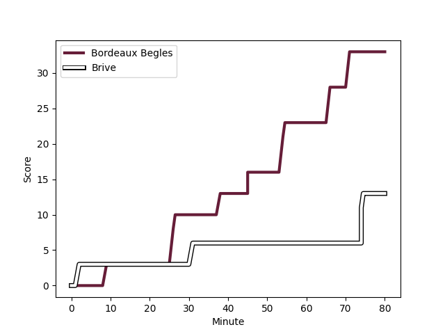
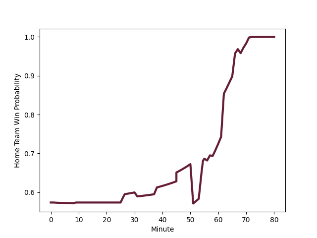

---  
layout: page  
title: Brive at Bordeaux Begles; 13-33  
date: 2022-12-03 17:00:00 18:00:00 -0500  
categories: match review  
---
# Brive (1470.33) at Bordeaux Begles (1599.05); 13-33

# Prediction: Bordeaux Begles by 15.9

Bordeaux Begles by 12.9 on a neutral field
## Scores over Time

## Win Probability over Time

# Pre-Match Prediction: Bordeaux Begles by 15.7

Bordeaux Begles by 12.7 on a neutral pitch

|   Away Minutes | Away Player                                                                     |   Away elo |   Away Percentile |   Number |   Home Percentile |   Home elo | Home Player                                                           |   Home Minutes |
|---------------:|:--------------------------------------------------------------------------------|-----------:|------------------:|---------:|------------------:|-----------:|:----------------------------------------------------------------------|---------------:|
|             51 | [Daniel Brennan](..//playerfiles//DanielBrennan_cleaned.md)                     |      89.75 |                23 |        1 |                21 |      89.17 | [Jefferson Poirot](..//playerfiles//JeffersonPoirot_cleaned.md)       |             43 |
|             51 | [Motu Matu'u](..//playerfiles//MotuMatu'u_cleaned.md)                           |      91.52 |                32 |        2 |                18 |      86.15 | [Maxime Lamothe](..//playerfiles//MaximeLamothe_cleaned.md)           |             68 |
|             51 | [Marcel van der Merwe](..//playerfiles//MarcelvanderMerwe_cleaned.md)           |     102.22 |                72 |        3 |                98 |     124.18 | [Vadim Cobilas](..//playerfiles//VadimCobilas_cleaned.md)             |             56 |
|             80 | [Oskar Rixen](..//playerfiles//OskarRixen_cleaned.md)                           |      98.56 |                62 |        4 |                96 |     121.74 | [Cyril Cazeaux](..//playerfiles//CyrilCazeaux_cleaned.md)             |             80 |
|             62 | [Julien Delannoy](..//playerfiles//JulienDelannoy_cleaned.md)                   |      86.62 |                15 |        5 |                96 |     121.32 | [Jandré Marais](..//playerfiles//JandréMarais_cleaned.md)             |             80 |
|             80 | [Retief Marais](..//playerfiles//RetiefMarais_cleaned.md)                       |      95.58 |                50 |        6 |                26 |      90.13 | [Pierre Bochaton](..//playerfiles//PierreBochaton_cleaned.md)         |             25 |
|             80 | [Said Hireche](..//playerfiles//SaidHireche_cleaned.md)                         |     118.18 |                95 |        7 |                21 |      88.39 | [Mahamadou Diaby](..//playerfiles//MahamadouDiaby_cleaned.md)         |             80 |
|             51 | [Esteban Abadie](..//playerfiles//EstebanAbadie_cleaned.md)                     |      89.81 |                27 |        8 |                33 |      91.21 | [Antoine Miquel](..//playerfiles//AntoineMiquel_cleaned.md)           |             80 |
|             51 | [Vaso Lobzhanidze](..//playerfiles//VasoLobzhanidze_cleaned.md)                 |      92.57 |                34 |        9 |                99 |     133.91 | [Maxime Lucu](..//playerfiles//MaximeLucu_cleaned.md)                 |             58 |
|             80 | [Nicolas Sanchez](..//playerfiles//NicolasSanchez_cleaned.md)                   |     126.22 |                96 |       10 |                77 |     106.12 | [Matthieu Jalibert](..//playerfiles//MatthieuJalibert_cleaned.md)     |             58 |
|             80 | [Axel Muller](..//playerfiles//AxelMuller_cleaned.md)                           |     106.8  |                82 |       11 |                93 |     117.4  | [Madosh Tambwe](..//playerfiles//MadoshTambwe_cleaned.md)             |             80 |
|              4 | [Stuart Olding](..//playerfiles//StuartOlding_cleaned.md)                       |      97.23 |                51 |       12 |                90 |     113.18 | [Remi Lamerat](..//playerfiles//RemiLamerat_cleaned.md)               |             56 |
|             80 | [Nico Lee](..//playerfiles//NicoLee_cleaned.md)                                 |     109.2  |                85 |       13 |                77 |     104.81 | [Jean-Baptiste Dubie](..//playerfiles//Jean-BaptisteDubie_cleaned.md) |             80 |
|             80 | [Seta Tuicuvu](..//playerfiles//SetaTuicuvu_cleaned.md)                         |      95.23 |                47 |       14 |                66 |      99.6  | [Santiago Cordero](..//playerfiles//SantiagoCordero_cleaned.md)       |             80 |
|             80 | [Mathis Ferté](..//playerfiles//MathisFerté_cleaned.md)                         |      80.33 |                 9 |       15 |                79 |     107.14 | [Romain Buros](..//playerfiles//RomainBuros_cleaned.md)               |             80 |
|             76 | [Sammy Arnold](..//playerfiles//SammyArnold_cleaned.md)                         |      85.82 |                15 |       16 |                40 |      92.37 | [Tom Willis](..//playerfiles//TomWillis_cleaned.md)                   |             55 |
|             29 | [Pietro Ceccarelli](..//playerfiles//PietroCeccarelli_cleaned.md)               |      92.19 |                33 |       17 |                93 |     112.31 | [Lekso Kaulashvili](..//playerfiles//LeksoKaulashvili_cleaned.md)     |             37 |
|             29 | [Leo Carbonneau](..//playerfiles//LeoCarbonneau_cleaned.md)                     |      81.15 |                 7 |       18 |                46 |      94.96 | [Tani Vili](..//playerfiles//TaniVili_cleaned.md)                     |             24 |
|             29 | [Vano Karkadze](..//playerfiles//VanoKarkadze_cleaned.md)                       |      92.62 |                38 |       19 |                18 |      87.81 | [Yann Lesgourgues](..//playerfiles//YannLesgourgues_cleaned.md)       |             22 |
|             29 | [Abraham Papali'i](..//playerfiles//AbrahamPapali'i_cleaned.md)                 |     104.5  |                73 |       20 |                97 |     125.5  | [Zack Holmes](..//playerfiles//ZackHolmes_cleaned.md)                 |             22 |
|             29 | [Hayden Thompson-Stringer](..//playerfiles//HaydenThompson-Stringer_cleaned.md) |      95.6  |                49 |       21 |                96 |     118.79 | [Clement Maynadier](..//playerfiles//ClementMaynadier_cleaned.md)     |             12 |
|             18 | [Renger Van Eerten](..//playerfiles//RengerVanEerten_cleaned.md)                |      92.35 |                45 |       22 |                98 |     125.12 | [Ben Tameifuna](..//playerfiles//BenTameifuna_cleaned.md)             |             24 |

