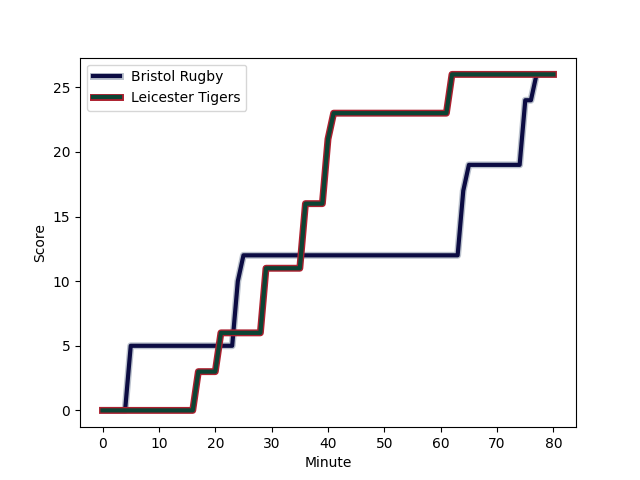
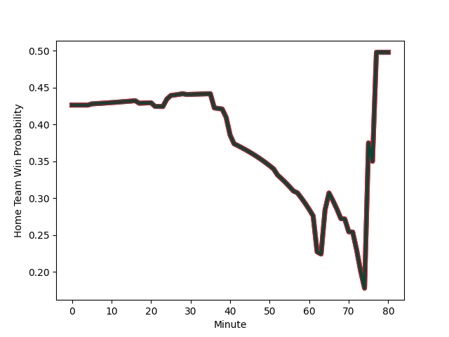

---  
layout: page  
title: Leicester Tigers at Bristol Rugby; 26-26  
date: 2022-12-03 15:00:00 18:00:00 -0500  
categories: match review  
---
# Leicester Tigers (1604.28) at Bristol Rugby (1475.09); 26-26

# Prediction: Leicester Tigers by 9.9

Leicester Tigers by 12.9 on a neutral field
## Scores over Time

## Win Probability over Time

# Pre-Match Prediction: Leicester Tigers by 10.2

Leicester Tigers by 13.2 on a neutral pitch

|   Away Minutes | Away Player                                                          |   Away elo |   Away Percentile |   Number |   Home Percentile |   Home elo | Home Player                                                   |   Home Minutes |
|---------------:|:---------------------------------------------------------------------|-----------:|------------------:|---------:|------------------:|-----------:|:--------------------------------------------------------------|---------------:|
|             63 | [James Whitcombe](..//playerfiles//JamesWhitcombe_cleaned.md)        |      91.27 |                28 |        1 |                81 |     103.78 | [Ellis Genge](..//playerfiles//EllisGenge_cleaned.md)         |             77 |
|             71 | [Julian Montoya](..//playerfiles//JulianMontoya_cleaned.md)          |     101.1  |                71 |        2 |                62 |      98.07 | [Bryan Byrne](..//playerfiles//BryanByrne_cleaned.md)         |             66 |
|             62 | [Dan Cole](..//playerfiles//DanCole_cleaned.md)                      |      99.32 |                65 |        3 |                18 |      88.08 | [Max Lahiff](..//playerfiles//MaxLahiff_cleaned.md)           |             74 |
|             71 | [Harry Wells](..//playerfiles//HarryWells_cleaned.md)                |     120.84 |                95 |        4 |                79 |     104.26 | [Joe Batley](..//playerfiles//JoeBatley_cleaned.md)           |             80 |
|             80 | [Ollie Chessum](..//playerfiles//OllieChessum_cleaned.md)            |     106.28 |                85 |        5 |                84 |     107.57 | [Chris Vui](..//playerfiles//ChrisVui_cleaned.md)             |             80 |
|             80 | [Hanro Liebenberg](..//playerfiles//HanroLiebenberg_cleaned.md)      |     115.64 |                93 |        6 |                92 |     114.22 | [Steven Luatua](..//playerfiles//StevenLuatua_cleaned.md)     |             80 |
|             57 | [Tommy Reffell](..//playerfiles//TommyReffell_cleaned.md)            |     123.67 |                96 |        7 |                77 |     104.15 | [Samuel Lewis](..//playerfiles//SamuelLewis_cleaned.md)       |             39 |
|             80 | [Jasper Wiese](..//playerfiles//JasperWiese_cleaned.md)              |     112.01 |                87 |        8 |                 5 |      80.86 | [Jake Heenan](..//playerfiles//JakeHeenan_cleaned.md)         |             80 |
|             52 | [Ben Youngs](..//playerfiles//BenYoungs_cleaned.md)                  |     111.57 |                89 |        9 |                37 |      92.97 | [Will Porter](..//playerfiles//WillPorter_cleaned.md)         |             80 |
|             70 | [Freddie Burns](..//playerfiles//FreddieBurns_cleaned.md)            |     122.74 |                94 |       10 |                88 |     112.3  | [Callum Sheedy](..//playerfiles//CallumSheedy_cleaned.md)     |             57 |
|             80 | [Anthony Watson](..//playerfiles//AnthonyWatson_cleaned.md)          |      89.18 |                27 |       11 |                50 |      96.08 | [Gabriel Ibitoye](..//playerfiles//GabrielIbitoye_cleaned.md) |             80 |
|             63 | [Dan Kelly](..//playerfiles//DanKelly_cleaned.md)                    |     117.41 |                93 |       12 |                11 |      82.56 | [Piers O'Conor](..//playerfiles//PiersO'Conor_cleaned.md)     |             80 |
|             80 | [Guy Porter](..//playerfiles//GuyPorter_cleaned.md)                  |      93.47 |                46 |       13 |                74 |     103.32 | [Semi Radradra](..//playerfiles//SemiRadradra_cleaned.md)     |             80 |
|             69 | [Chris Ashton](..//playerfiles//ChrisAshton_cleaned.md)              |     126.01 |                98 |       14 |                 3 |      76.37 | [Deago Bailey](..//playerfiles//DeagoBailey_cleaned.md)       |             80 |
|             80 | [Freddie Steward](..//playerfiles//FreddieSteward_cleaned.md)        |      95.89 |                51 |       15 |                86 |     110.81 | [Charles Piutau](..//playerfiles//CharlesPiutau_cleaned.md)   |             80 |
|              9 | [Charlie Clare](..//playerfiles//CharlieClare_cleaned.md)            |      86.08 |                14 |       16 |                55 |      97.7  | [Harry Thacker](..//playerfiles//HarryThacker_cleaned.md)     |             14 |
|             28 | [Francois van Wyk](..//playerfiles//FrancoisvanWyk_cleaned.md)       |     104.76 |                85 |       17 |                88 |     108.07 | [Jake Woolmore](..//playerfiles//JakeWoolmore_cleaned.md)     |              3 |
|             18 | [Joe Heyes](..//playerfiles//JoeHeyes_cleaned.md)                    |     101.93 |                73 |       18 |                97 |     119.37 | [Jay Tyack](..//playerfiles//JayTyack_cleaned.md)             |              6 |
|              9 | [Eli Snyman](..//playerfiles//EliSnyman_cleaned.md)                  |      85.44 |                18 |       19 |                10 |      82.61 | [John Hawkins](..//playerfiles//JohnHawkins_cleaned.md)       |              0 |
|             23 | [George Martin](..//playerfiles//GeorgeMartin_cleaned.md)            |     100.26 |                69 |       20 |                82 |     106.75 | [Daniel Thomas](..//playerfiles//DanielThomas_cleaned.md)     |             41 |
|             28 | [Jack van Poortvliet](..//playerfiles//JackvanPoortvliet_cleaned.md) |     106.15 |                81 |       21 |                 0 |      72.25 | [Andy Uren](..//playerfiles//AndyUren_cleaned.md)             |              0 |
|             10 | [Charlie Atkinson](..//playerfiles//CharlieAtkinson_cleaned.md)      |      98.54 |                60 |       22 |                51 |      98.12 | [AJ MacGinty](..//playerfiles//AJMacGinty_cleaned.md)         |             23 |
|             17 | [Harry Potter](..//playerfiles//HarryPotter_cleaned.md)              |      92.36 |                38 |       23 |                33 |      92.16 | [Joe Jenkins](..//playerfiles//JoeJenkins_cleaned.md)         |              0 |

