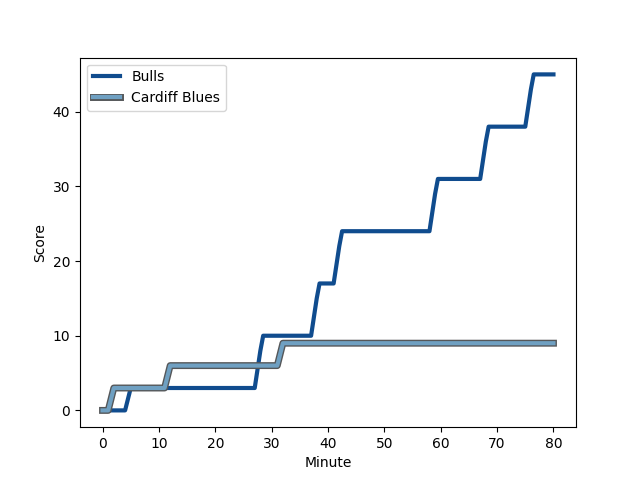
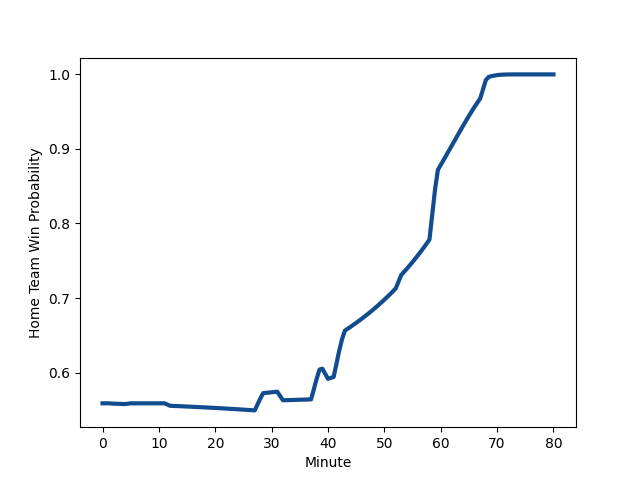

---  
layout: page  
title: Cardiff Blues at Bulls; 9-45  
date: 2022-12-03 19:00:00 18:00:00 -0500  
categories: match review  
---
# Cardiff Blues (1469.34) at Bulls (1571.8); 9-45

# Prediction: Bulls by 13.2

Bulls by 10.2 on a neutral field
## Scores over Time

## Win Probability over Time

# Pre-Match Prediction: Bulls by 12.0

Bulls by 9.0 on a neutral pitch

|   Away Minutes | Away Player                                                           |   Away elo |   Away Percentile |   Number |   Home Percentile |   Home elo | Home Player                                                          |   Home Minutes |
|---------------:|:----------------------------------------------------------------------|-----------:|------------------:|---------:|------------------:|-----------:|:---------------------------------------------------------------------|---------------:|
|             43 | [Rhys Carré](..//playerfiles//RhysCarré_cleaned.md)                   |      93    |                36 |        1 |                88 |     108.81 | [Gerhard Steenekamp](..//playerfiles//GerhardSteenekamp_cleaned.md)  |             59 |
|             43 | [Kristian Dacey](..//playerfiles//KristianDacey_cleaned.md)           |     110.2  |                89 |        2 |                97 |     120.75 | [Johan Grobbelaar](..//playerfiles//JohanGrobbelaar_cleaned.md)      |             69 |
|             53 | [Dimitri Arhip](..//playerfiles//DimitriArhip_cleaned.md)             |      98.74 |                62 |        3 |                55 |      95.48 | [Mornay Smith](..//playerfiles//MornaySmith_cleaned.md)              |             40 |
|             57 | [Lopeti Timani](..//playerfiles//LopetiTimani_cleaned.md)             |      93.58 |                42 |        4 |                19 |      86.7  | [Ruan Vermaak](..//playerfiles//RuanVermaak_cleaned.md)              |             59 |
|             60 | [Seb Davies](..//playerfiles//SebDavies_cleaned.md)                   |      89.38 |                21 |        5 |                76 |     103.4  | [Ruan Nortje](..//playerfiles//RuanNortje_cleaned.md)                |             80 |
|             80 | [Josh Turnbull](..//playerfiles//JoshTurnbull_cleaned.md)             |      97.81 |                58 |        6 |                62 |      99.77 | [Marco van Staden](..//playerfiles//MarcovanStaden_cleaned.md)       |             80 |
|             80 | [Thomas Young](..//playerfiles//ThomasYoung_cleaned.md)               |     106.71 |                82 |        7 |                11 |      83.26 | [Cyle Brink](..//playerfiles//CyleBrink_cleaned.md)                  |             62 |
|             57 | [James Botham](..//playerfiles//JamesBotham_cleaned.md)               |     110.93 |                86 |        8 |                77 |     105.06 | [Elrigh Louw](..//playerfiles//ElrighLouw_cleaned.md)                |             80 |
|             53 | [Lloyd Williams](..//playerfiles//LloydWilliams_cleaned.md)           |     109.8  |                87 |        9 |                84 |     106.63 | [Zak Burger](..//playerfiles//ZakBurger_cleaned.md)                  |             59 |
|             80 | [Jarrod Evans](..//playerfiles//JarrodEvans_cleaned.md)               |     110.73 |                85 |       10 |                54 |      97.03 | [Johan Goosen](..//playerfiles//JohanGoosen_cleaned.md)              |             62 |
|             80 | [Aled Summerhill](..//playerfiles//AledSummerhill_cleaned.md)         |      83.75 |                 9 |       11 |                90 |     113    | [Canan Moodie](..//playerfiles//CananMoodie_cleaned.md)              |             80 |
|             77 | [Ben Thomas](..//playerfiles//BenThomas_cleaned.md)                   |      91.51 |                35 |       12 |                96 |     123.47 | [Harold Vorster](..//playerfiles//HaroldVorster_cleaned.md)          |             80 |
|             80 | [Mason Grady](..//playerfiles//MasonGrady_cleaned.md)                 |      89.48 |                25 |       13 |                46 |      94.97 | [Cornal Hendricks](..//playerfiles//CornalHendricks_cleaned.md)      |             80 |
|             80 | [Jason Harries](..//playerfiles//JasonHarries_cleaned.md)             |     111.81 |                88 |       14 |                91 |     114.14 | [David Kriel](..//playerfiles//DavidKriel_cleaned.md)                |             18 |
|             80 | [Cam Winnett](..//playerfiles//CamWinnett_cleaned.md)                 |      90.95 |               nan |       15 |                98 |     128.15 | [Kurt-Lee Arendse](..//playerfiles//Kurt-LeeArendse_cleaned.md)      |             80 |
|             37 | [Corey Domachowski](..//playerfiles//CoreyDomachowski_cleaned.md)     |      95.38 |                48 |       16 |                78 |     105.58 | [Lionel Mapoe](..//playerfiles//LionelMapoe_cleaned.md)              |             62 |
|             37 | [Kirby Myhill](..//playerfiles//KirbyMyhill_cleaned.md)               |      90.79 |                28 |       17 |                19 |      88.54 | [Francois Klopper](..//playerfiles//FrancoisKlopper_cleaned.md)      |             40 |
|             27 | [Ellis Bevan](..//playerfiles//EllisBevan_cleaned.md)                 |      95.75 |               nan |       18 |                61 |      98.92 | [Simphiwe Matanzima](..//playerfiles//SimphiweMatanzima_cleaned.md)  |             21 |
|             27 | [William Davies-King](..//playerfiles//WilliamDavies-King_cleaned.md) |      88.38 |                15 |       19 |                82 |     106.81 | [Embrose Papier](..//playerfiles//EmbrosePapier_cleaned.md)          |             21 |
|             23 | [James Ratti](..//playerfiles//JamesRatti_cleaned.md)                 |      97.99 |                51 |       20 |                36 |      92.22 | [Janko Swanepoel](..//playerfiles//JankoSwanepoel_cleaned.md)        |             21 |
|             23 | [Shane Lewis-Hughes](..//playerfiles//ShaneLewis-Hughes_cleaned.md)   |      90.25 |                26 |       21 |                75 |     103.34 | [Nizaam Carr](..//playerfiles//NizaamCarr_cleaned.md)                |             18 |
|             20 | [Teddy Williams](..//playerfiles//TeddyWilliams_cleaned.md)           |      96.01 |               nan |       22 |                85 |     110.82 | [Chris Smith](..//playerfiles//ChrisSmith_cleaned.md)                |             18 |
|              3 | [Harri Millard](..//playerfiles//HarriMillard_cleaned.md)             |      93.63 |               nan |       23 |                 7 |      82.74 | [Jan Hendrik Wessels](..//playerfiles//JanHendrikWessels_cleaned.md) |             11 |

