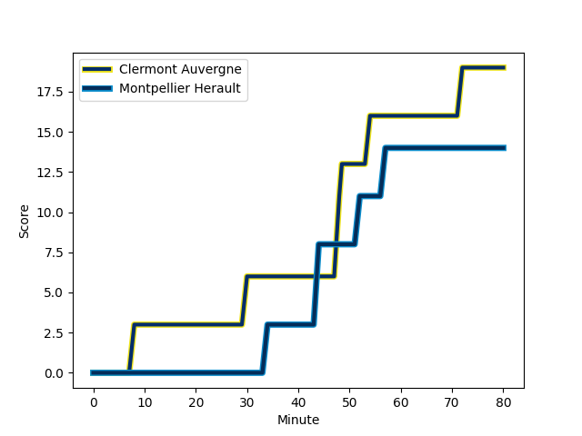
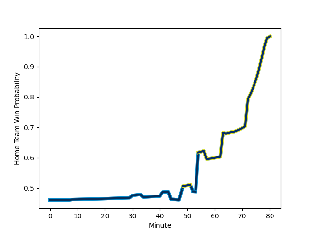

---  
layout: page  
title: Montpellier Herault at Clermont Auvergne; 14-19  
date: 2022-12-03 15:00:00 18:00:00 -0500  
categories: match review  
---
# Montpellier Herault (1559.83) at Clermont Auvergne (1491.21); 14-19

# Prediction: Montpellier Herault by 3.9

Montpellier Herault by 6.9 on a neutral field
## Scores over Time

## Win Probability over Time

# Pre-Match Prediction: Montpellier Herault by 6.6

Montpellier Herault by 9.6 on a neutral pitch

|   Away Minutes | Away Player                                                                     |   Away elo |   Away Percentile |   Number |   Home Percentile |   Home elo | Home Player                                                               |   Home Minutes |
|---------------:|:--------------------------------------------------------------------------------|-----------:|------------------:|---------:|------------------:|-----------:|:--------------------------------------------------------------------------|---------------:|
|             54 | [Simon-Pierre Chauvac](..//playerfiles//Simon-PierreChauvac_cleaned.md)         |     102.87 |                69 |        1 |                84 |     106.58 | [Etienne Falgoux](..//playerfiles//EtienneFalgoux_cleaned.md)             |             57 |
|             54 | [Curtis Langdon](..//playerfiles//CurtisLangdon_cleaned.md)                     |      96.94 |                56 |        2 |                36 |      92.27 | [Yohan Beheregaray](..//playerfiles//YohanBeheregaray_cleaned.md)         |             53 |
|             54 | [Mohamed Haouas](..//playerfiles//MohamedHaouas_cleaned.md)                     |      94.1  |                40 |        3 |                49 |      95.65 | [Cristian Ojovan](..//playerfiles//CristianOjovan_cleaned.md)             |             80 |
|             57 | [Marco Tauleigne](..//playerfiles//MarcoTauleigne_cleaned.md)                   |     102.09 |                64 |        4 |                85 |     108.21 | [Tomas Lavanini](..//playerfiles//TomasLavanini_cleaned.md)               |             80 |
|             80 | [Yacouba Camara](..//playerfiles//YacoubaCamara_cleaned.md)                     |     118.62 |                95 |        5 |                89 |     111.58 | [Sebastien Vahaamahina](..//playerfiles//SebastienVahaamahina_cleaned.md) |             62 |
|             67 | [Lenni Nouchi](..//playerfiles//LenniNouchi_cleaned.md)                         |      97.85 |                59 |        6 |                73 |     102.67 | [Arthur Iturria](..//playerfiles//ArthurIturria_cleaned.md)               |             80 |
|             80 | [Clément Doumenc](..//playerfiles//ClémentDoumenc_cleaned.md)                   |     113.95 |                91 |        7 |                 9 |      83.13 | [Jacobus van Tonder](..//playerfiles//JacobusvanTonder_cleaned.md)        |             80 |
|             80 | [Zach Mercer](..//playerfiles//ZachMercer_cleaned.md)                           |     103.03 |                71 |        8 |                26 |      89.98 | [Loic Godener](..//playerfiles//LoicGodener_cleaned.md)                   |             53 |
|             64 | [Cobus Reinach](..//playerfiles//CobusReinach_cleaned.md)                       |     113.98 |                90 |        9 |                92 |     113.42 | [Sebastien Bezy](..//playerfiles//SebastienBezy_cleaned.md)               |             63 |
|             64 | [Louis Foursans-Bourdette](..//playerfiles//LouisFoursans-Bourdette_cleaned.md) |      90.53 |                21 |       10 |                81 |     107.17 | [Jules Plisson](..//playerfiles//JulesPlisson_cleaned.md)                 |             80 |
|             80 | [George Bridge](..//playerfiles//GeorgeBridge_cleaned.md)                       |     120.01 |                95 |       11 |                24 |      88.56 | [Cheikh Tiberghien](..//playerfiles//CheikhTiberghien_cleaned.md)         |             80 |
|             80 | [Paolo Garbisi](..//playerfiles//PaoloGarbisi_cleaned.md)                       |     109.58 |                84 |       12 |                39 |      92.53 | [Julien Heriteau](..//playerfiles//JulienHeriteau_cleaned.md)             |             80 |
|             80 | [Pierre Lucas](..//playerfiles//PierreLucas_cleaned.md)                         |      95.97 |                48 |       13 |                 6 |      77.4  | [Samuel Ezeala](..//playerfiles//SamuelEzeala_cleaned.md)                 |             41 |
|             80 | [Gabriel Ngandebe](..//playerfiles//GabrielNgandebe_cleaned.md)                 |      94.84 |                46 |       14 |                72 |     101.63 | [Damian Penaud](..//playerfiles//DamianPenaud_cleaned.md)                 |             80 |
|             80 | [Anthony Bouthier](..//playerfiles//AnthonyBouthier_cleaned.md)                 |     110.84 |                86 |       15 |                76 |     105.18 | [Alex Newsome](..//playerfiles//AlexNewsome_cleaned.md)                   |             80 |
|             26 | [Brandon Paenga-Amosa](..//playerfiles//BrandonPaenga-Amosa_cleaned.md)         |      90.85 |                28 |       16 |                81 |     106.53 | [Apisai Naqalevu](..//playerfiles//ApisaiNaqalevu_cleaned.md)             |             39 |
|             26 | [Gregory Fichten](..//playerfiles//GregoryFichten_cleaned.md)                   |      97.38 |               nan |       17 |                21 |      89.02 | [Benjamin Boudou](..//playerfiles//BenjaminBoudou_cleaned.md)             |             27 |
|             26 | [Titi Lamositele](..//playerfiles//TitiLamositele_cleaned.md)                   |      93.48 |                39 |       18 |                97 |     123.86 | [Alexandre Fischer](..//playerfiles//AlexandreFischer_cleaned.md)         |             27 |
|             16 | [Louis Carbonel](..//playerfiles//LouisCarbonel_cleaned.md)                     |     103.9  |                74 |       19 |                73 |      98.69 | [Daniel Bibi Biziwu](..//playerfiles//DanielBibiBiziwu_cleaned.md)        |             23 |
|             23 | [Tyler Duguid](..//playerfiles//TylerDuguid_cleaned.md)                         |      90.62 |                30 |       20 |                60 |      98.15 | [Thibaud Lanen](..//playerfiles//ThibaudLanen_cleaned.md)                 |             18 |
|             16 | [Gela Aprasidze](..//playerfiles//GelaAprasidze_cleaned.md)                     |     102.93 |                75 |       21 |                51 |      94.55 | [Baptiste Jauneau](..//playerfiles//BaptisteJauneau_cleaned.md)           |             17 |
|             13 | [Masivesi Dakuwaqa](..//playerfiles//MasivesiDakuwaqa_cleaned.md)               |     106.5  |                80 |       22 |               nan |     nan    | nan                                                                       |            nan |

