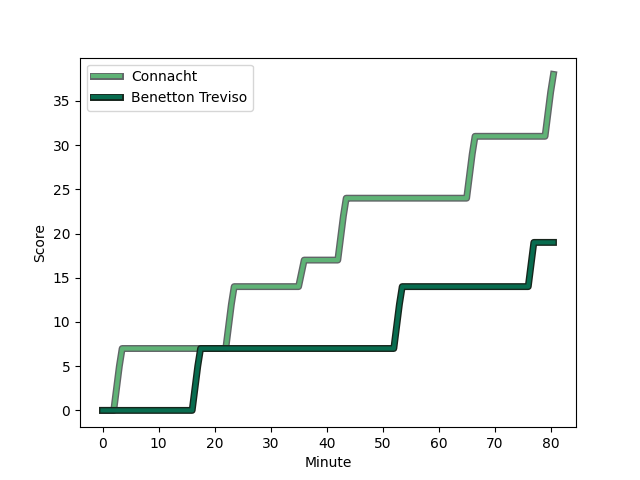
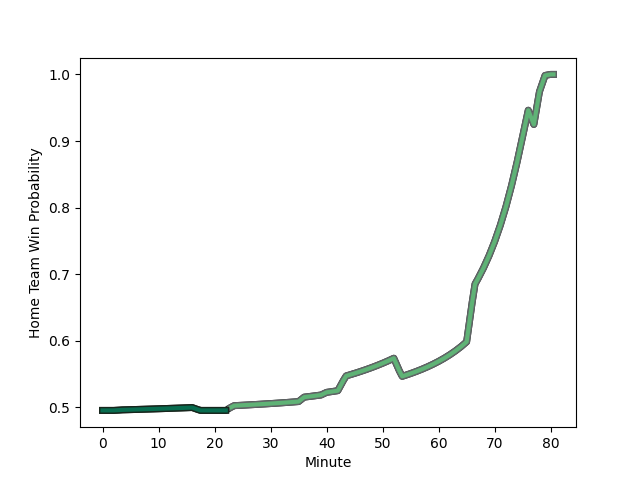

---  
layout: page  
title: Benetton Treviso at Connacht; 19-38  
date: 2022-12-03 16:15:00 18:00:00 -0500  
categories: match review  
---
# Benetton Treviso (1527.91) at Connacht (1520.12); 19-38

# Prediction: Connacht by 2.2

Benetton Treviso by 0.8 on a neutral field
## Scores over Time

## Win Probability over Time

# Pre-Match Prediction: Benetton Treviso by 7.6

Connacht by 4.6 on a neutral pitch

|   Away Minutes | Away Player                                                              |   Away elo |   Away Percentile |   Number |   Home Percentile |   Home elo | Home Player                                                             |   Home Minutes |
|---------------:|:-------------------------------------------------------------------------|-----------:|------------------:|---------:|------------------:|-----------:|:------------------------------------------------------------------------|---------------:|
|             40 | [Ivan Nemer](..//playerfiles//IvanNemer_cleaned.md)                      |      99.03 |                65 |        1 |                76 |     103.15 | [Denis Buckley](..//playerfiles//DenisBuckley_cleaned.md)               |             52 |
|             80 | [Giacomo Nicotera](..//playerfiles//GiacomoNicotera_cleaned.md)          |     107.16 |                84 |        2 |                52 |      95.24 | [Dave Heffernan](..//playerfiles//DaveHeffernan_cleaned.md)             |             52 |
|             32 | [Filippo Alongi](..//playerfiles//FilippoAlongi_cleaned.md)              |      91.43 |                33 |        3 |                76 |     103.11 | [Finlay Bealham](..//playerfiles//FinlayBealham_cleaned.md)             |             52 |
|             71 | [Niccolo Cannone](..//playerfiles//NiccoloCannone_cleaned.md)            |      73.36 |                 3 |        4 |                24 |      89.64 | [Oisin Dowling](..//playerfiles//OisinDowling_cleaned.md)               |             80 |
|             80 | [Scott Scrafton](..//playerfiles//ScottScrafton_cleaned.md)              |     105.84 |                81 |        5 |                70 |     100.43 | [Niall Murray](..//playerfiles//NiallMurray_cleaned.md)                 |             54 |
|             80 | [Manuel Zuliani](..//playerfiles//ManuelZuliani_cleaned.md)              |      93.58 |                42 |        6 |                11 |      84.64 | [Cian Prendergast](..//playerfiles//CianPrendergast_cleaned.md)         |             80 |
|             80 | [Michele Lamaro](..//playerfiles//MicheleLamaro_cleaned.md)              |     110.15 |                88 |        7 |                69 |     101.55 | [Conor Oliver](..//playerfiles//ConorOliver_cleaned.md)                 |             63 |
|             71 | [Giovanni Pettinelli](..//playerfiles//GiovanniPettinelli_cleaned.md)    |     109.6  |                86 |        8 |                72 |     102.85 | [Paul Boyle](..//playerfiles//PaulBoyle_cleaned.md)                     |             80 |
|             80 | [Dewaldt Duvenage](..//playerfiles//DewaldtDuvenage_cleaned.md)          |     122.42 |                97 |        9 |                89 |     111.48 | [Kieran Marmion](..//playerfiles//KieranMarmion_cleaned.md)             |             60 |
|             80 | [Jacob Umaga](..//playerfiles//JacobUmaga_cleaned.md)                    |     106.72 |                77 |       10 |                83 |     109.47 | [Jack Carty](..//playerfiles//JackCarty_cleaned.md)                     |             80 |
|             80 | [Marcus Watson](..//playerfiles//MarcusWatson_cleaned.md)                |      96.92 |                54 |       11 |                55 |      97.19 | [Mack Hansen](..//playerfiles//MackHansen_cleaned.md)                   |             80 |
|             65 | [Marco Zanon](..//playerfiles//MarcoZanon_cleaned.md)                    |     107.19 |                81 |       12 |                96 |     126.05 | [Bundee Aki](..//playerfiles//BundeeAki_cleaned.md)                     |             80 |
|             80 | [Tommaso Menoncello](..//playerfiles//TommasoMenoncello_cleaned.md)      |     103.1  |                77 |       13 |                18 |      87.2  | [Tom Farrell](..//playerfiles//TomFarrell_cleaned.md)                   |             60 |
|             80 | [Edoardo Padovani](..//playerfiles//EdoardoPadovani_cleaned.md)          |     106.15 |                79 |       14 |                35 |      90.47 | [Diarmuid Kilgallen](..//playerfiles//DiarmuidKilgallen_cleaned.md)     |             63 |
|             19 | [Rhyno Smith](..//playerfiles//RhynoSmith_cleaned.md)                    |     103.43 |                72 |       15 |                92 |     115.61 | [John Porch](..//playerfiles//JohnPorch_cleaned.md)                     |             80 |
|             61 | [Ignacio Mendy](..//playerfiles//IgnacioMendy_cleaned.md)                |      87.76 |                18 |       16 |                27 |      90.4  | [Dylan Tierney-Martin](..//playerfiles//DylanTierney-Martin_cleaned.md) |             28 |
|             48 | [Nahuel Tetaz Chaparro](..//playerfiles//NahuelTetazChaparro_cleaned.md) |     106.16 |                83 |       17 |                57 |      98.64 | [Jack Aungier](..//playerfiles//JackAungier_cleaned.md)                 |             28 |
|             40 | [Thomas Gallo](..//playerfiles//ThomasGallo_cleaned.md)                  |     103.38 |                77 |       18 |                97 |     121.04 | [Peter Dooley](..//playerfiles//PeterDooley_cleaned.md)                 |             28 |
|             15 | [Joaquin Riera](..//playerfiles//JoaquinRiera_cleaned.md)                |      90.69 |                29 |       19 |                76 |     102.98 | [Gavin Thornbury](..//playerfiles//GavinThornbury_cleaned.md)           |             26 |
|              9 | [Alessandro Izekor](..//playerfiles//AlessandroIzekor_cleaned.md)        |      82.57 |                10 |       20 |                12 |      83.49 | [Tom Daly](..//playerfiles//TomDaly_cleaned.md)                         |             20 |
|              9 | [Marco Lazzaroni](..//playerfiles//MarcoLazzaroni_cleaned.md)            |      63.64 |                 0 |       21 |                67 |      99.76 | [Caolin Blade](..//playerfiles//CaolinBlade_cleaned.md)                 |             20 |
|            nan | nan                                                                      |     nan    |               nan |       22 |                63 |     100.61 | [Jarrad Butler](..//playerfiles//JarradButler_cleaned.md)               |             17 |
|            nan | nan                                                                      |     nan    |               nan |       23 |                68 |     101.15 | [Tiernan O'Halloran](..//playerfiles//TiernanO'Halloran_cleaned.md)     |             17 |

