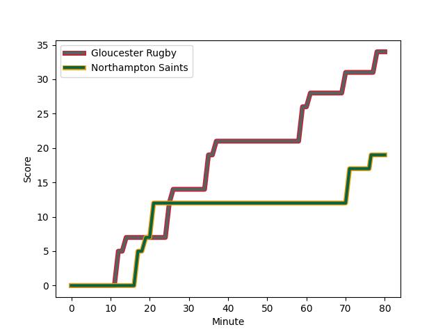
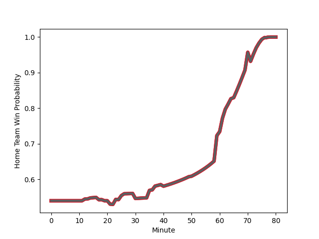

---  
layout: page  
title: Northampton Saints at Gloucester Rugby; 19-34  
date: 2022-12-03 12:30:00 18:00:00 -0500  
categories: match review  
---
# Northampton Saints (1516.15) at Gloucester Rugby (1585.37); 19-34

# Prediction: Gloucester Rugby by 9.9

Gloucester Rugby by 6.9 on a neutral field
## Scores over Time

## Win Probability over Time

# Pre-Match Prediction: Gloucester Rugby by 9.5

Gloucester Rugby by 6.5 on a neutral pitch

|   Away Minutes | Away Player                                                             |   Away elo |   Away Percentile |   Number |   Home Percentile |   Home elo | Home Player                                                         |   Home Minutes |
|---------------:|:------------------------------------------------------------------------|-----------:|------------------:|---------:|------------------:|-----------:|:--------------------------------------------------------------------|---------------:|
|             62 | [Alex Waller](..//playerfiles//AlexWaller_cleaned.md)                   |     131.49 |                99 |        1 |                78 |     103.98 | [Val Rapava-Ruskin](..//playerfiles//ValRapava-Ruskin_cleaned.md)   |             75 |
|             71 | [Sam Matavesi](..//playerfiles//SamMatavesi_cleaned.md)                 |      99.46 |                67 |        2 |                72 |     101.02 | [Jack Singleton](..//playerfiles//JackSingleton_cleaned.md)         |             32 |
|             64 | [Paul Hill](..//playerfiles//PaulHill_cleaned.md)                       |     104.36 |                79 |        3 |                10 |      84.57 | [Fraser Balmain](..//playerfiles//FraserBalmain_cleaned.md)         |             80 |
|             74 | [Lukhan Salakaia-Loto](..//playerfiles//LukhanSalakaia-Loto_cleaned.md) |      88.97 |                24 |        4 |                84 |     107.43 | [Freddie Clarke](..//playerfiles//FreddieClarke_cleaned.md)         |             80 |
|             50 | [Alex Moon](..//playerfiles//AlexMoon_cleaned.md)                       |     104.59 |                79 |        5 |                93 |     117.03 | [Matias Alemanno](..//playerfiles//MatiasAlemanno_cleaned.md)       |             80 |
|             80 | [Alex Coles](..//playerfiles//AlexColes_cleaned.md)                     |      78.12 |                 4 |        6 |                97 |     124.09 | [Ruan Ackermann](..//playerfiles//RuanAckermann_cleaned.md)         |             80 |
|             80 | [Lewis Ludlam](..//playerfiles//LewisLudlam_cleaned.md)                 |      99.53 |                64 |        7 |                84 |     108.01 | [Lewis Ludlow](..//playerfiles//LewisLudlow_cleaned.md)             |             80 |
|             80 | [Juarno Augustus](..//playerfiles//JuarnoAugustus_cleaned.md)           |      91.16 |                32 |        8 |                83 |     108.87 | [Ben Morgan](..//playerfiles//BenMorgan_cleaned.md)                 |             80 |
|             80 | [Alex Mitchell](..//playerfiles//AlexMitchell_cleaned.md)               |     110.4  |                88 |        9 |                 6 |      80.55 | [Stephen Varney](..//playerfiles//StephenVarney_cleaned.md)         |             80 |
|             65 | [Fin Smith](..//playerfiles//FinSmith_cleaned.md)                       |      89.02 |                21 |       10 |                95 |     124.88 | [Santiago Carreras](..//playerfiles//SantiagoCarreras_cleaned.md)   |             80 |
|             80 | [Tommy Freeman](..//playerfiles//TommyFreeman_cleaned.md)               |     115.29 |                92 |       11 |                81 |     106.41 | [Jonny May](..//playerfiles//JonnyMay_cleaned.md)                   |             80 |
|             40 | [Rory Hutchinson](..//playerfiles//RoryHutchinson_cleaned.md)           |      95.88 |                49 |       12 |                28 |      89.93 | [Sebastien Atkinson](..//playerfiles//SebastienAtkinson_cleaned.md) |             80 |
|             80 | [Fraser Dingwall](..//playerfiles//FraserDingwall_cleaned.md)           |      81.46 |                 9 |       13 |                86 |     111.22 | [Chris Harris](..//playerfiles//ChrisHarris_cleaned.md)             |             80 |
|             80 | [James Ramm](..//playerfiles//JamesRamm_cleaned.md)                     |     108.1  |               nan |       14 |                56 |      97.22 | [Louis Rees-Zammit](..//playerfiles//LouisRees-Zammit_cleaned.md)   |             80 |
|             80 | [George Furbank](..//playerfiles//GeorgeFurbank_cleaned.md)             |     115.27 |                92 |       15 |                94 |     120.78 | [Lloyd Evans](..//playerfiles//LloydEvans_cleaned.md)               |             77 |
|              9 | [Robbie Smith](..//playerfiles//RobbieSmith_cleaned.md)                 |      78.42 |               nan |       16 |                72 |     101.55 | [Santiago Socino](..//playerfiles//SantiagoSocino_cleaned.md)       |             48 |
|             18 | [Emmanuel Iyogun](..//playerfiles//EmmanuelIyogun_cleaned.md)           |     103.37 |                80 |       17 |                77 |     103.41 | [Harry Elrington](..//playerfiles//HarryElrington_cleaned.md)       |              5 |
|             16 | [Alfie Petch](..//playerfiles//AlfiePetch_cleaned.md)                   |      77.6  |                 4 |       18 |                27 |      88.1  | [Ciaran Knight](..//playerfiles//CiaranKnight_cleaned.md)           |              0 |
|             30 | [David Ribbans](..//playerfiles//DavidRibbans_cleaned.md)               |     108.96 |                89 |       19 |                91 |     113.4  | [Cameron Jordan](..//playerfiles//CameronJordan_cleaned.md)         |              0 |
|              6 | [Angus Scott-Young](..//playerfiles//AngusScott-Young_cleaned.md)       |     112.65 |                90 |       20 |                52 |      96.01 | [Jake Polledri](..//playerfiles//JakePolledri_cleaned.md)           |              0 |
|              0 | [Tom James](..//playerfiles//TomJames_cleaned.md)                       |      88.01 |                18 |       21 |                70 |     100.84 | [Charlie Chapman](..//playerfiles//CharlieChapman_cleaned.md)       |              0 |
|             15 | [Tom Collins](..//playerfiles//TomCollins_cleaned.md)                   |     128.17 |                98 |       22 |                88 |     112.74 | [Billy Twelvetrees](..//playerfiles//BillyTwelvetrees_cleaned.md)   |              0 |
|             40 | [Matt Proctor](..//playerfiles//MattProctor_cleaned.md)                 |     108.52 |                84 |       23 |                57 |      96.75 | [Alex Hearle](..//playerfiles//AlexHearle_cleaned.md)               |              3 |

