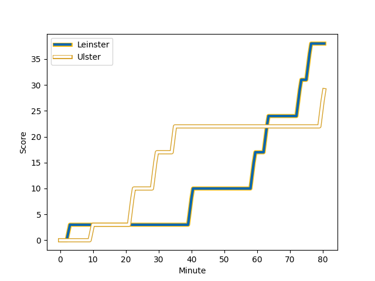
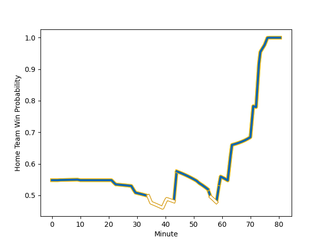

---  
layout: page  
title: Ulster at Leinster; 29-38  
date: 2022-12-03 20:35:00 18:00:00 -0500  
categories: match review  
---
# Ulster (1626.41) at Leinster (1710.15); 29-38

# Prediction: Leinster by 11.4

Leinster by 8.4 on a neutral field
## Scores over Time

## Win Probability over Time

# Pre-Match Prediction: Leinster by 12.2

Leinster by 9.2 on a neutral pitch

|   Away Minutes | Away Player                                                     |   Away elo |   Away Percentile |   Number |   Home Percentile |   Home elo | Home Player                                                           |   Home Minutes |
|---------------:|:----------------------------------------------------------------|-----------:|------------------:|---------:|------------------:|-----------:|:----------------------------------------------------------------------|---------------:|
|             72 | [Andrew Warwick](..//playerfiles//AndrewWarwick_cleaned.md)     |     100.92 |                72 |        1 |                95 |     114.89 | [Cian Healy](..//playerfiles//CianHealy_cleaned.md)                   |             80 |
|             20 | [Tom Stewart](..//playerfiles//TomStewart_cleaned.md)           |      96.99 |                58 |        2 |                96 |     118.7  | [Ronan Kelleher](..//playerfiles//RonanKelleher_cleaned.md)           |             44 |
|             52 | [Marty Moore](..//playerfiles//MartyMoore_cleaned.md)           |     104    |                78 |        3 |                72 |     101.62 | [Michael Alaalatoa](..//playerfiles//MichaelAlaalatoa_cleaned.md)     |             44 |
|             80 | [Alan O'Connor](..//playerfiles//AlanO'Connor_cleaned.md)       |     118.35 |                94 |        4 |                92 |     115.55 | [James Ryan](..//playerfiles//JamesRyan_cleaned.md)                   |             80 |
|             52 | [Kieran Treadwell](..//playerfiles//KieranTreadwell_cleaned.md) |      98.41 |                61 |        5 |                54 |      97.09 | [Jason Jenkins](..//playerfiles//JasonJenkins_cleaned.md)             |             65 |
|             56 | [Iain Henderson](..//playerfiles//IainHenderson_cleaned.md)     |     104.65 |                81 |        6 |                85 |     109.02 | [Ryan Baird](..//playerfiles//RyanBaird_cleaned.md)                   |             80 |
|             80 | [Marcus Rea](..//playerfiles//MarcusRea_cleaned.md)             |     114.26 |                92 |        7 |                97 |     124.22 | [Josh van der Flier](..//playerfiles//JoshvanderFlier_cleaned.md)     |             80 |
|             73 | [Nick Timoney](..//playerfiles//NickTimoney_cleaned.md)         |     110    |                88 |        8 |                94 |     122.61 | [Jack Conan](..//playerfiles//JackConan_cleaned.md)                   |             56 |
|             44 | [John Cooney](..//playerfiles//JohnCooney_cleaned.md)           |     111.87 |                88 |        9 |                92 |     114.56 | [Jamison Gibson-Park](..//playerfiles//JamisonGibson-Park_cleaned.md) |             72 |
|             80 | [Billy Burns](..//playerfiles//BillyBurns_cleaned.md)           |     116.88 |                91 |       10 |                75 |     104.63 | [Ross Byrne](..//playerfiles//RossByrne_cleaned.md)                   |             77 |
|             80 | [Stewart Moore](..//playerfiles//StewartMoore_cleaned.md)       |     111.69 |                87 |       11 |                99 |     155.47 | [James Lowe](..//playerfiles//JamesLowe_cleaned.md)                   |             80 |
|             80 | [Stuart McCloskey](..//playerfiles//StuartMcCloskey_cleaned.md) |     130.08 |                98 |       12 |                74 |     104.46 | [Jamie Osborne](..//playerfiles//JamieOsborne_cleaned.md)             |             80 |
|             71 | [James Hume](..//playerfiles//JamesHume_cleaned.md)             |      99.4  |                62 |       13 |                73 |     103.11 | [Garry Ringrose](..//playerfiles//GarryRingrose_cleaned.md)           |             77 |
|             80 | [Ethan McIlroy](..//playerfiles//EthanMcIlroy_cleaned.md)       |     104.05 |                78 |       14 |                89 |     111.91 | [Jimmy O'Brien](..//playerfiles//JimmyO'Brien_cleaned.md)             |             25 |
|             80 | [Michael Lowry](..//playerfiles//MichaelLowry_cleaned.md)       |     100.52 |                65 |       15 |                94 |     121.27 | [Hugo Keenan](..//playerfiles//HugoKeenan_cleaned.md)                 |             80 |
|             60 | [Rob Herring](..//playerfiles//RobHerring_cleaned.md)           |     103.83 |                78 |       16 |                74 |     102.44 | [Andrew Porter](..//playerfiles//AndrewPorter_cleaned.md)             |             55 |
|             36 | [Nathan Doak](..//playerfiles//NathanDoak_cleaned.md)           |      90.03 |                24 |       17 |                57 |      96.99 | [Dan Sheehan](..//playerfiles//DanSheehan_cleaned.md)                 |             36 |
|             28 | [Sam Carter](..//playerfiles//SamCarter_cleaned.md)             |     110.67 |                88 |       18 |                92 |     112.41 | [Tadhg Furlong](..//playerfiles//TadhgFurlong_cleaned.md)             |             36 |
|             28 | [Tom O'Toole](..//playerfiles//TomO'Toole_cleaned.md)           |      96.06 |                49 |       19 |                92 |     118.95 | [Caelan Doris](..//playerfiles//CaelanDoris_cleaned.md)               |             24 |
|             24 | [Duane Vermeulen](..//playerfiles//DuaneVermeulen_cleaned.md)   |     135.09 |                98 |       20 |                97 |     127.69 | [Ross Molony](..//playerfiles//RossMolony_cleaned.md)                 |             15 |
|              9 | [Jacob Stockdale](..//playerfiles//JacobStockdale_cleaned.md)   |     106.78 |                82 |       21 |                48 |      95.07 | [Nick McCarthy](..//playerfiles//NickMcCarthy_cleaned.md)             |              8 |
|              8 | [Callum Reid](..//playerfiles//CallumReid_cleaned.md)           |      94.3  |                43 |       22 |                80 |     106.77 | [Liam Turner](..//playerfiles//LiamTurner_cleaned.md)                 |              3 |
|              7 | [Matthew Rea](..//playerfiles//MatthewRea_cleaned.md)           |      89.39 |                23 |       23 |               nan |      95.4  | [Charlie Tector](..//playerfiles//CharlieTector_cleaned.md)           |              3 |

