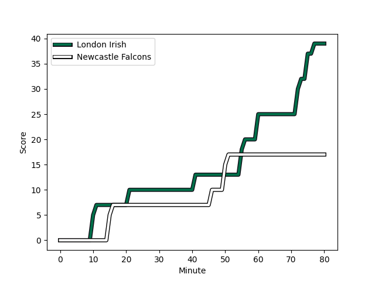
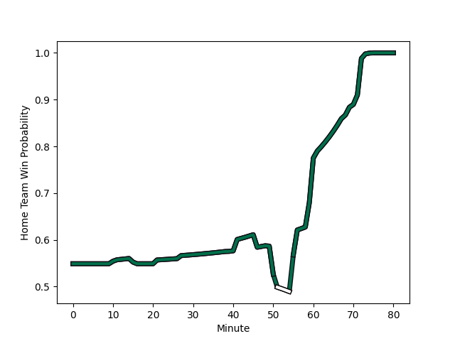

---  
layout: page  
title: Newcastle Falcons at London Irish; 17-39  
date: 2022-12-03 10:00:00 18:00:00 -0500  
categories: match review  
---
# Newcastle Falcons (1475.09) at London Irish (1560.37); 17-39

# Prediction: London Irish by 11.5

London Irish by 8.5 on a neutral field
## Scores over Time

## Win Probability over Time

# Pre-Match Prediction: London Irish by 9.6

London Irish by 6.6 on a neutral pitch

|   Away Minutes | Away Player                                                          |   Away elo |   Away Percentile |   Number |   Home Percentile |   Home elo | Home Player                                                                       |   Home Minutes |
|---------------:|:---------------------------------------------------------------------|-----------:|------------------:|---------:|------------------:|-----------:|:----------------------------------------------------------------------------------|---------------:|
|             80 | [Adam Brocklebank](..//playerfiles//AdamBrocklebank_cleaned.md)      |      93.17 |                37 |        1 |                35 |      92.79 | [Facundo Gigena](..//playerfiles//FacundoGigena_cleaned.md)                       |             39 |
|             61 | [George McGuigan](..//playerfiles//GeorgeMcGuigan_cleaned.md)        |     105.72 |                82 |        2 |                86 |     107.05 | [Agustin Creevy](..//playerfiles//AgustinCreevy_cleaned.md)                       |             49 |
|             56 | [Richard Palframan](..//playerfiles//RichardPalframan_cleaned.md)    |      99.89 |                67 |        3 |                46 |      94.9  | [Lovejoy Chawatama](..//playerfiles//LovejoyChawatama_cleaned.md)                 |             59 |
|             80 | [Greg Peterson](..//playerfiles//GregPeterson_cleaned.md)            |      77.72 |                 6 |        4 |                76 |     102.99 | [Api Ratuniyarawa](..//playerfiles//ApiRatuniyarawa_cleaned.md)                   |             56 |
|             80 | [Sebastian de Chaves](..//playerfiles//SebastiandeChaves_cleaned.md) |      97.52 |                58 |        5 |                62 |      98.57 | [Chunya Munga](..//playerfiles//ChunyaMunga_cleaned.md)                           |             75 |
|             80 | [Callum Chick](..//playerfiles//CallumChick_cleaned.md)              |      95.66 |                50 |        6 |                93 |     115.24 | [Matt Rogerson](..//playerfiles//MattRogerson_cleaned.md)                         |             80 |
|             77 | [Guy Pepper](..//playerfiles//GuyPepper_cleaned.md)                  |      98.23 |                60 |        7 |                89 |     112.39 | [Juan Martin Gonzalez](..//playerfiles//JuanMartinGonzalez_cleaned.md)            |             68 |
|             27 | [Carl Fearns](..//playerfiles//CarlFearns_cleaned.md)                |     101.28 |                64 |        8 |                58 |      97.84 | [Josh Basham](..//playerfiles//JoshBasham_cleaned.md)                             |             80 |
|             59 | [Michael Young](..//playerfiles//MichaelYoung_cleaned.md)            |     123.7  |                97 |        9 |                81 |     109.23 | [Ben White](..//playerfiles//BenWhite_cleaned.md)                                 |             70 |
|             73 | [Brett Connon](..//playerfiles//BrettConnon_cleaned.md)              |      78.87 |                 5 |       10 |                85 |     110.31 | [Paddy Jackson](..//playerfiles//PaddyJackson_cleaned.md)                         |             80 |
|             70 | [Mateo Carreras](..//playerfiles//MateoCarreras_cleaned.md)          |      93.88 |                42 |       11 |                49 |      95.67 | [Ollie Hassell-Collins](..//playerfiles//OllieHassell-Collins_cleaned.md)         |             80 |
|             80 | [Matias Moroni](..//playerfiles//MatiasMoroni_cleaned.md)            |     115.04 |                91 |       12 |                93 |     117.56 | [Luca Morisi](..//playerfiles//LucaMorisi_cleaned.md)                             |             80 |
|             80 | [Ben Stevenson](..//playerfiles//BenStevenson_cleaned.md)            |      99.61 |                66 |       13 |                53 |      96.86 | [Will Joseph](..//playerfiles//WillJoseph_cleaned.md)                             |             80 |
|             80 | [Adam Radwan](..//playerfiles//AdamRadwan_cleaned.md)                |     119.7  |                95 |       14 |                85 |     109.27 | [Ben Loader](..//playerfiles//BenLoader_cleaned.md)                               |             80 |
|             80 | [Elliott Obatoyinbo](..//playerfiles//ElliottObatoyinbo_cleaned.md)  |      93.48 |                44 |       15 |                50 |      95.97 | [James Stokes](..//playerfiles//JamesStokes_cleaned.md)                           |             56 |
|             19 | [Jamie Blamire](..//playerfiles//JamieBlamire_cleaned.md)            |      94.89 |                48 |       16 |                73 |     103.58 | [Mike Willemse](..//playerfiles//MikeWillemse_cleaned.md)                         |             31 |
|              0 | [Conrad Cade](..//playerfiles//ConradCade_cleaned.md)                |      95.8  |               nan |       17 |                26 |      91.86 | [Danilo Fischetti](..//playerfiles//DaniloFischetti_cleaned.md)                   |             41 |
|             24 | [Mark Tampin](..//playerfiles//MarkTampin_cleaned.md)                |      91.59 |                21 |       18 |                94 |     115.11 | [Oli Hoskins](..//playerfiles//OliHoskins_cleaned.md)                             |             21 |
|             53 | [Matthew Dalton](..//playerfiles//MatthewDalton_cleaned.md)          |      93.66 |                43 |       19 |               nan |      91.17 | [Josh Caulfield](..//playerfiles//JoshCaulfield_cleaned.md)                       |              5 |
|              3 | [Tom Marshall](..//playerfiles//TomMarshall_cleaned.md)              |      94.61 |               nan |       20 |                96 |     122.24 | [Adam Coleman](..//playerfiles//AdamColeman_cleaned.md)                           |             24 |
|             21 | [Sam Stuart](..//playerfiles//SamStuart_cleaned.md)                  |      75.72 |                 2 |       21 |                50 |      95.14 | [Chandler Cunningham-South](..//playerfiles//ChandlerCunningham-South_cleaned.md) |             12 |
|              7 | [Tian Schoeman](..//playerfiles//TianSchoeman_cleaned.md)            |     102.14 |                71 |       22 |                50 |      95.75 | [Joe Powell](..//playerfiles//JoePowell_cleaned.md)                               |             10 |
|             10 | [Tom Penny](..//playerfiles//TomPenny_cleaned.md)                    |     113.17 |                89 |       23 |                39 |      93.32 | [Lucio Cinti](..//playerfiles//LucioCinti_cleaned.md)                             |             24 |

