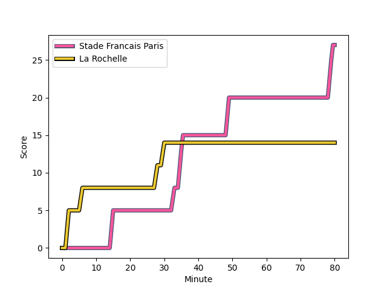
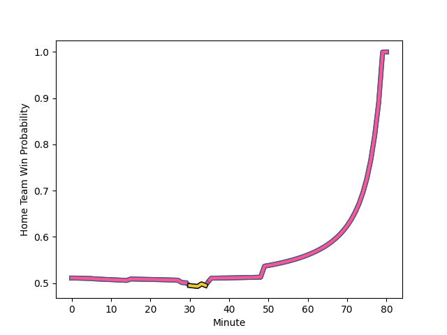

---  
layout: page  
title: La Rochelle at Stade Francais Paris; 14-27  
date: 2022-12-03 21:00:00 18:00:00 -0500  
categories: match review  
---
# La Rochelle (1527.2) at Stade Francais Paris (1546.56); 14-27

# Prediction: Stade Francais Paris by 4.9

Stade Francais Paris by 1.9 on a neutral field
## Scores over Time

## Win Probability over Time

# Pre-Match Prediction: Stade Francais Paris by 5.1

Stade Francais Paris by 2.1 on a neutral pitch

|   Away Minutes | Away Player                                                            |   Away elo |   Away Percentile |   Number |   Home Percentile |   Home elo | Home Player                                                                   |   Home Minutes |
|---------------:|:-----------------------------------------------------------------------|-----------:|------------------:|---------:|------------------:|-----------:|:------------------------------------------------------------------------------|---------------:|
|             59 | [Reda Wardi](..//playerfiles//RedaWardi_cleaned.md)                    |     110.78 |                90 |        1 |                73 |     102.21 | [Clement Castets](..//playerfiles//ClementCastets_cleaned.md)                 |             61 |
|             57 | [Pierre Bourgarit](..//playerfiles//PierreBourgarit_cleaned.md)        |     106.64 |                84 |        2 |                40 |      92.95 | [Mickael Ivaldi](..//playerfiles//MickaelIvaldi_cleaned.md)                   |             61 |
|             34 | [Aleksandre Kuntelia](..//playerfiles//AleksandreKuntelia_cleaned.md)  |      95.48 |               nan |        3 |                75 |     102.58 | [Giorgi Melikidze](..//playerfiles//GiorgiMelikidze_cleaned.md)               |             61 |
|             57 | [Thomas Lavault](..//playerfiles//ThomasLavault_cleaned.md)            |     103.89 |                78 |        4 |                50 |      95.14 | [Paul Gabrillagues](..//playerfiles//PaulGabrillagues_cleaned.md)             |             52 |
|             80 | [Remi Picquette](..//playerfiles//RemiPicquette_cleaned.md)            |      99.71 |                67 |        5 |                38 |      92.5  | [Baptiste Pesenti](..//playerfiles//BaptistePesenti_cleaned.md)               |             80 |
|             57 | [Ultan Dillane](..//playerfiles//UltanDillane_cleaned.md)              |     106.56 |                80 |        6 |                34 |      91.76 | [Romain Briatte](..//playerfiles//RomainBriatte_cleaned.md)                   |             80 |
|             57 | [Kyle Hatherell](..//playerfiles//KyleHatherell_cleaned.md)            |      80.71 |                 6 |        7 |                72 |     102.28 | [Sekou Macalou](..//playerfiles//SekouMacalou_cleaned.md)                     |             65 |
|             80 | [Gregory Alldritt](..//playerfiles//GregoryAlldritt_cleaned.md)        |     119.43 |                92 |        8 |                95 |     125.07 | [Giovanni Habel-Kueffner](..//playerfiles//GiovanniHabel-Kueffner_cleaned.md) |             80 |
|             49 | [Thomas Berjon](..//playerfiles//ThomasBerjon_cleaned.md)              |      92.7  |                33 |        9 |                13 |      86.03 | [Morgan Parra](..//playerfiles//MorganParra_cleaned.md)                       |             64 |
|             80 | [Antoine Hastoy](..//playerfiles//AntoineHastoy_cleaned.md)            |      85.14 |                13 |       10 |                93 |     120.73 | [Joris Segonds](..//playerfiles//JorisSegonds_cleaned.md)                     |             80 |
|             80 | [Pierre Boudehent](..//playerfiles//PierreBoudehent_cleaned.md)        |      91.28 |                32 |       11 |                94 |     117.82 | [Stéphane Ahmed](..//playerfiles//StéphaneAhmed_cleaned.md)                   |             45 |
|             80 | [Levani Botia Veivuke](..//playerfiles//LevaniBotiaVeivuke_cleaned.md) |     128.95 |                98 |       12 |                92 |     116.77 | [Julien Delbouis](..//playerfiles//JulienDelbouis_cleaned.md)                 |             66 |
|             80 | [Ulupano Seuteni](..//playerfiles//UlupanoSeuteni_cleaned.md)          |      95.1  |                44 |       13 |                76 |     104.1  | [Jeremy Ward](..//playerfiles//JeremyWard_cleaned.md)                         |             80 |
|             80 | [Martin Alonso Munoz](..//playerfiles//MartinAlonsoMunoz_cleaned.md)   |      92.88 |                35 |       14 |                93 |     117.4  | [Lester Etien](..//playerfiles//LesterEtien_cleaned.md)                       |             80 |
|             49 | [Brice Dulin](..//playerfiles//BriceDulin_cleaned.md)                  |     113.39 |                90 |       15 |                31 |      91.4  | [Sione Tui](..//playerfiles//SioneTui_cleaned.md)                             |             80 |
|             46 | [Joel Sclavi](..//playerfiles//JoelSclavi_cleaned.md)                  |     104.11 |                75 |       16 |                69 |     101.83 | [Leo Barre](..//playerfiles//LeoBarre_cleaned.md)                             |             35 |
|             31 | [Tawera Kerr-Barlow](..//playerfiles//TaweraKerr-Barlow_cleaned.md)    |     127.75 |                98 |       17 |                83 |     105.6  | [JJ van der Mescht](..//playerfiles//JJvanderMescht_cleaned.md)               |             28 |
|             31 | [Victor Olivier](..//playerfiles//VictorOlivier_cleaned.md)            |      98.01 |               nan |       18 |                12 |      85.95 | [Laurent Panis](..//playerfiles//LaurentPanis_cleaned.md)                     |             19 |
|             23 | [Romain Sazy](..//playerfiles//RomainSazy_cleaned.md)                  |      95.19 |                44 |       19 |                59 |      96.57 | [Moses Alo-Emile](..//playerfiles//MosesAlo-Emile_cleaned.md)                 |             19 |
|             23 | [Remi Bourdeau](..//playerfiles//RemiBourdeau_cleaned.md)              |     112.75 |                90 |       20 |                50 |      94.07 | [Vincent Koch](..//playerfiles//VincentKoch_cleaned.md)                       |             19 |
|             23 | [Quentin Lespiaucq](..//playerfiles//QuentinLespiaucq_cleaned.md)      |      86.2  |                10 |       21 |                94 |     118.65 | [James Hall](..//playerfiles//JamesHall_cleaned.md)                           |             16 |
|             23 | [Paul Boudehent](..//playerfiles//PaulBoudehent_cleaned.md)            |      92.51 |                37 |       22 |                 5 |      79.1  | [Mathieu Hirigoyen](..//playerfiles//MathieuHirigoyen_cleaned.md)             |             15 |
|             21 | [Leo Aouf](..//playerfiles//LeoAouf_cleaned.md)                        |      92.43 |                35 |       23 |                11 |      82.52 | [Alex Arrate](..//playerfiles//AlexArrate_cleaned.md)                         |             14 |

