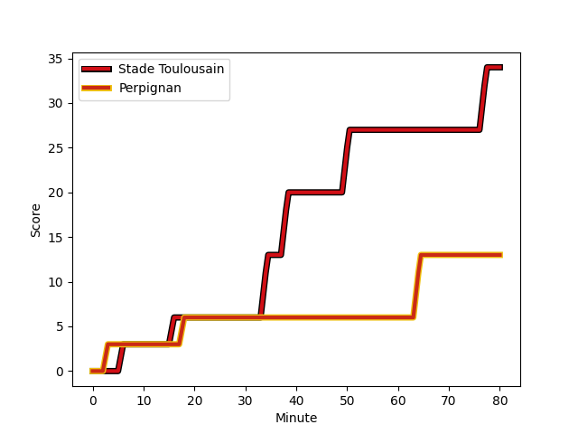
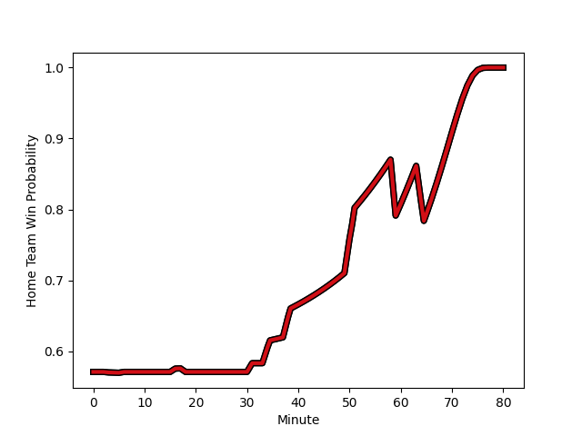

---  
layout: page  
title: Perpignan at Stade Toulousain; 13-34  
date: 2022-12-03 17:00:00 18:00:00 -0500  
categories: match review  
---
# Perpignan (1468.74) at Stade Toulousain (1592.68); 13-34

# Prediction: Stade Toulousain by 15.4

Stade Toulousain by 12.4 on a neutral field
## Scores over Time

## Win Probability over Time

# Pre-Match Prediction: Stade Toulousain by 14.1

Stade Toulousain by 11.1 on a neutral pitch

|   Away Minutes | Away Player                                                             |   Away elo |   Away Percentile |   Number |   Home Percentile |   Home elo | Home Player                                                       |   Home Minutes |
|---------------:|:------------------------------------------------------------------------|-----------:|------------------:|---------:|------------------:|-----------:|:------------------------------------------------------------------|---------------:|
|             31 | [Sacha Lotrian](..//playerfiles//SachaLotrian_cleaned.md)               |     103.61 |                80 |        1 |                 6 |      81.81 | [Rodrigue Neti](..//playerfiles//RodrigueNeti_cleaned.md)         |             51 |
|             51 | [Mike Tadjer Barbosa](..//playerfiles//MikeTadjerBarbosa_cleaned.md)    |      85.97 |                13 |        2 |                93 |     112.62 | [Peato Mauvaka](..//playerfiles//PeatoMauvaka_cleaned.md)         |             51 |
|             51 | [Siua Halanukonuka](..//playerfiles//SiuaHalanukonuka_cleaned.md)       |     104.48 |                79 |        3 |                93 |     113.13 | [Dorian Aldegheri](..//playerfiles//DorianAldegheri_cleaned.md)   |             51 |
|             51 | [Shahn Eru](..//playerfiles//ShahnEru_cleaned.md)                       |      83.76 |                13 |        4 |                12 |      81.41 | [Richie Arnold](..//playerfiles//RichieArnold_cleaned.md)         |             80 |
|             80 | [Victor Moreaux](..//playerfiles//VictorMoreaux_cleaned.md)             |      83.76 |                13 |        5 |                23 |      88.56 | [Emmanuel Meafou](..//playerfiles//EmmanuelMeafou_cleaned.md)     |             51 |
|             80 | [Brad Shields](..//playerfiles//BradShields_cleaned.md)                 |     113.41 |                91 |        6 |                85 |     108.31 | [Alban Placines](..//playerfiles//AlbanPlacines_cleaned.md)       |             51 |
|             59 | [Kelian Galletier](..//playerfiles//KelianGalletier_cleaned.md)         |      88.79 |                23 |        7 |                95 |     116.45 | [Jack Willis](..//playerfiles//JackWillis_cleaned.md)             |             80 |
|             51 | [Genesis Mamea Lemalu](..//playerfiles//GenesisMameaLemalu_cleaned.md)  |     104.47 |                74 |        8 |                95 |     125.39 | [Alexandre Roumat](..//playerfiles//AlexandreRoumat_cleaned.md)   |             51 |
|             59 | [Sadek Deghmache](..//playerfiles//SadekDeghmache_cleaned.md)           |      83.62 |                 9 |        9 |                29 |      91.09 | [Martin Page-Relo](..//playerfiles//MartinPage-Relo_cleaned.md)   |             53 |
|             80 | [Tristan Tedder](..//playerfiles//TristanTedder_cleaned.md)             |      84.65 |                15 |       10 |                81 |     108.14 | [Romain Ntamack](..//playerfiles//RomainNtamack_cleaned.md)       |             80 |
|             80 | [Alivereti Duguivalu](..//playerfiles//AliveretiDuguivalu_cleaned.md)   |      90.63 |                28 |       11 |                98 |     126.84 | [Matthis Lebel](..//playerfiles//MatthisLebel_cleaned.md)         |             80 |
|             59 | [Jeronimo de la Fuente](..//playerfiles//JeronimodelaFuente_cleaned.md) |     115.58 |                91 |       12 |                50 |      96.08 | [Pita Ahki](..//playerfiles//PitaAhki_cleaned.md)                 |             51 |
|             80 | [Afusipa Taumoepeau](..//playerfiles//AfusipaTaumoepeau_cleaned.md)     |     114.83 |                90 |       13 |                55 |      97.01 | [Dimitri Delibes](..//playerfiles//DimitriDelibes_cleaned.md)     |             80 |
|             80 | [George Tilsley](..//playerfiles//GeorgeTilsley_cleaned.md)             |     107.14 |                82 |       14 |                78 |     106.64 | [Ange Capuozzo](..//playerfiles//AngeCapuozzo_cleaned.md)         |             80 |
|             80 | [Ali Crossdale](..//playerfiles//AliCrossdale_cleaned.md)               |      97.38 |                56 |       15 |                94 |     119.9  | [Thomas Ramos](..//playerfiles//ThomasRamos_cleaned.md)           |             80 |
|             49 | [Giorgi Tetrashvili](..//playerfiles//GiorgiTetrashvili_cleaned.md)     |      84.04 |                 9 |       16 |                71 |     101.12 | [David Ainu'u](..//playerfiles//DavidAinu'u_cleaned.md)           |             29 |
|             29 | [Victor Montgaillard](..//playerfiles//VictorMontgaillard_cleaned.md)   |      89.6  |                23 |       17 |                81 |     105.61 | [Julien Marchand](..//playerfiles//JulienMarchand_cleaned.md)     |             29 |
|             29 | [Piula Faasalele](..//playerfiles//PiulaFaasalele_cleaned.md)           |     101.51 |                72 |       18 |                97 |     123.93 | [Antoine Dupont](..//playerfiles//AntoineDupont_cleaned.md)       |             29 |
|             29 | [Ma'afu Fia](..//playerfiles//Ma'afuFia_cleaned.md)                     |     106.44 |                82 |       19 |                99 |     130.61 | [Charlie Faumuina](..//playerfiles//CharlieFaumuina_cleaned.md)   |             29 |
|             21 | [Matteo Rodor](..//playerfiles//MatteoRodor_cleaned.md)                 |      93.97 |                41 |       20 |                81 |     106.03 | [Anthony Jelonch](..//playerfiles//AnthonyJelonch_cleaned.md)     |             29 |
|             21 | [Lucas Velarte](..//playerfiles//LucasVelarte_cleaned.md)               |      88.99 |                31 |       21 |                51 |      95.58 | [Yannick Youyoutte](..//playerfiles//YannickYouyoutte_cleaned.md) |             29 |
|             29 | [Joaquin Oviedo](..//playerfiles//JoaquinOviedo_cleaned.md)             |     108.31 |                82 |       22 |                85 |     108.57 | [Rynhardt Elstadt](..//playerfiles//RynhardtElstadt_cleaned.md)   |             29 |
|             21 | [Mathieu Acebes](..//playerfiles//MathieuAcebes_cleaned.md)             |     138.5  |                99 |       23 |                68 |      99.36 | [Lucas Tauzin](..//playerfiles//LucasTauzin_cleaned.md)           |             27 |

