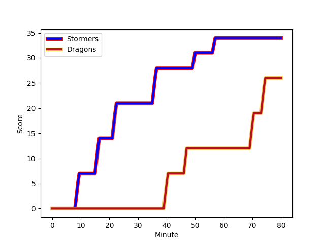
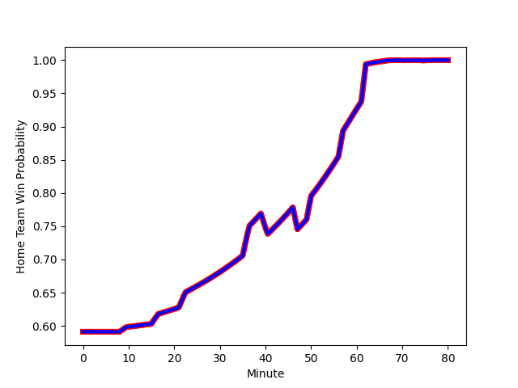

---  
layout: page  
title: Dragons at Stormers; 26-34  
date: 2022-12-03 13:00:00 18:00:00 -0500  
categories: match review  
---
# Dragons (1473.45) at Stormers (1633.71); 26-34

# Prediction: Stormers by 19.0

Stormers by 16.0 on a neutral field
## Scores over Time

## Win Probability over Time

# Pre-Match Prediction: Stormers by 15.9

Stormers by 12.9 on a neutral pitch

|   Away Minutes | Away Player                                                       |   Away elo |   Away Percentile |   Number |   Home Percentile |   Home elo | Home Player                                                                      |   Home Minutes |
|---------------:|:------------------------------------------------------------------|-----------:|------------------:|---------:|------------------:|-----------:|:---------------------------------------------------------------------------------|---------------:|
|             72 | [Aki Seiuli](..//playerfiles//AkiSeiuli_cleaned.md)               |      95.01 |                46 |        1 |                47 |      95.8  | [Kwenzokuhle Ndumiso Blose](..//playerfiles//KwenzokuhleNdumisoBlose_cleaned.md) |             48 |
|             58 | [Bradley Roberts](..//playerfiles//BradleyRoberts_cleaned.md)     |      92.58 |                42 |        2 |                62 |      97.99 | [Joseph Dweba](..//playerfiles//JosephDweba_cleaned.md)                          |             48 |
|             39 | [Lloyd Fairbrother](..//playerfiles//LloydFairbrother_cleaned.md) |      86.85 |                14 |        3 |                85 |     106.69 | [Neethling Fouche](..//playerfiles//NeethlingFouche_cleaned.md)                  |             80 |
|             80 | [Matthew Screech](..//playerfiles//MatthewScreech_cleaned.md)     |      79.83 |                 7 |        4 |                74 |     102.29 | [Salmaan Moerat](..//playerfiles//SalmaanMoerat_cleaned.md)                      |             80 |
|             80 | [Sean Lonsdale](..//playerfiles//SeanLonsdale_cleaned.md)         |      88.25 |                22 |        5 |                61 |      98.42 | [Marvin Orie](..//playerfiles//MarvinOrie_cleaned.md)                            |             41 |
|             80 | [Huw Taylor](..//playerfiles//HuwTaylor_cleaned.md)               |      79.58 |                 4 |        6 |                62 |      98.81 | [Junior Pokomela](..//playerfiles//JuniorPokomela_cleaned.md)                    |             48 |
|             44 | [Aaron Wainwright](..//playerfiles//AaronWainwright_cleaned.md)   |     106.68 |                82 |        7 |                89 |     111.85 | [Willie Engelbrecht](..//playerfiles//WillieEngelbrecht_cleaned.md)              |             80 |
|             67 | [Ross Moriarty](..//playerfiles//RossMoriarty_cleaned.md)         |     109.07 |                83 |        8 |                89 |     115.02 | [Hacjivah Dayimani](..//playerfiles//HacjivahDayimani_cleaned.md)                |             80 |
|             58 | [Rhodri Williams](..//playerfiles//RhodriWilliams_cleaned.md)     |     112.02 |                89 |        9 |                94 |     116.77 | [Herschel Jantjies](..//playerfiles//HerschelJantjies_cleaned.md)                |             62 |
|             80 | [JJ Hanrahan](..//playerfiles//JJHanrahan_cleaned.md)             |     118.63 |                92 |       10 |                79 |     108.88 | [Manie Libbok](..//playerfiles//ManieLibbok_cleaned.md)                          |             62 |
|             80 | [Jordan Williams](..//playerfiles//JordanWilliams_cleaned.md)     |     106.11 |                75 |       11 |                86 |     110.11 | [Leolin Zas](..//playerfiles//LeolinZas_cleaned.md)                              |             80 |
|             62 | [Max Clark](..//playerfiles//MaxClark_cleaned.md)                 |     114.88 |                90 |       12 |                95 |     120.32 | [Daniel du Plessis](..//playerfiles//DanielduPlessis_cleaned.md)                 |             64 |
|             80 | [Steffan Hughes](..//playerfiles//SteffanHughes_cleaned.md)       |     121.25 |                95 |       13 |                95 |     120.25 | [Ruhan Nel](..//playerfiles//RuhanNel_cleaned.md)                                |             80 |
|             80 | [Sio Tomkinson](..//playerfiles//SioTomkinson_cleaned.md)         |     106.59 |                81 |       14 |                45 |      95.54 | [Tristan Leyds](..//playerfiles//TristanLeyds_cleaned.md)                        |             80 |
|             80 | [Angus O'Brien](..//playerfiles//AngusO'Brien_cleaned.md)         |      78.37 |                 8 |       15 |                92 |     115.65 | [Clayton Blommetjies](..//playerfiles//ClaytonBlommetjies_cleaned.md)            |             80 |
|             41 | [Chris Coleman](..//playerfiles//ChrisColeman_cleaned.md)         |      92.62 |                27 |       16 |                41 |      92.63 | [Connor Evans](..//playerfiles//ConnorEvans_cleaned.md)                          |             39 |
|             36 | [Harrison Keddie](..//playerfiles//HarrisonKeddie_cleaned.md)     |      70.39 |                 1 |       17 |                99 |     145.27 | [Deon Fourie](..//playerfiles//DeonFourie_cleaned.md)                            |             32 |
|             22 | [James Benjamin](..//playerfiles//JamesBenjamin_cleaned.md)       |      91.23 |                31 |       18 |               100 |     143.13 | [Brok Harris](..//playerfiles//BrokHarris_cleaned.md)                            |             32 |
|             18 | [Will Reed](..//playerfiles//WillReed_cleaned.md)                 |      96.2  |                48 |       19 |                44 |      93.26 | [JJ Kotze](..//playerfiles//JJKotze_cleaned.md)                                  |             32 |
|             22 | [Lewis Jones](..//playerfiles//LewisJones_cleaned.md)             |      99.99 |                68 |       20 |                45 |      95.55 | [Kade Wolhuter](..//playerfiles//KadeWolhuter_cleaned.md)                        |             18 |
|             13 | [Ben Fry](..//playerfiles//BenFry_cleaned.md)                     |     103.07 |                74 |       21 |                35 |      92.79 | [Albertus Paul de Wet](..//playerfiles//AlbertusPauldeWet_cleaned.md)            |             18 |
|              8 | [Josh Reynolds](..//playerfiles//JoshReynolds_cleaned.md)         |      94.88 |               nan |       22 |                43 |      94.97 | [Mnombo Zwelendaba](..//playerfiles//MnomboZwelendaba_cleaned.md)                |             16 |

