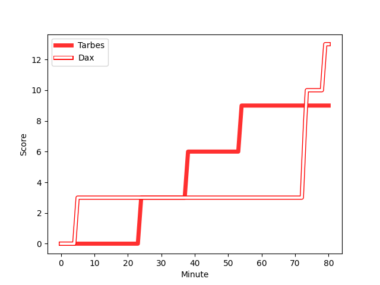
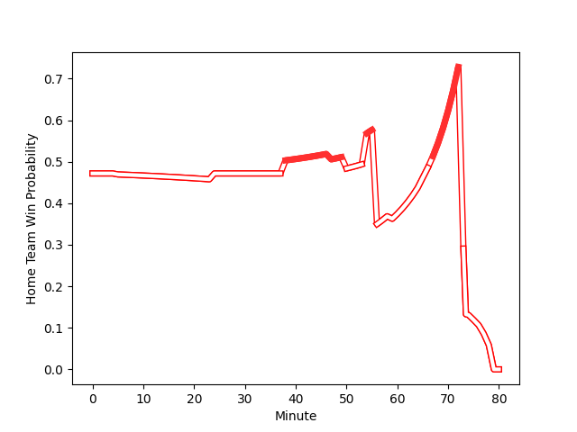

---  
layout: page  
title: Dax at Tarbes; 13-9  
date: 2022-12-03 19:00:00 18:00:00 -0500  
categories: match review  
---
# Dax (1482.75) at Tarbes (1433.58); 13-9

# Prediction: Dax by 1.9

Dax by 4.9 on a neutral field
## Scores over Time

## Win Probability over Time

# Pre-Match Prediction: Dax by 0.8

Dax by 3.8 on a neutral pitch

|   Away Minutes | Away Player                                                                |   Away elo |   Away Percentile |   Number |   Home Percentile |   Home elo | Home Player                                                                      |   Home Minutes |
|---------------:|:---------------------------------------------------------------------------|-----------:|------------------:|---------:|------------------:|-----------:|:---------------------------------------------------------------------------------|---------------:|
|             56 | [Louis Mary](..//playerfiles//LouisMary_cleaned.md)                        |      97.64 |                42 |        1 |                65 |      97.96 | [Antoine Palisse](..//playerfiles//AntoinePalisse_cleaned.md)                    |             47 |
|             56 | [Elvis Levi](..//playerfiles//ElvisLevi_cleaned.md)                        |     106.05 |                80 |        2 |                23 |      87.77 | [Florian Lamothe](..//playerfiles//FlorianLamothe_cleaned.md)                    |             65 |
|             56 | [Diogo Hasse Ferreira](..//playerfiles//DiogoHasseFerreira_cleaned.md)     |      72.76 |                 2 |        3 |                49 |      94.39 | [Aleksi Tchitchiashvili](..//playerfiles//AleksiTchitchiashvili_cleaned.md)      |             47 |
|             80 | [Étienne Loiret](..//playerfiles//ÉtienneLoiret_cleaned.md)                |      96.94 |                52 |        4 |                72 |     100.7  | [Antoine Bousquet](..//playerfiles//AntoineBousquet_cleaned.md)                  |             50 |
|             80 | [Mat Luamanu](..//playerfiles//MatLuamanu_cleaned.md)                      |      89.23 |                26 |        5 |                26 |      89.78 | [Jone Trevor Seuvou](..//playerfiles//JoneTrevorSeuvou_cleaned.md)               |             76 |
|             80 | [Arnaud Aletti](..//playerfiles//ArnaudAletti_cleaned.md)                  |     107.03 |                83 |        6 |                53 |      96.2  | [Mattéo Coustalat](..//playerfiles//MattéoCoustalat_cleaned.md)                  |             80 |
|             52 | [Diaby Doucouré](..//playerfiles//DiabyDoucouré_cleaned.md)                |      90.8  |                22 |        7 |                93 |     116.21 | [Aurelien Ricart](..//playerfiles//AurelienRicart_cleaned.md)                    |             80 |
|             80 | [Brice Ferrer](..//playerfiles//BriceFerrer_cleaned.md)                    |     100.3  |                62 |        8 |                26 |      89.29 | [Gigi Leshkasheli](..//playerfiles//GigiLeshkasheli_cleaned.md)                  |             50 |
|             59 | [Adrien Ayestaran](..//playerfiles//AdrienAyestaran_cleaned.md)            |      81.12 |                 6 |        9 |                96 |     120.74 | [Thomas Lhusero](..//playerfiles//ThomasLhusero_cleaned.md)                      |             80 |
|             59 | [Felipe Berchesi Pisano](..//playerfiles//FelipeBerchesiPisano_cleaned.md) |      97.22 |                51 |       10 |                 8 |      81.88 | [Anthony Fuertes](..//playerfiles//AnthonyFuertes_cleaned.md)                    |             80 |
|             80 | [Rodrigo Marta](..//playerfiles//RodrigoMarta_cleaned.md)                  |     109.11 |                85 |       11 |                86 |     109.92 | [Jonathan Duffau](..//playerfiles//JonathanDuffau_cleaned.md)                    |             80 |
|             80 | [Hugo Fourquet](..//playerfiles//HugoFourquet_cleaned.md)                  |     111.94 |                87 |       12 |                74 |     103.35 | [Josaia Vakacegu](..//playerfiles//JosaiaVakacegu_cleaned.md)                    |             80 |
|             74 | [Sylvère Reteau](..//playerfiles//SylvèreReteau_cleaned.md)                |     112.96 |                87 |       13 |               nan |      93.18 | [Théo Belair](..//playerfiles//ThéoBelair_cleaned.md)                            |             80 |
|             80 | [Guillaume Bouche](..//playerfiles//GuillaumeBouche_cleaned.md)            |      97.05 |                51 |       14 |                 1 |      71.14 | [Maxime Oltmann](..//playerfiles//MaximeOltmann_cleaned.md)                      |             80 |
|             80 | [Théo Gatelier](..//playerfiles//ThéoGatelier_cleaned.md)                  |      98.3  |                61 |       15 |                37 |      92.13 | [Thibaut Trotta](..//playerfiles//ThibautTrotta_cleaned.md)                      |             51 |
|             28 | [Paul Arnaud Ausset](..//playerfiles//PaulArnaudAusset_cleaned.md)         |     103.84 |                76 |       16 |                11 |      85.22 | [Johan Mees Erasmus](..//playerfiles//JohanMeesErasmus_cleaned.md)               |             33 |
|             24 | [Asa Faitotoa](..//playerfiles//AsaFaitotoa_cleaned.md)                    |     111.45 |                92 |       17 |                43 |      94.29 | [Mariano Ezequiel Filomeno](..//playerfiles//MarianoEzequielFilomeno_cleaned.md) |             33 |
|             24 | [Louis Barrere](..//playerfiles//LouisBarrere_cleaned.md)                  |      93.27 |                42 |       18 |                 4 |      75.27 | [Paul Sajous](..//playerfiles//PaulSajous_cleaned.md)                            |             30 |
|             24 | [Thibaud Dréan](..//playerfiles//ThibaudDréan_cleaned.md)                  |      84.67 |                10 |       19 |                 5 |      78.57 | [Len Massyn](..//playerfiles//LenMassyn_cleaned.md)                              |             30 |
|             21 | [Simon Garrouteigt](..//playerfiles//SimonGarrouteigt_cleaned.md)          |      91.84 |                32 |       20 |                87 |     111.55 | [Alofa Alofa](..//playerfiles//AlofaAlofa_cleaned.md)                            |             29 |
|             21 | [Hugo Cerisier](..//playerfiles//HugoCerisier_cleaned.md)                  |     110.25 |                84 |       21 |                25 |      90.52 | [Alexandre Combier](..//playerfiles//AlexandreCombier_cleaned.md)                |             15 |
|              6 | [Théo Duprat](..//playerfiles//ThéoDuprat_cleaned.md)                      |     107.65 |                80 |       22 |               nan |      94.36 | [Léo Estaque](..//playerfiles//LéoEstaque_cleaned.md)                            |              4 |

