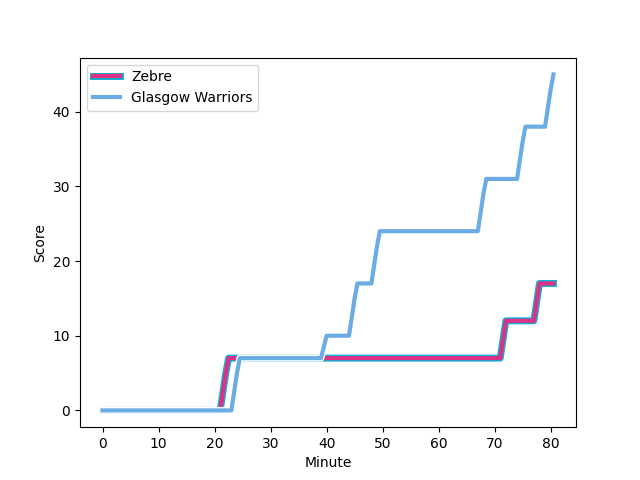
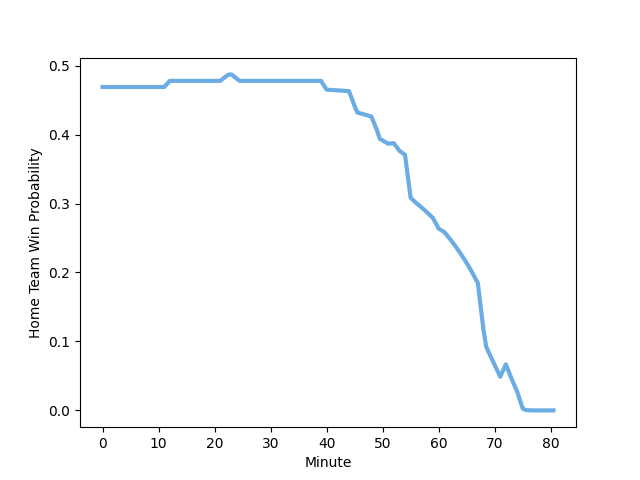

---  
layout: page  
title: Glasgow Warriors at Zebre; 45-17  
date: 2022-12-03 14:00:00 18:00:00 -0500  
categories: match review  
---
# Glasgow Warriors (1509.67) at Zebre (1455.56); 45-17

# Prediction: Glasgow Warriors by 2.4

Glasgow Warriors by 5.4 on a neutral field
## Scores over Time

## Win Probability over Time

# Pre-Match Prediction: Glasgow Warriors by 3.3

Glasgow Warriors by 6.3 on a neutral pitch

|   Away Minutes | Away Player                                                               |   Away elo |   Away Percentile |   Number |   Home Percentile |   Home elo | Home Player                                                                 |   Home Minutes |
|---------------:|:--------------------------------------------------------------------------|-----------:|------------------:|---------:|------------------:|-----------:|:----------------------------------------------------------------------------|---------------:|
|             53 | [Oli Kebble](..//playerfiles//OliKebble_cleaned.md)                       |     124.55 |                98 |        1 |                39 |      92.67 | [Luca Rizzoli](..//playerfiles//LucaRizzoli_cleaned.md)                     |             61 |
|             61 | [Fraser Brown](..//playerfiles//FraserBrown_cleaned.md)                   |     118.26 |                95 |        2 |                 1 |      71.5  | [Marco Manfredi](..//playerfiles//MarcoManfredi_cleaned.md)                 |             52 |
|             12 | [Zander Fagerson](..//playerfiles//ZanderFagerson_cleaned.md)             |     121.44 |                98 |        3 |                51 |      96.18 | [Matteo Nocera](..//playerfiles//MatteoNocera_cleaned.md)                   |             40 |
|             80 | [Sintu Manjezi](..//playerfiles//SintuManjezi_cleaned.md)                 |      95.18 |                50 |        4 |                62 |      97.51 | [David Sisi](..//playerfiles//DavidSisi_cleaned.md)                         |             80 |
|             75 | [Richie Gray](..//playerfiles//RichieGray_cleaned.md)                     |      92.25 |                36 |        5 |                19 |      87.27 | [Andrea Zambonin](..//playerfiles//AndreaZambonin_cleaned.md)               |             56 |
|             80 | [Ryan Wilson](..//playerfiles//RyanWilson_cleaned.md)                     |      89.22 |                24 |        6 |                94 |     121.37 | [Taina Fox-Matamua](..//playerfiles//TainaFox-Matamua_cleaned.md)           |             60 |
|             53 | [Sione Vailanu](..//playerfiles//SioneVailanu_cleaned.md)                 |      88.57 |                22 |        7 |                 6 |      80.11 | [MJ Pelser](..//playerfiles//MJPelser_cleaned.md)                           |             80 |
|             80 | [Matt Fagerson](..//playerfiles//MattFagerson_cleaned.md)                 |     121.07 |                96 |        8 |                73 |     103.86 | [Matt Kvesic](..//playerfiles//MattKvesic_cleaned.md)                       |             80 |
|             80 | [George Horne](..//playerfiles//GeorgeHorne_cleaned.md)                   |     123.1  |                97 |        9 |                46 |      94.78 | [Chris Cook](..//playerfiles//ChrisCook_cleaned.md)                         |             55 |
|             68 | [Tom Jordan](..//playerfiles//TomJordan_cleaned.md)                       |      87.36 |                18 |       10 |                97 |     128.03 | [Geronimo Prisciantelli](..//playerfiles//GeronimoPrisciantelli_cleaned.md) |             80 |
|             80 | [Kyle Steyn](..//playerfiles//KyleSteyn_cleaned.md)                       |      94.72 |                45 |       11 |                 7 |      80.84 | [Jacopo Trulla](..//playerfiles//JacopoTrulla_cleaned.md)                   |             80 |
|             80 | [Stafford McDowall](..//playerfiles//StaffordMcDowall_cleaned.md)         |     103.36 |                74 |       12 |                90 |     114.47 | [Enrico Lucchin](..//playerfiles//EnricoLucchin_cleaned.md)                 |             80 |
|             80 | [Sione Tuipulotu](..//playerfiles//SioneTuipulotu_cleaned.md)             |      82.37 |                10 |       13 |                29 |      91.37 | [Erich Cronje](..//playerfiles//ErichCronje_cleaned.md)                     |             70 |
|             68 | [Sebastian Cancelliere](..//playerfiles//SebastianCancelliere_cleaned.md) |     112.08 |                89 |       14 |                35 |      92.19 | [Pierre Bruno](..//playerfiles//PierreBruno_cleaned.md)                     |             49 |
|             80 | [Ollie Smith](..//playerfiles//OllieSmith_cleaned.md)                     |      91.51 |                35 |       15 |                67 |     100.93 | [Lorenzo Pani](..//playerfiles//LorenzoPani_cleaned.md)                     |             80 |
|             68 | [Murphy Walker](..//playerfiles//MurphyWalker_cleaned.md)                 |      95.03 |                46 |       16 |                17 |      87.7  | [Ion Neculai](..//playerfiles//IonNeculai_cleaned.md)                       |             40 |
|             27 | [Jamie Bhatti](..//playerfiles//JamieBhatti_cleaned.md)                   |     105.84 |                84 |       17 |               nan |     115.74 | [Jacobus van Wyk](..//playerfiles//JacobusvanWyk_cleaned.md)                |             31 |
|             27 | [Lewis Bean](..//playerfiles//LewisBean_cleaned.md)                       |      86.11 |                16 |       18 |                25 |      90.23 | [Jacques du Toit](..//playerfiles//JacquesduToit_cleaned.md)                |             28 |
|             19 | [Johnny Matthews](..//playerfiles//JohnnyMatthews_cleaned.md)             |      91.7  |                34 |       19 |               nan |      82.48 | [Gonzalo Jesus Garcia](..//playerfiles//GonzaloJesusGarcia_cleaned.md)      |             25 |
|             12 | [Jamie Dobie](..//playerfiles//JamieDobie_cleaned.md)                     |      92.39 |                37 |       20 |                63 |      98.74 | [Jan Uys](..//playerfiles//JanUys_cleaned.md)                               |             24 |
|             12 | [Domingo Miotti](..//playerfiles//DomingoMiotti_cleaned.md)               |     112.47 |                88 |       21 |                56 |      97.06 | [Giacomo Ferrari](..//playerfiles//GiacomoFerrari_cleaned.md)               |             20 |
|              5 | [JP du Preez](..//playerfiles//JPduPreez_cleaned.md)                      |      87.91 |                25 |       22 |               nan |      81.18 | [Daniele Rimpelli](..//playerfiles//DanieleRimpelli_cleaned.md)             |             19 |
|            nan | nan                                                                       |     nan    |               nan |       23 |                41 |      93.33 | [Franco Smith](..//playerfiles//FrancoSmith_cleaned.md)                     |             10 |

