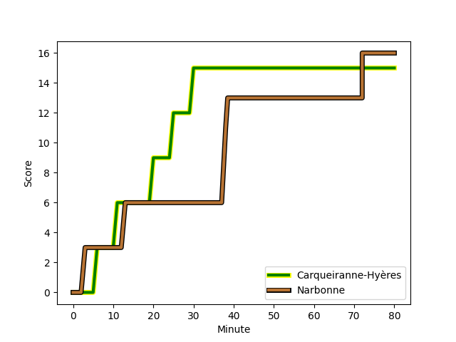
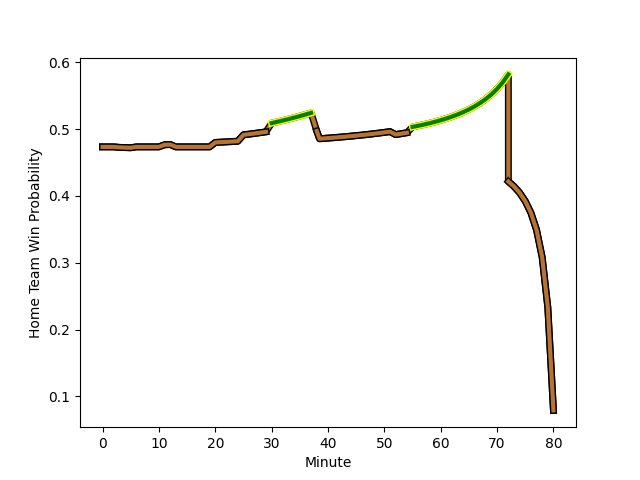

---  
layout: page  
title: Narbonne at Carqueiranne-Hyères; 16-15  
date: 2022-12-04 15:00:00 18:00:00 -0500  
categories: match review  
---
# Narbonne (1402.98) at Carqueiranne-Hyères (1356.57); 16-15

# Prediction: Narbonne by 1.6

Narbonne by 4.6 on a neutral field
## Scores over Time

## Win Probability over Time

# Pre-Match Prediction: Narbonne by 6.1

Narbonne by 9.1 on a neutral pitch

|   Away Minutes | Away Player                                                       |   Away elo |   Away Percentile |   Number |   Home Percentile |   Home elo | Home Player                                                            |   Home Minutes |
|---------------:|:------------------------------------------------------------------|-----------:|------------------:|---------:|------------------:|-----------:|:-----------------------------------------------------------------------|---------------:|
|             52 | [Sylvain Abadie](..//playerfiles//SylvainAbadie_cleaned.md)       |      84.96 |                11 |        1 |                11 |      84.79 | [Liam Chad Hendricks](..//playerfiles//LiamChadHendricks_cleaned.md)   |             80 |
|             52 | [Christophe David](..//playerfiles//ChristopheDavid_cleaned.md)   |     104.7  |                80 |        2 |                 8 |      83.29 | [Yan Tabarot](..//playerfiles//YanTabarot_cleaned.md)                  |             62 |
|             80 | [Matthieu Loudet](..//playerfiles//MatthieuLoudet_cleaned.md)     |      85.56 |                12 |        3 |                45 |      94.81 | [Costel Burtila](..//playerfiles//CostelBurtila_cleaned.md)            |             55 |
|             80 | [Valentin Sese](..//playerfiles//ValentinSese_cleaned.md)         |      91.83 |                34 |        4 |                13 |      83.67 | [Sven D'Hooghe](..//playerfiles//SvenD'Hooghe_cleaned.md)              |             80 |
|             58 | [Mauro Rebussone](..//playerfiles//MauroRebussone_cleaned.md)     |     101.96 |                74 |        5 |                 1 |      68.65 | [Cesar Damiani](..//playerfiles//CesarDamiani_cleaned.md)              |             80 |
|             52 | [Guillem Montagne](..//playerfiles//GuillemMontagne_cleaned.md)   |      95.72 |                51 |        6 |                59 |      97.95 | [Florian Munoz Rivero](..//playerfiles//FlorianMunozRivero_cleaned.md) |             72 |
|             80 | [Paul Belzons](..//playerfiles//PaulBelzons_cleaned.md)           |      71.66 |                 2 |        7 |                31 |      90.76 | [Joachim Beaumont](..//playerfiles//JoachimBeaumont_cleaned.md)        |             80 |
|             80 | [Luke Nakobukobua](..//playerfiles//LukeNakobukobua_cleaned.md)   |     109.65 |                83 |        8 |                17 |      87.05 | [Julien Ormea](..//playerfiles//JulienOrmea_cleaned.md)                |             80 |
|             67 | [Pierrick Nova](..//playerfiles//PierrickNova_cleaned.md)         |      79.78 |                 5 |        9 |                52 |      96.21 | [Thomas Sonetti](..//playerfiles//ThomasSonetti_cleaned.md)            |             80 |
|             57 | [Tom Chauvet](..//playerfiles//TomChauvet_cleaned.md)             |      90.44 |                26 |       10 |                66 |     100.46 | [Lachie Munro](..//playerfiles//LachieMunro_cleaned.md)                |             80 |
|             80 | [Baptiste Tsague](..//playerfiles//BaptisteTsague_cleaned.md)     |      95    |               nan |       11 |                 4 |      77.48 | [Vincent Alessi](..//playerfiles//VincentAlessi_cleaned.md)            |             53 |
|             80 | [Jose Lima](..//playerfiles//JoseLima_cleaned.md)                 |     110.43 |                86 |       12 |                65 |     100.31 | [Romain Leveque](..//playerfiles//RomainLeveque_cleaned.md)            |             80 |
|             80 | [Pierre Nueno](..//playerfiles//PierreNueno_cleaned.md)           |      86.06 |                16 |       13 |                95 |     118.85 | [Charles Brousse](..//playerfiles//CharlesBrousse_cleaned.md)          |             80 |
|             80 | [Sébastien Giorgis](..//playerfiles//SébastienGiorgis_cleaned.md) |      96.86 |                52 |       14 |                10 |      83.74 | [Quentin Bourdieu](..//playerfiles//QuentinBourdieu_cleaned.md)        |             80 |
|             80 | [Tom Homer](..//playerfiles//TomHomer_cleaned.md)                 |      92.14 |                38 |       15 |                26 |      89    | [Josselyn Bouchon](..//playerfiles//JosselynBouchon_cleaned.md)        |             80 |
|             28 | [Geoffrey Moise](..//playerfiles//GeoffreyMoise_cleaned.md)       |      98.03 |                57 |       16 |                23 |      88.63 | [Dylan Sage](..//playerfiles//DylanSage_cleaned.md)                    |             27 |
|             28 | [Thibault Clauzade](..//playerfiles//ThibaultClauzade_cleaned.md) |     102.92 |                71 |       17 |                18 |      88.13 | [Lasha Mchelidze](..//playerfiles//LashaMchelidze_cleaned.md)          |             25 |
|             28 | [Jordan Rochier](..//playerfiles//JordanRochier_cleaned.md)       |      92.9  |                36 |       18 |                 3 |      76.18 | [Michael Tyumenev](..//playerfiles//MichaelTyumenev_cleaned.md)        |             18 |
|             23 | [Thibault Santoro](..//playerfiles//ThibaultSantoro_cleaned.md)   |      97.53 |                51 |       19 |                43 |      92.75 | [Nicolas Baquer](..//playerfiles//NicolasBaquer_cleaned.md)            |              8 |
|             22 | [Morgan Maga](..//playerfiles//MorganMaga_cleaned.md)             |      96.89 |                53 |       20 |               nan |     nan    | nan                                                                    |            nan |
|             13 | [Pablo Barbaste](..//playerfiles//PabloBarbaste_cleaned.md)       |      95.87 |                51 |       21 |               nan |     nan    | nan                                                                    |            nan |

