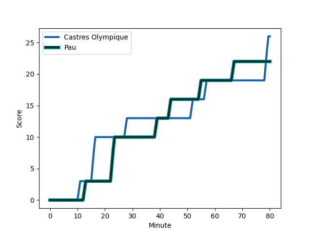
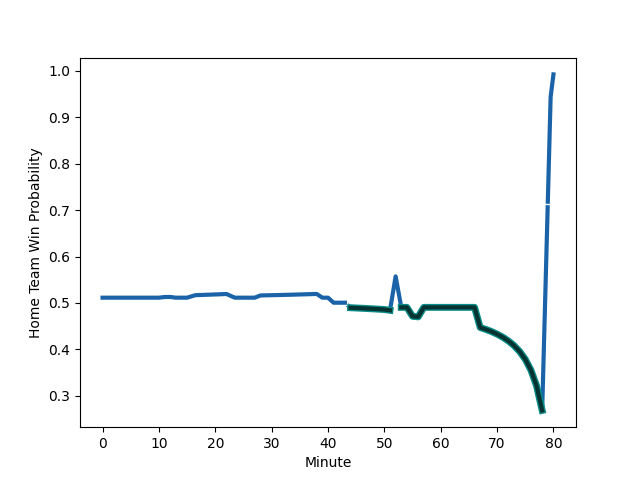

---  
layout: page  
title: Pau at Castres Olympique; 22-26  
date: 2022-12-04 14:00:00 18:00:00 -0500  
categories: match review  
---
# Pau (1538.13) at Castres Olympique (1557.96); 22-26

# Prediction: Castres Olympique by 5.0

Castres Olympique by 2.0 on a neutral field
## Scores over Time

## Win Probability over Time

# Pre-Match Prediction: Castres Olympique by 11.5

Castres Olympique by 8.5 on a neutral pitch

|   Away Minutes | Away Player                                                           |   Away elo |   Away Percentile |   Number |   Home Percentile |   Home elo | Home Player                                                                       |   Home Minutes |
|---------------:|:----------------------------------------------------------------------|-----------:|------------------:|---------:|------------------:|-----------:|:----------------------------------------------------------------------------------|---------------:|
|             52 | [Siegfried Fisi'ihoi](..//playerfiles//SiegfriedFisi'ihoi_cleaned.md) |     121.71 |                98 |        1 |                33 |      92.2  | [Quentin Walcker](..//playerfiles//QuentinWalcker_cleaned.md)                     |             60 |
|             60 | [Lucas Rey](..//playerfiles//LucasRey_cleaned.md)                     |      89.87 |                23 |        2 |                82 |     105.83 | [Gaetan Barlot](..//playerfiles//GaetanBarlot_cleaned.md)                         |             74 |
|             55 | [Guram Papidze](..//playerfiles//GuramPapidze_cleaned.md)             |      82.81 |                 7 |        3 |                85 |     106.8  | [Wilfrid Hounkpatin](..//playerfiles//WilfridHounkpatin_cleaned.md)               |             60 |
|             55 | [Lekima Tagitagivalu](..//playerfiles//LekimaTagitagivalu_cleaned.md) |      96.03 |                54 |        4 |                77 |     103.58 | [Florent Vanverberghe](..//playerfiles//FlorentVanverberghe_cleaned.md)           |             69 |
|             80 | [Mickael Capelli](..//playerfiles//MickaelCapelli_cleaned.md)         |     116.79 |                94 |        5 |                33 |      91.64 | [Tom Staniforth](..//playerfiles//TomStaniforth_cleaned.md)                       |             80 |
|             52 | [Sacha Zegueur](..//playerfiles//SachaZegueur_cleaned.md)             |      96.89 |                56 |        6 |                70 |     101.77 | [Mathieu Babillot](..//playerfiles//MathieuBabillot_cleaned.md)                   |             80 |
|             80 | [Reece Hewat](..//playerfiles//ReeceHewat_cleaned.md)                 |      93.79 |                42 |        7 |                66 |     100.1  | [Nick Champion de Crespigny](..//playerfiles//NickChampiondeCrespigny_cleaned.md) |             51 |
|             80 | [Beka Gorgadze](..//playerfiles//BekaGorgadze_cleaned.md)             |     102.56 |                73 |        8 |                79 |     104.71 | [Tyler Ardron](..//playerfiles//TylerArdron_cleaned.md)                           |             80 |
|             80 | [Dan Robson](..//playerfiles//DanRobson_cleaned.md)                   |     119.16 |                95 |        9 |                71 |      99.44 | [Gauthier Doubrere](..//playerfiles//GauthierDoubrere_cleaned.md)                 |             51 |
|             80 | [Zack Henry](..//playerfiles//ZackHenry_cleaned.md)                   |     126.73 |                96 |       10 |                96 |     126.47 | [Benjamin Urdapilleta](..//playerfiles//BenjaminUrdapilleta_cleaned.md)           |             53 |
|             80 | [Elliot Roudil](..//playerfiles//ElliotRoudil_cleaned.md)             |      81.52 |                 9 |       11 |                88 |     111.53 | [Filipo Nakosi](..//playerfiles//FilipoNakosi_cleaned.md)                         |             80 |
|             80 | [Jale Vatubua](..//playerfiles//JaleVatubua_cleaned.md)               |      99.04 |                61 |       12 |                60 |      98.92 | [Vilimoni Botitu](..//playerfiles//VilimoniBotitu_cleaned.md)                     |             80 |
|             79 | [Tumua Manu](..//playerfiles//TumuaManu_cleaned.md)                   |     128.32 |                98 |       13 |                96 |     125.85 | [Adrea Cocagi](..//playerfiles//AdreaCocagi_cleaned.md)                           |             41 |
|             80 | [Vincent Pinto](..//playerfiles//VincentPinto_cleaned.md)             |      94.73 |                42 |       14 |                91 |     114.29 | [Geoffrey Palis](..//playerfiles//GeoffreyPalis_cleaned.md)                       |             80 |
|             80 | [Jack Maddocks](..//playerfiles//JackMaddocks_cleaned.md)             |      97.44 |                56 |       15 |                69 |     101.89 | [Julien Dumora](..//playerfiles//JulienDumora_cleaned.md)                         |             80 |
|             28 | [Ignacio Calles](..//playerfiles//IgnacioCalles_cleaned.md)           |     103.98 |                78 |       16 |                30 |      90.18 | [Louis Le Brun](..//playerfiles//LouisLeBrun_cleaned.md)                          |             39 |
|             28 | [Jordan Joseph](..//playerfiles//JordanJoseph_cleaned.md)             |      93.99 |                41 |       17 |                56 |      97.37 | [Julien Blanc](..//playerfiles//JulienBlanc_cleaned.md)                           |             29 |
|             25 | [Guillaume Ducat](..//playerfiles//GuillaumeDucat_cleaned.md)         |      80.7  |                 9 |       18 |                40 |      93.25 | [Baptiste Delaporte](..//playerfiles//BaptisteDelaporte_cleaned.md)               |             29 |
|             25 | [Nicolas Corato](..//playerfiles//NicolasCorato_cleaned.md)           |      82.86 |                 7 |       19 |                36 |      91.82 | [Antoine Zeghdar](..//playerfiles//AntoineZeghdar_cleaned.md)                     |             27 |
|             20 | [Romain Ruffenach](..//playerfiles//RomainRuffenach_cleaned.md)       |     101.45 |                72 |       20 |                85 |     104.56 | [Antoine Tichit](..//playerfiles//AntoineTichit_cleaned.md)                       |             20 |
|              1 | [Émilien Gailleton](..//playerfiles//ÉmilienGailleton_cleaned.md)     |     116.15 |                92 |       21 |               nan |     110.57 | [Levan Chilachava](..//playerfiles//LevanChilachava_cleaned.md)                   |             20 |
|            nan | nan                                                                   |     nan    |               nan |       22 |                91 |     118.67 | [Leone Nakarawa](..//playerfiles//LeoneNakarawa_cleaned.md)                       |             11 |
|            nan | nan                                                                   |     nan    |               nan |       23 |               nan |      94.43 | [Pierre Colonna](..//playerfiles//PierreColonna_cleaned.md)                       |              6 |

