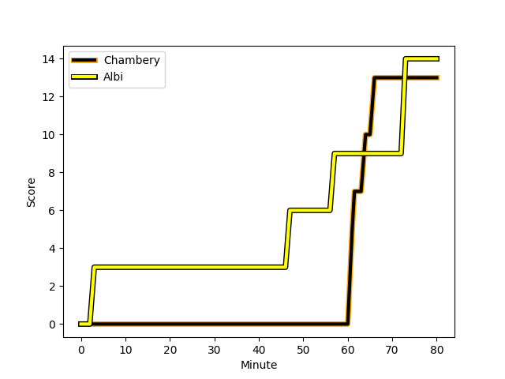
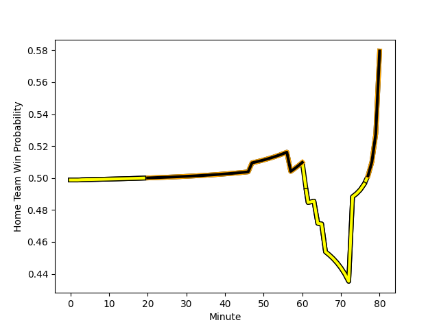

---  
layout: page  
title: Albi at Chambery; 14-13  
date: 2022-12-04 15:00:00 18:00:00 -0500  
categories: match review  
---
# Albi (1388.96) at Chambery (1386.84); 14-13

# Prediction: Chambery by 2.8

Albi by 0.2 on a neutral field
## Scores over Time

## Win Probability over Time

# Pre-Match Prediction: Albi by 5.3

Chambery by 2.3 on a neutral pitch

|   Away Minutes | Away Player                                                                 |   Away elo |   Away Percentile |   Number |   Home Percentile |   Home elo | Home Player                                                                 |   Home Minutes |
|---------------:|:----------------------------------------------------------------------------|-----------:|------------------:|---------:|------------------:|-----------:|:----------------------------------------------------------------------------|---------------:|
|             57 | [Maxime Escur](..//playerfiles//MaximeEscur_cleaned.md)                     |      80.69 |                 5 |        1 |                48 |      94.4  | [Géraud Clermont](..//playerfiles//GéraudClermont_cleaned.md)               |             62 |
|             80 | [Arthur Castant](..//playerfiles//ArthurCastant_cleaned.md)                 |      85.33 |                12 |        2 |                45 |      94.06 | [Julien Primault](..//playerfiles//JulienPrimault_cleaned.md)               |             55 |
|             57 | [Dimitri Tchapnga](..//playerfiles//DimitriTchapnga_cleaned.md)             |      91.26 |                38 |        3 |                48 |      93.73 | [Giorgi Pertaia](..//playerfiles//GiorgiPertaia_cleaned.md)                 |             62 |
|             57 | [Charles Foures](..//playerfiles//CharlesFoures_cleaned.md)                 |     101.93 |                74 |        4 |                36 |      92.3  | [Steevy Cerqueira](..//playerfiles//SteevyCerqueira_cleaned.md)             |             57 |
|             80 | [Jacques Engelbrecht](..//playerfiles//JacquesEngelbrecht_cleaned.md)       |      84.78 |                14 |        5 |                 7 |      78.73 | [Romain Guyot](..//playerfiles//RomainGuyot_cleaned.md)                     |             75 |
|             63 | [Hugo Boutin](..//playerfiles//HugoBoutin_cleaned.md)                       |      78.39 |                 4 |        6 |                86 |     109.11 | [Pierre-Nicolas Dance](..//playerfiles//Pierre-NicolasDance_cleaned.md)     |             80 |
|             80 | [Lucas Guillaume](..//playerfiles//LucasGuillaume_cleaned.md)               |      96.01 |                52 |        7 |                20 |      88.08 | [Colin Lebian](..//playerfiles//ColinLebian_cleaned.md)                     |             80 |
|             80 | [Sandrick Maciotta](..//playerfiles//SandrickMaciotta_cleaned.md)           |      97.46 |                53 |        8 |                52 |      97.18 | [Thomas Coignat](..//playerfiles//ThomasCoignat_cleaned.md)                 |             80 |
|             48 | [Titouan Pouzoullic](..//playerfiles//TitouanPouzoullic_cleaned.md)         |      83.84 |                10 |        9 |                24 |      89.94 | [Dylan Nocete](..//playerfiles//DylanNocete_cleaned.md)                     |             80 |
|             67 | [Benjamin Pehau](..//playerfiles//BenjaminPehau_cleaned.md)                 |      91.51 |                29 |       10 |                33 |      91.34 | [Mattéo Faucher](..//playerfiles//MattéoFaucher_cleaned.md)                 |             80 |
|             80 | [Enzo Marzocca](..//playerfiles//EnzoMarzocca_cleaned.md)                   |     108.06 |                83 |       11 |                79 |     104.9  | [Mosese Mawalu](..//playerfiles//MoseseMawalu_cleaned.md)                   |             80 |
|             63 | [Simon Andreu](..//playerfiles//SimonAndreu_cleaned.md)                     |      86.32 |                17 |       12 |                50 |      94.85 | [Bastien Reymond](..//playerfiles//BastienReymond_cleaned.md)               |             80 |
|             80 | [Gilen Queheille](..//playerfiles//GilenQueheille_cleaned.md)               |      90.69 |                29 |       13 |                 1 |      69.12 | [Vereniki Goneva](..//playerfiles//VerenikiGoneva_cleaned.md)               |             55 |
|             80 | [Baptiste Couchinave](..//playerfiles//BaptisteCouchinave_cleaned.md)       |     111.03 |                86 |       14 |                58 |      97.68 | [Theo Velten](..//playerfiles//TheoVelten_cleaned.md)                       |             71 |
|             80 | [Téo Dospital](..//playerfiles//TéoDospital_cleaned.md)                     |      92.04 |                38 |       15 |                42 |      93.34 | [Thomas Hecquet](..//playerfiles//ThomasHecquet_cleaned.md)                 |             62 |
|             32 | [Charly Trussardi](..//playerfiles//CharlyTrussardi_cleaned.md)             |      86.27 |                14 |       16 |                17 |      86.82 | [Gauthier Brute de Remur](..//playerfiles//GauthierBrutedeRemur_cleaned.md) |             25 |
|             23 | [Antoine Soave](..//playerfiles//AntoineSoave_cleaned.md)                   |     101.18 |                71 |       17 |                 4 |      75.7  | [Victor Pisano](..//playerfiles//VictorPisano_cleaned.md)                   |             25 |
|             23 | [Jean Baptiste De Clercq](..//playerfiles//JeanBaptisteDeClercq_cleaned.md) |      92.06 |                31 |       18 |                22 |      88.5  | [Fabien Witz](..//playerfiles//FabienWitz_cleaned.md)                       |             23 |
|             23 | [Mohsen Essid](..//playerfiles//MohsenEssid_cleaned.md)                     |     101.44 |                73 |       19 |                40 |      93.87 | [Lautaro Caro Saisi](..//playerfiles//LautaroCaroSaisi_cleaned.md)          |             18 |
|             17 | [Gael Ekpe](..//playerfiles//GaelEkpe_cleaned.md)                           |      91.73 |                35 |       20 |               nan |      95.94 | [Enzo Segui](..//playerfiles//EnzoSegui_cleaned.md)                         |             18 |
|             17 | [François Fontaine](..//playerfiles//FrançoisFontaine_cleaned.md)           |      87.18 |                19 |       21 |                27 |      88.51 | [Jules Dorrival](..//playerfiles//JulesDorrival_cleaned.md)                 |             18 |
|             13 | [Théo Vidal](..//playerfiles//ThéoVidal_cleaned.md)                         |      89.33 |                21 |       22 |                25 |      90.04 | [Arthur Nennig](..//playerfiles//ArthurNennig_cleaned.md)                   |              9 |
|            nan | nan                                                                         |     nan    |               nan |       23 |               nan |      93.79 | [Matheo Triki](..//playerfiles//MatheoTriki_cleaned.md)                     |              5 |

