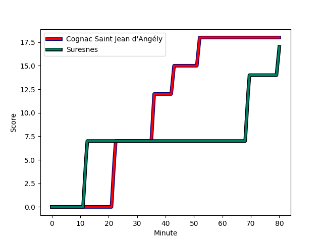
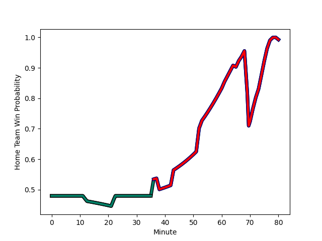

---  
layout: page  
title: Suresnes at Cognac Saint Jean d'Angély; 24-18  
date: 2022-12-04 15:00:00 18:00:00 -0500  
categories: match review  
---
# Suresnes (1305.65) at Cognac Saint Jean d'Angély (1270.68); 24-18

# Prediction: Suresnes by 0.5

Suresnes by 3.5 on a neutral field
## Scores over Time

## Win Probability over Time

# Pre-Match Prediction: Suresnes by 4.3

Suresnes by 7.3 on a neutral pitch

|   Away Minutes | Away Player                                                                 |   Away elo |   Away Percentile |   Number |   Home Percentile |   Home elo | Home Player                                                             |   Home Minutes |
|---------------:|:----------------------------------------------------------------------------|-----------:|------------------:|---------:|------------------:|-----------:|:------------------------------------------------------------------------|---------------:|
|             80 | [Lucas Dycke](..//playerfiles//LucasDycke_cleaned.md)                       |      92.07 |                32 |        1 |                14 |      85.1  | [Kevin Tougne](..//playerfiles//KevinTougne_cleaned.md)                 |             80 |
|             65 | [Thomas Bordes](..//playerfiles//ThomasBordes_cleaned.md)                   |      86.19 |                13 |        2 |                 3 |      79.2  | [Maxime Gau](..//playerfiles//MaximeGau_cleaned.md)                     |             80 |
|             65 | [Kakhaber Koberize](..//playerfiles//KakhaberKoberize_cleaned.md)           |      79.29 |                 4 |        3 |                 6 |      81.52 | [Giorgi Sharashidze](..//playerfiles//GiorgiSharashidze_cleaned.md)     |             53 |
|             61 | [Youssouf Yatera](..//playerfiles//YoussoufYatera_cleaned.md)               |      93.68 |                40 |        4 |                 2 |      70.12 | [Utu Maninoa](..//playerfiles//UtuManinoa_cleaned.md)                   |             80 |
|             80 | [Wian Vosloo](..//playerfiles//WianVosloo_cleaned.md)                       |      95.38 |                50 |        5 |                18 |      86.05 | [Clément Praud](..//playerfiles//ClémentPraud_cleaned.md)               |             77 |
|             38 | [Florian Desbordes](..//playerfiles//FlorianDesbordes_cleaned.md)           |      79.69 |                 5 |        6 |                 9 |      83.1  | [Matthieu Thomas](..//playerfiles//MatthieuThomas_cleaned.md)           |             73 |
|             61 | [Théo David Nathan Tanda](..//playerfiles//ThéoDavidNathanTanda_cleaned.md) |      94.99 |                53 |        7 |                94 |     116.48 | [Gio Sordia](..//playerfiles//GioSordia_cleaned.md)                     |             80 |
|             80 | [Louis-Mathieu Jazeix](..//playerfiles//Louis-MathieuJazeix_cleaned.md)     |      87.87 |                19 |        8 |                58 |      99.03 | [Filipe Manu](..//playerfiles//FilipeManu_cleaned.md)                   |             80 |
|             71 | [Théo Bachiri](..//playerfiles//ThéoBachiri_cleaned.md)                     |      92.12 |                30 |        9 |                 4 |      78.94 | [Mathieu Billou](..//playerfiles//MathieuBillou_cleaned.md)             |             71 |
|             80 | [Gaëtan Robert](..//playerfiles//GaëtanRobert_cleaned.md)                   |      86.65 |                15 |       10 |               nan |      95    | [Jordan Cremoux](..//playerfiles//JordanCremoux_cleaned.md)             |             67 |
|             80 | [Ervin Muric](..//playerfiles//ErvinMuric_cleaned.md)                       |      48.01 |                 0 |       11 |               nan |      94.62 | [Paul Boitard](..//playerfiles//PaulBoitard_cleaned.md)                 |             80 |
|             80 | [Petero Tuwai](..//playerfiles//PeteroTuwai_cleaned.md)                     |      92.63 |                39 |       12 |                 2 |      72.88 | [Eneri Lotawa](..//playerfiles//EneriLotawa_cleaned.md)                 |             80 |
|             80 | [Arthur Proult](..//playerfiles//ArthurProult_cleaned.md)                   |      87.74 |                20 |       13 |                 1 |      64.58 | [Jone Tuva](..//playerfiles//JoneTuva_cleaned.md)                       |             80 |
|             53 | [Jean-Baptiste Fuster](..//playerfiles//Jean-BaptisteFuster_cleaned.md)     |      82    |                 8 |       14 |                 3 |      75.84 | [Vincent Pageneau](..//playerfiles//VincentPageneau_cleaned.md)         |             80 |
|             80 | [Alexis Clément](..//playerfiles//AlexisClément_cleaned.md)                 |      86.26 |                14 |       15 |                17 |      87.42 | [Nils Guyon](..//playerfiles//NilsGuyon_cleaned.md)                     |             80 |
|             42 | [Bastien Berenguel](..//playerfiles//BastienBerenguel_cleaned.md)           |     108.31 |                84 |       16 |               nan |      91.86 | [Alico Kaikatsishvili](..//playerfiles//AlicoKaikatsishvili_cleaned.md) |             27 |
|             27 | [Enzo Barbarit](..//playerfiles//EnzoBarbarit_cleaned.md)                   |      81.7  |                 7 |       17 |                10 |      83.1  | [Dany Antunes](..//playerfiles//DanyAntunes_cleaned.md)                 |             13 |
|             19 | [Elias Coulibaly](..//playerfiles//EliasCoulibaly_cleaned.md)               |      96.23 |               nan |       18 |                10 |      84.12 | [William Beaudon](..//playerfiles//WilliamBeaudon_cleaned.md)           |              9 |
|             19 | [Yakine Djebarri](..//playerfiles//YakineDjebarri_cleaned.md)               |      87.34 |                18 |       19 |                 1 |      69.52 | [Lucas Gulizzi](..//playerfiles//LucasGulizzi_cleaned.md)               |              7 |
|             15 | [Leandro Mario Assi](..//playerfiles//LeandroMarioAssi_cleaned.md)          |     113.5  |                93 |       20 |                 9 |      82.23 | [Daniel Faleafa](..//playerfiles//DanielFaleafa_cleaned.md)             |              3 |
|             15 | [Hayam El Bibouji](..//playerfiles//HayamElBibouji_cleaned.md)              |      93.1  |                36 |       21 |               nan |     nan    | nan                                                                     |            nan |
|              9 | [Quentin Dauvergne](..//playerfiles//QuentinDauvergne_cleaned.md)           |      89.17 |                21 |       22 |               nan |     nan    | nan                                                                     |            nan |

