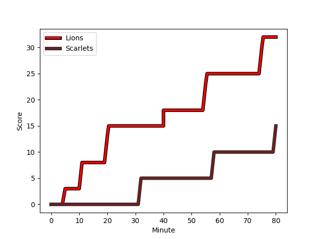
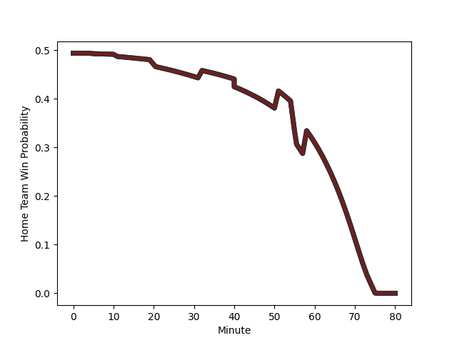

---  
layout: page  
title: Scarlets at Lions; 15-32  
date: 2022-12-04 12:30:00 18:00:00 -0500  
categories: match review  
---
# Scarlets (1482.42) at Lions (1471.41); 15-32

# Prediction: Lions by 1.9

Scarlets by 1.1 on a neutral field
## Scores over Time

## Win Probability over Time

# Pre-Match Prediction: Scarlets by 2.0

Scarlets by 1.0 on a neutral pitch

|   Away Minutes | Away Player                                                     |   Away elo |   Away Percentile |   Number |   Home Percentile |   Home elo | Home Player                                                                 |   Home Minutes |
|---------------:|:----------------------------------------------------------------|-----------:|------------------:|---------:|------------------:|-----------:|:----------------------------------------------------------------------------|---------------:|
|             51 | [Phil Price](..//playerfiles//PhilPrice_cleaned.md)             |     100.13 |               nan |        1 |                80 |     104.66 | [Sti Sithole](..//playerfiles//StiSithole_cleaned.md)                       |             51 |
|             59 | [Taylor Davies](..//playerfiles//TaylorDavies_cleaned.md)       |      85.26 |                13 |        2 |                17 |      87.48 | [PJ Botha](..//playerfiles//PJBotha_cleaned.md)                             |             60 |
|             51 | [WillGriff John](..//playerfiles//WillGriffJohn_cleaned.md)     |     107.19 |                85 |        3 |                97 |     120.32 | [Ruan Dreyer](..//playerfiles//RuanDreyer_cleaned.md)                       |             60 |
|             44 | [Sam Lousi](..//playerfiles//SamLousi_cleaned.md)               |     105.33 |                81 |        4 |                83 |     106.55 | [Ruben Schoeman](..//playerfiles//RubenSchoeman_cleaned.md)                 |             51 |
|             80 | [Vaea Fifita](..//playerfiles//VaeaFifita_cleaned.md)           |     118.78 |                95 |        5 |                67 |      99.46 | [Reinhard Nothnagel](..//playerfiles//ReinhardNothnagel_cleaned.md)         |             80 |
|             80 | [Aaron Shingler](..//playerfiles//AaronShingler_cleaned.md)     |      98.57 |                61 |        6 |                97 |     125.89 | [Jaco Kriel](..//playerfiles//JacoKriel_cleaned.md)                         |             59 |
|             51 | [Dan Davis](..//playerfiles//DanDavis_cleaned.md)               |     108.67 |                86 |        7 |                38 |      92.94 | [Darrien-Lane Landsberg](..//playerfiles//Darrien-LaneLandsberg_cleaned.md) |             80 |
|             80 | [Blade Thomson](..//playerfiles//BladeThomson_cleaned.md)       |      93.88 |                40 |        8 |                 4 |      78    | [Emmanuel Tshituka](..//playerfiles//EmmanuelTshituka_cleaned.md)           |             80 |
|             40 | [Gareth Davies](..//playerfiles//GarethDavies_cleaned.md)       |      82.14 |                 7 |        9 |                80 |     105.85 | [Sanele Nohamba](..//playerfiles//SaneleNohamba_cleaned.md)                 |             51 |
|             51 | [Sam Costelow](..//playerfiles//SamCostelow_cleaned.md)         |      73.59 |                 3 |       10 |                11 |      83.42 | [Jordan Hendrikse](..//playerfiles//JordanHendrikse_cleaned.md)             |             80 |
|             80 | [Ryan Conbeer](..//playerfiles//RyanConbeer_cleaned.md)         |      91.16 |                30 |       11 |                33 |      91.71 | [Edwill van der Merwe](..//playerfiles//EdwillvanderMerwe_cleaned.md)       |             80 |
|             57 | [Scott Williams](..//playerfiles//ScottWilliams_cleaned.md)     |     103.14 |                73 |       12 |                84 |     108.66 | [Marius Louw](..//playerfiles//MariusLouw_cleaned.md)                       |             56 |
|             80 | [Jonathan Davies](..//playerfiles//JonathanDavies_cleaned.md)   |     116.32 |                92 |       13 |                79 |     106.22 | [Sango (Saida) Xamlashe](..//playerfiles//Sango(Saida)Xamlashe_cleaned.md)  |             80 |
|             80 | [Tom Rogers](..//playerfiles//TomRogers_cleaned.md)             |      86.5  |                15 |       14 |                 9 |      82.36 | [Rabz Maxwane](..//playerfiles//RabzMaxwane_cleaned.md)                     |             80 |
|             80 | [Johnny McNicholl](..//playerfiles//JohnnyMcNicholl_cleaned.md) |     112.68 |                89 |       15 |                68 |     101.38 | [Quan Horn](..//playerfiles//QuanHorn_cleaned.md)                           |             80 |
|             40 | [Dane Blacker](..//playerfiles//DaneBlacker_cleaned.md)         |      77.25 |                 5 |       16 |                44 |      93.98 | [Jean-Pierre Smith](..//playerfiles//Jean-PierreSmith_cleaned.md)           |             29 |
|             36 | [Sione Kalamafoni](..//playerfiles//SioneKalamafoni_cleaned.md) |     101.71 |                66 |       17 |                86 |     109.16 | [Ruan Venter](..//playerfiles//RuanVenter_cleaned.md)                       |             29 |
|             29 | [Steffan Thomas](..//playerfiles//SteffanThomas_cleaned.md)     |      88.96 |                20 |       18 |                23 |      89.6  | [Andre Warner](..//playerfiles//AndreWarner_cleaned.md)                     |             29 |
|             29 | [Javan Sebastian](..//playerfiles//JavanSebastian_cleaned.md)   |      85.91 |                12 |       19 |                78 |     107.69 | [Zander du Plessis](..//playerfiles//ZanderduPlessis_cleaned.md)            |             24 |
|             29 | [Rhys Patchell](..//playerfiles//RhysPatchell_cleaned.md)       |     135    |                99 |       20 |                41 |      90.86 | [Sibusiso Sangweni](..//playerfiles//SibusisoSangweni_cleaned.md)           |             21 |
|             29 | [Tomas Lezana](..//playerfiles//TomasLezana_cleaned.md)         |      92.73 |                36 |       21 |                85 |     106.05 | [Jaco Visagie](..//playerfiles//JacoVisagie_cleaned.md)                     |             20 |
|             23 | [Steffan Evans](..//playerfiles//SteffanEvans_cleaned.md)       |      99.5  |                62 |       22 |                 4 |      80.96 | [Asenathi Ntlabakanye](..//playerfiles//AsenathiNtlabakanye_cleaned.md)     |             20 |
|             21 | [Shaun Evans](..//playerfiles//ShaunEvans_cleaned.md)           |      83.26 |                11 |       23 |               nan |     nan    | nan                                                                         |            nan |

