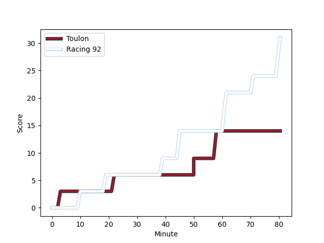
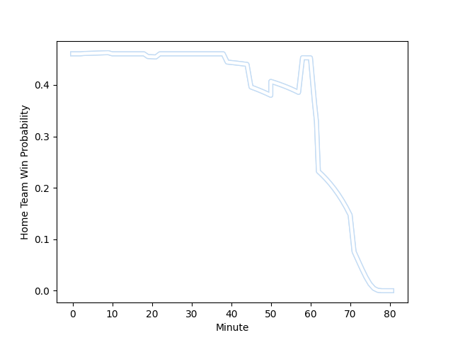

---  
layout: page  
title: Racing 92 at Toulon; 31-14  
date: 2022-12-04 21:00:00 18:00:00 -0500  
categories: match review  
---
# Racing 92 (1561.2) at Toulon (1492.95); 31-14

# Prediction: Racing 92 by 3.8

Racing 92 by 6.8 on a neutral field
## Scores over Time

## Win Probability over Time

# Pre-Match Prediction: Racing 92 by 5.4

Racing 92 by 8.4 on a neutral pitch

|   Away Minutes | Away Player                                                           |   Away elo |   Away Percentile |   Number |   Home Percentile |   Home elo | Home Player                                                       |   Home Minutes |
|---------------:|:----------------------------------------------------------------------|-----------:|------------------:|---------:|------------------:|-----------:|:------------------------------------------------------------------|---------------:|
|             59 | [Guram Gogichashvili](..//playerfiles//GuramGogichashvili_cleaned.md) |     104.52 |                77 |        1 |                78 |     100.21 | [Dany Priso](..//playerfiles//DanyPriso_cleaned.md)               |             45 |
|             59 | [Peniami Narisia](..//playerfiles//PeniamiNarisia_cleaned.md)         |      99    |                68 |        2 |                30 |      92.33 | [Teddy Baubigny](..//playerfiles//TeddyBaubigny_cleaned.md)       |             62 |
|             59 | [Biyi Alo](..//playerfiles//BiyiAlo_cleaned.md)                       |     119.93 |                97 |        3 |                87 |     107.75 | [Beka Gigashvili](..//playerfiles//BekaGigashvili_cleaned.md)     |             62 |
|             80 | [Boris Palu](..//playerfiles//BorisPalu_cleaned.md)                   |     107.79 |                84 |        4 |                24 |      88.99 | [Swan Rebbadj](..//playerfiles//SwanRebbadj_cleaned.md)           |             71 |
|             80 | [Anton Bresler](..//playerfiles//AntonBresler_cleaned.md)             |     117.25 |                92 |        5 |                75 |     102.46 | [Brian Alainu'uese](..//playerfiles//BrianAlainu'uese_cleaned.md) |             80 |
|             77 | [Ibrahim Diallo](..//playerfiles//IbrahimDiallo_cleaned.md)           |      94.27 |                44 |        6 |                52 |      95.95 | [Cornell du Preez](..//playerfiles//CornellduPreez_cleaned.md)    |             62 |
|             80 | [Baptiste Chouzenoux](..//playerfiles//BaptisteChouzenoux_cleaned.md) |      97.51 |                54 |        7 |                96 |     120.34 | [Charles Ollivon](..//playerfiles//CharlesOllivon_cleaned.md)     |             80 |
|             59 | [Kitione Kamikamica](..//playerfiles//KitioneKamikamica_cleaned.md)   |      96.76 |                52 |        8 |                93 |     119.99 | [Facundo Isa](..//playerfiles//FacundoIsa_cleaned.md)             |             80 |
|             80 | [Teddy Iribaren](..//playerfiles//TeddyIribaren_cleaned.md)           |     120.93 |                96 |        9 |                85 |     108.84 | [Baptiste Serin](..//playerfiles//BaptisteSerin_cleaned.md)       |             59 |
|             72 | [Antoine Gibert](..//playerfiles//AntoineGibert_cleaned.md)           |     106.71 |                80 |       10 |                60 |      99.81 | [Mathieu Smaili](..//playerfiles//MathieuSmaili_cleaned.md)       |             80 |
|             79 | [Louis Dupichot](..//playerfiles//LouisDupichot_cleaned.md)           |     100.98 |                70 |       11 |                19 |      88.25 | [Gaël Dréan](..//playerfiles//GaëlDréan_cleaned.md)               |             80 |
|             66 | [Inia Tabuavou](..//playerfiles//IniaTabuavou_cleaned.md)             |      96.3  |                49 |       12 |                20 |      87.61 | [Maëlan Rabut](..//playerfiles//MaëlanRabut_cleaned.md)           |             80 |
|             80 | [Olivier Klemenczak](..//playerfiles//OlivierKlemenczak_cleaned.md)   |      99.64 |                63 |       13 |                 9 |      81.72 | [Jérémy Sinzelle](..//playerfiles//JérémySinzelle_cleaned.md)     |             80 |
|             80 | [Donovan Taofifenua](..//playerfiles//DonovanTaofifenua_cleaned.md)   |      89.56 |                22 |       14 |                69 |     100.6  | [Jiuta Wainiqolo](..//playerfiles//JiutaWainiqolo_cleaned.md)     |             62 |
|             80 | [Warrick Gelant](..//playerfiles//WarrickGelant_cleaned.md)           |     110.27 |                82 |       15 |                62 |      99.17 | [Aymeric Luc](..//playerfiles//AymericLuc_cleaned.md)             |             80 |
|             21 | [Maxime Baudonne](..//playerfiles//MaximeBaudonne_cleaned.md)         |     104.35 |                74 |       16 |                14 |      87.15 | [Bruce Devaux](..//playerfiles//BruceDevaux_cleaned.md)           |             35 |
|             21 | [Eddy Ben Arous](..//playerfiles//EddyBenArous_cleaned.md)            |     123.81 |                98 |       17 |                89 |     112.04 | [Benoit Paillaugue](..//playerfiles//BenoitPaillaugue_cleaned.md) |             21 |
|             21 | [Gia Kharaishvili](..//playerfiles//GiaKharaishvili_cleaned.md)       |      97.53 |                56 |       18 |                88 |     110.52 | [Raphael Lakafia](..//playerfiles//RaphaelLakafia_cleaned.md)     |             18 |
|             21 | [Jonathan Maiau](..//playerfiles//JonathanMaiau_cleaned.md)           |      96.08 |               nan |       19 |                77 |     103.38 | [Anthony Etrillard](..//playerfiles//AnthonyEtrillard_cleaned.md) |             18 |
|             14 | [Francis Saili](..//playerfiles//FrancisSaili_cleaned.md)             |      96.26 |                50 |       20 |                81 |     102.36 | [Emerick Setiano](..//playerfiles//EmerickSetiano_cleaned.md)     |             18 |
|              8 | [Ben Volavola](..//playerfiles//BenVolavola_cleaned.md)               |      99.49 |                55 |       21 |                54 |      96.82 | [Gervais Cordin](..//playerfiles//GervaisCordin_cleaned.md)       |             18 |
|              3 | [Anthime Hemery](..//playerfiles//AnthimeHemery_cleaned.md)           |     100.34 |                61 |       22 |                27 |      89.95 | [Mathieu Tanguy](..//playerfiles//MathieuTanguy_cleaned.md)       |              9 |
|              1 | [Enzo Benmegal](..//playerfiles//EnzoBenmegal_cleaned.md)             |      91.66 |                32 |       23 |               nan |     nan    | nan                                                               |            nan |

