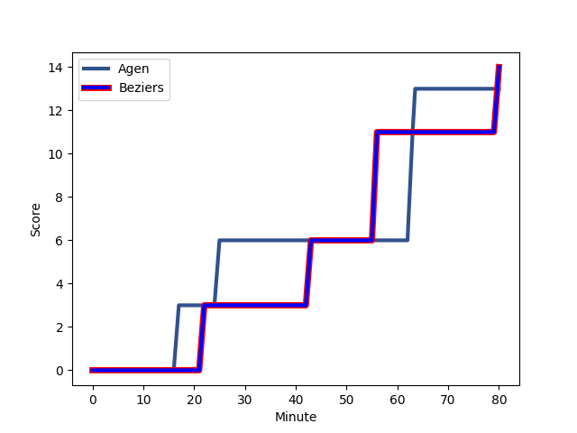
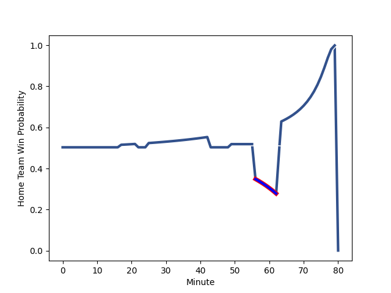

---  
layout: page  
title: Beziers at Agen; 14-13  
date: 2022-12-08 21:00:00 18:00:00 -0500  
categories: match review  
---
# Beziers (1462.16) at Agen (1464.29); 14-13

# Prediction: Agen by 3.2

Agen by 0.2 on a neutral field
## Scores over Time

## Win Probability over Time

# Pre-Match Prediction: Agen by 3.2

Agen by 0.2 on a neutral pitch

|   Away Minutes | Away Player                                                               |   Away elo |   Away Percentile |   Number |   Home Percentile |   Home elo | Home Player                                                             |   Home Minutes |
|---------------:|:--------------------------------------------------------------------------|-----------:|------------------:|---------:|------------------:|-----------:|:------------------------------------------------------------------------|---------------:|
|             80 | [Giorgi Akhaladze](..//playerfiles//GiorgiAkhaladze_cleaned.md)           |     101.28 |                67 |        1 |                43 |      94.32 | [Hans Lombard-Buret](..//playerfiles//HansLombard-Buret_cleaned.md)     |             80 |
|             80 | [Clément Esteriola](..//playerfiles//ClémentEsteriola_cleaned.md)         |      94.31 |                47 |        2 |                48 |      94.49 | [Loris Zarantonello](..//playerfiles//LorisZarantonello_cleaned.md)     |             80 |
|             80 | [Jon Zabala Arrieta](..//playerfiles//JonZabalaArrieta_cleaned.md)        |     105.64 |                82 |        3 |                51 |      95.46 | [Malik Hamadache](..//playerfiles//MalikHamadache_cleaned.md)           |             80 |
|             80 | [Clément Bitz](..//playerfiles//ClémentBitz_cleaned.md)                   |      98.63 |                62 |        4 |                16 |      84.19 | [Joe Maksymiw](..//playerfiles//JoeMaksymiw_cleaned.md)                 |             80 |
|             80 | [Pierre Gayraud](..//playerfiles//PierreGayraud_cleaned.md)               |      94.22 |                45 |        5 |                73 |     101.59 | [Zak Farrance](..//playerfiles//ZakFarrance_cleaned.md)                 |             80 |
|             80 | [Jean-Baptiste Barrère](..//playerfiles//Jean-BaptisteBarrère_cleaned.md) |      79.94 |                 6 |        6 |                80 |     107.07 | [Martin Devergie](..//playerfiles//MartinDevergie_cleaned.md)           |             80 |
|             80 | [Pierrick Gunther](..//playerfiles//PierrickGunther_cleaned.md)           |      84.87 |                11 |        7 |                21 |      87.81 | [Evan Olmstead](..//playerfiles//EvanOlmstead_cleaned.md)               |             80 |
|             80 | [Sias Koen](..//playerfiles//SiasKoen_cleaned.md)                         |      90.14 |                28 |        8 |                82 |     108.06 | [Fotu Lokotui](..//playerfiles//FotuLokotui_cleaned.md)                 |             80 |
|             80 | [Jean Victor Goillot](..//playerfiles//JeanVictorGoillot_cleaned.md)      |     100.97 |                66 |        9 |                20 |      88.8  | [Tane Takulua](..//playerfiles//TaneTakulua_cleaned.md)                 |             80 |
|             80 | [Romain Uruty](..//playerfiles//RomainUruty_cleaned.md)                   |      96.4  |                45 |       10 |                46 |      95.56 | [Emile Dayral](..//playerfiles//EmileDayral_cleaned.md)                 |             80 |
|             80 | [Gabin Lorre](..//playerfiles//GabinLorre_cleaned.md)                     |     104.35 |                78 |       11 |                91 |     114.06 | [Iban Etcheverry](..//playerfiles//IbanEtcheverry_cleaned.md)           |             80 |
|             80 | [Jarrod Poi](..//playerfiles//JarrodPoi_cleaned.md)                       |      85.33 |                15 |       12 |                44 |      94.08 | [Kolinio Ramoka](..//playerfiles//KolinioRamoka_cleaned.md)             |             80 |
|             80 | [Maxime Espeut](..//playerfiles//MaximeEspeut_cleaned.md)                 |     132.23 |                99 |       13 |                71 |     102.22 | [Theo Belan](..//playerfiles//TheoBelan_cleaned.md)                     |             80 |
|             80 | [Paul Recor](..//playerfiles//PaulRecor_cleaned.md)                       |     101.38 |                68 |       14 |                56 |      97.27 | [Tevita Railevu](..//playerfiles//TevitaRailevu_cleaned.md)             |             80 |
|             80 | [Charly Malie](..//playerfiles//CharlyMalie_cleaned.md)                   |      92.46 |                39 |       15 |                63 |      99.3  | [Jean-Marcelin Buttin](..//playerfiles//Jean-MarcelinButtin_cleaned.md) |             80 |

