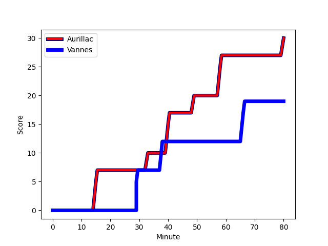
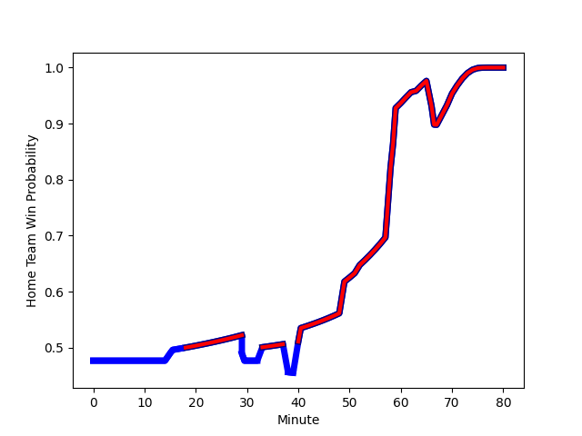

---  
layout: page  
title: Vannes at Aurillac; 19-30  
date: 2022-12-09 19:30:00 18:00:00 -0500  
categories: match review  
---
# Vannes (1417.39) at Aurillac (1376.9); 19-30

# Prediction: Vannes by 1.0

Vannes by 4.0 on a neutral field
## Scores over Time

## Win Probability over Time

# Pre-Match Prediction: Vannes by 0.5

Vannes by 2.5 on a neutral pitch

|   Away Minutes | Away Player                                                                  |   Away elo |   Away Percentile |   Number |   Home Percentile |   Home elo | Home Player                                                               |   Home Minutes |
|---------------:|:-----------------------------------------------------------------------------|-----------:|------------------:|---------:|------------------:|-----------:|:--------------------------------------------------------------------------|---------------:|
|             52 | [Charles-Henri Berguet](..//playerfiles//Charles-HenriBerguet_cleaned.md)    |      91.68 |                30 |        1 |                68 |      99.93 | [Alexandre Plantier](..//playerfiles//AlexandrePlantier_cleaned.md)       |             59 |
|             52 | [Cyril Blanchard](..//playerfiles//CyrilBlanchard_cleaned.md)                |     100.21 |                74 |        2 |                80 |     105.26 | [Adrian Smith](..//playerfiles//AdrianSmith_cleaned.md)                   |             59 |
|             52 | [John Afoa](..//playerfiles//JohnAfoa_cleaned.md)                            |      93.53 |                35 |        3 |                90 |     109.63 | [Giorgi Kartvelishvili](..//playerfiles//GiorgiKartvelishvili_cleaned.md) |             67 |
|             80 | [Myles Edwards](..//playerfiles//MylesEdwards_cleaned.md)                    |      81.59 |                 9 |        4 |                89 |     111.61 | [Cam Dodson](..//playerfiles//CamDodson_cleaned.md)                       |             63 |
|             52 | [Ewan Thomas Johnson](..//playerfiles//EwanThomasJohnson_cleaned.md)         |      96.73 |                55 |        5 |                68 |     100.03 | [Georgi Javakhia](..//playerfiles//GeorgiJavakhia_cleaned.md)             |             63 |
|             55 | [Juan Bautista Pedemonte](..//playerfiles//JuanBautistaPedemonte_cleaned.md) |      92.6  |                37 |        6 |                33 |      91.72 | [Eoghan Masterson](..//playerfiles//EoghanMasterson_cleaned.md)           |             80 |
|             80 | [Edoardo Iachizzi](..//playerfiles//EdoardoIachizzi_cleaned.md)              |     106.18 |                84 |        7 |                18 |      87.45 | [Beka Shvangiradze](..//playerfiles//BekaShvangiradze_cleaned.md)         |             80 |
|             54 | [Kevin Burgaud](..//playerfiles//KevinBurgaud_cleaned.md)                    |      87.46 |                21 |        8 |                73 |     102.76 | [Dylan Cretin](..//playerfiles//DylanCretin_cleaned.md)                   |             59 |
|             60 | [Hugo Zabalza](..//playerfiles//HugoZabalza_cleaned.md)                      |      86.34 |                13 |        9 |                 6 |      80.91 | [David Delarue](..//playerfiles//DavidDelarue_cleaned.md)                 |             70 |
|             80 | [Dan Hollinshead](..//playerfiles//DanHollinshead_cleaned.md)                |      89.8  |                28 |       10 |                64 |      99.63 | [Marc Palmier](..//playerfiles//MarcPalmier_cleaned.md)                   |             80 |
|             80 | [Théo Bastardie](..//playerfiles//ThéoBastardie_cleaned.md)                  |     100.15 |                68 |       11 |                 9 |      83.11 | [AJ Coertzen](..//playerfiles//AJCoertzen_cleaned.md)                     |             80 |
|             59 | [Youenn Floch](..//playerfiles//YouennFloch_cleaned.md)                      |      88.9  |                24 |       12 |                 8 |      80.9  | [Christa Powell](..//playerfiles//ChristaPowell_cleaned.md)               |             80 |
|             80 | [Nicolas Freitas](..//playerfiles//NicolasFreitas_cleaned.md)                |      99.31 |                65 |       13 |                 3 |      74.07 | [Jimmy Yobo](..//playerfiles//JimmyYobo_cleaned.md)                       |             80 |
|             80 | [Nathanael Hulleu](..//playerfiles//NathanaelHulleu_cleaned.md)              |      96.9  |                54 |       14 |                17 |      87.64 | [Giorgi Gogoladze](..//playerfiles//GiorgiGogoladze_cleaned.md)           |             80 |
|             80 | [Gwenaël Duplenne](..//playerfiles//GwenaëlDuplenne_cleaned.md)              |     101.45 |                69 |       15 |                 7 |      78.22 | [Anderson Neisen](..//playerfiles//AndersonNeisen_cleaned.md)             |             67 |
|             28 | [Pat Leafa](..//playerfiles//PatLeafa_cleaned.md)                            |      94.16 |                46 |       16 |                79 |     103.87 | [Luka Nioradze](..//playerfiles//LukaNioradze_cleaned.md)                 |             21 |
|             28 | [Eric Marks](..//playerfiles//EricMarks_cleaned.md)                          |      64.25 |                 0 |       17 |                37 |      90.93 | [Jean-Jacques Gymael](..//playerfiles//Jean-JacquesGymael_cleaned.md)     |             21 |
|             28 | [Enzo Baggiani](..//playerfiles//EnzoBaggiani_cleaned.md)                    |      96.75 |                54 |       18 |                 5 |      76.83 | [Latuka Maituku](..//playerfiles//LatukaMaituku_cleaned.md)               |             21 |
|             28 | [Paga Tafili](..//playerfiles//PagaTafili_cleaned.md)                        |     116.01 |                96 |       19 |                 9 |      79.61 | [Jean-Baptiste Singer](..//playerfiles//Jean-BaptisteSinger_cleaned.md)   |             17 |
|             26 | [Remi Leroux](..//playerfiles//RemiLeroux_cleaned.md)                        |     103.59 |                77 |       20 |                83 |     105.95 | [Yann Tivoli](..//playerfiles//YannTivoli_cleaned.md)                     |             17 |
|             25 | [Clément Vidoni](..//playerfiles//ClémentVidoni_cleaned.md)                  |      95    |               nan |       21 |                 9 |      81.72 | [Peter Nelson](..//playerfiles//PeterNelson_cleaned.md)                   |             13 |
|             21 | [Jean Chezeau](..//playerfiles//JeanChezeau_cleaned.md)                      |      95.45 |               nan |       22 |                26 |      89.6  | [Henzo Kiteau](..//playerfiles//HenzoKiteau_cleaned.md)                   |             13 |
|             20 | [Will Percillier](..//playerfiles//WillPercillier_cleaned.md)                |      89.14 |                21 |       23 |               nan |      95.4  | [Boris Hadinegoro](..//playerfiles//BorisHadinegoro_cleaned.md)           |             10 |

