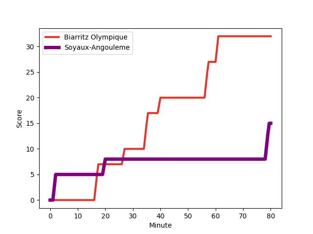
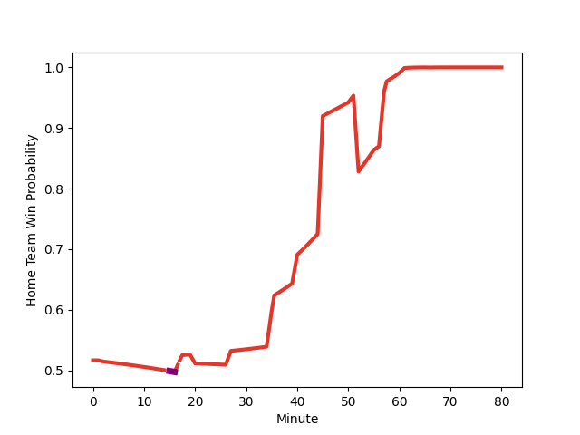

---  
layout: page  
title: Soyaux-Angouleme at Biarritz Olympique; 15-32  
date: 2022-12-09 19:30:00 18:00:00 -0500  
categories: match review  
---
# Soyaux-Angouleme (1439.49) at Biarritz Olympique (1468.01); 15-32

# Prediction: Biarritz Olympique by 5.9

Biarritz Olympique by 2.9 on a neutral field
## Scores over Time

## Win Probability over Time

# Pre-Match Prediction: Biarritz Olympique by 1.0

Soyaux-Angouleme by 2.0 on a neutral pitch

|   Away Minutes | Away Player                                                            |   Away elo |   Away Percentile |   Number |   Home Percentile |   Home elo | Home Player                                                           |   Home Minutes |
|---------------:|:-----------------------------------------------------------------------|-----------:|------------------:|---------:|------------------:|-----------:|:----------------------------------------------------------------------|---------------:|
|             49 | [Khatchik Vartanov](..//playerfiles//KhatchikVartanov_cleaned.md)      |      92.95 |                27 |        1 |                36 |      92.93 | [Baptiste Erdocio](..//playerfiles//BaptisteErdocio_cleaned.md)       |             80 |
|             45 | [Patxi Bidart](..//playerfiles//PatxiBidart_cleaned.md)                |      94.82 |                46 |        2 |                64 |      98.38 | [Thomas Sauveterre](..//playerfiles//ThomasSauveterre_cleaned.md)     |             66 |
|             51 | [Manasa Saulo Romumu](..//playerfiles//ManasaSauloRomumu_cleaned.md)   |     118.35 |                96 |        3 |                39 |      93.46 | [Quentin Samaran](..//playerfiles//QuentinSamaran_cleaned.md)         |             52 |
|             80 | [Matt Beukeboom](..//playerfiles//MattBeukeboom_cleaned.md)            |      81.94 |                 7 |        4 |                50 |      95.22 | [Johan Aliouat](..//playerfiles//JohanAliouat_cleaned.md)             |             52 |
|             57 | [Sikeli Nabou](..//playerfiles//SikeliNabou_cleaned.md)                |     118.55 |                94 |        5 |                57 |      97.79 | [Josh Tyrell](..//playerfiles//JoshTyrell_cleaned.md)                 |             80 |
|             80 | [Gautier Gibouin](..//playerfiles//GautierGibouin_cleaned.md)          |      76.66 |                 4 |        6 |                30 |      90.7  | [Dave O'Callaghan](..//playerfiles//DaveO'Callaghan_cleaned.md)       |             16 |
|             56 | [Nicolas Martins](..//playerfiles//NicolasMartins_cleaned.md)          |      93.67 |               nan |        7 |               nan |      96.53 | [Temo Matiu](..//playerfiles//TemoMatiu_cleaned.md)                   |             80 |
|             80 | [Robin Copeland](..//playerfiles//RobinCopeland_cleaned.md)            |     115.02 |                89 |        8 |                56 |      97.09 | [Elliot Dixon](..//playerfiles//ElliotDixon_cleaned.md)               |             80 |
|             60 | [Manu Saubusse](..//playerfiles//ManuSaubusse_cleaned.md)              |     107.36 |                82 |        9 |                11 |      85.76 | [Barnabe Couilloud](..//playerfiles//BarnabeCouilloud_cleaned.md)     |             66 |
|             60 | [Matthieu Ugalde](..//playerfiles//MatthieuUgalde_cleaned.md)          |     108.83 |                82 |       10 |                78 |     107.56 | [Ilian Perraux](..//playerfiles//IlianPerraux_cleaned.md)             |             80 |
|             80 | [Maxime Laforgue](..//playerfiles//MaximeLaforgue_cleaned.md)          |      97.15 |                55 |       11 |                42 |      94.02 | [Steeve Barry](..//playerfiles//SteeveBarry_cleaned.md)               |             80 |
|             80 | [Inaki Ayarza Saporta](..//playerfiles//InakiAyarzaSaporta_cleaned.md) |      87.03 |                16 |       12 |                50 |      96.28 | [Auguste Cadot](..//playerfiles//AugusteCadot_cleaned.md)             |             80 |
|             80 | [Ledua Mau](..//playerfiles//LeduaMau_cleaned.md)                      |      88.04 |                21 |       13 |                13 |      84.33 | [Francois Vergnaud](..//playerfiles//FrancoisVergnaud_cleaned.md)     |             57 |
|             80 | [Hugo Le Gall](..//playerfiles//HugoLeGall_cleaned.md)                 |      84.35 |                11 |       14 |                96 |     121.24 | [Henry Speight](..//playerfiles//HenrySpeight_cleaned.md)             |             80 |
|             60 | [Pierre Lafitte](..//playerfiles//PierreLafitte_cleaned.md)            |      88.47 |                25 |       15 |                90 |     112.48 | [Romain Lonca](..//playerfiles//RomainLonca_cleaned.md)               |             66 |
|             35 | [Rayne Barka](..//playerfiles//RayneBarka_cleaned.md)                  |     101.86 |                74 |       16 |                75 |     104.58 | [Tornike Jalagonia](..//playerfiles//TornikeJalagonia_cleaned.md)     |             64 |
|             31 | [Yassine Boutemane](..//playerfiles//YassineBoutemane_cleaned.md)      |      88.98 |                20 |       17 |                21 |      89.9  | [Luka Tchelidze](..//playerfiles//LukaTchelidze_cleaned.md)           |             28 |
|             29 | [Seydou Diakité](..//playerfiles//SeydouDiakité_cleaned.md)            |     100.11 |                68 |       18 |                 5 |      76.42 | [Johnny Dyer](..//playerfiles//JohnnyDyer_cleaned.md)                 |             28 |
|             24 | [Hubert Texier](..//playerfiles//HubertTexier_cleaned.md)              |     101.64 |                70 |       19 |                57 |      97.6  | [Joe Jonas](..//playerfiles//JoeJonas_cleaned.md)                     |             23 |
|             23 | [Saba Pesvianidze](..//playerfiles//SabaPesvianidze_cleaned.md)        |     105.41 |                81 |       20 |                67 |     100.75 | [Baptiste Fariscot](..//playerfiles//BaptisteFariscot_cleaned.md)     |             14 |
|             20 | [Adrien Bau](..//playerfiles//AdrienBau_cleaned.md)                    |      78.19 |                 3 |       21 |               nan |      94.88 | [Leo Carella](..//playerfiles//LeoCarella_cleaned.md)                 |             14 |
|             20 | [Jacob Botica](..//playerfiles//JacobBotica_cleaned.md)                |     102.33 |                71 |       22 |                11 |      84.79 | [Kerman Aurrekoetxea](..//playerfiles//KermanAurrekoetxea_cleaned.md) |             14 |
|             20 | [Rémi Brosset](..//playerfiles//RémiBrosset_cleaned.md)                |      95.12 |                48 |       23 |               nan |     nan    | nan                                                                   |            nan |

