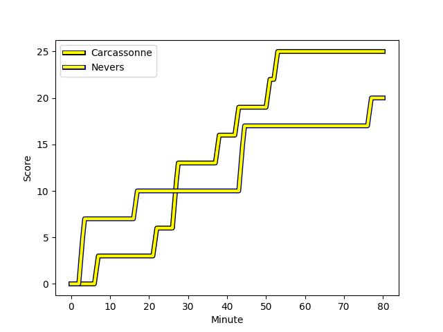
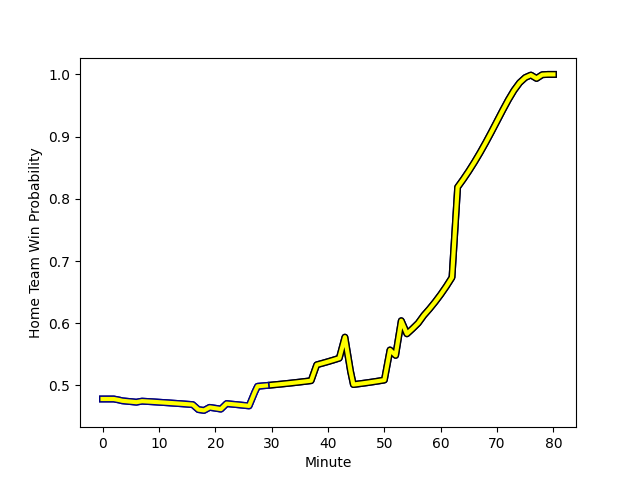

---  
layout: page  
title: Nevers at Carcassonne; 20-25  
date: 2022-12-09 19:30:00 18:00:00 -0500  
categories: match review  
---
# Nevers (1444.74) at Carcassonne (1406.79); 20-25

# Prediction: Nevers by 0.8

Nevers by 3.8 on a neutral field
## Scores over Time

## Win Probability over Time

# Pre-Match Prediction: Nevers by 2.0

Nevers by 5.0 on a neutral pitch

|   Away Minutes | Away Player                                                                   |   Away elo |   Away Percentile |   Number |   Home Percentile |   Home elo | Home Player                                                           |   Home Minutes |
|---------------:|:------------------------------------------------------------------------------|-----------:|------------------:|---------:|------------------:|-----------:|:----------------------------------------------------------------------|---------------:|
|             57 | [Tomike Mataradze](..//playerfiles//TomikeMataradze_cleaned.md)               |      82.81 |                 7 |        1 |                 3 |      78.42 | [Youssef Amrouni](..//playerfiles//YoussefAmrouni_cleaned.md)         |             54 |
|             52 | [Elia Elia](..//playerfiles//EliaElia_cleaned.md)                             |      84.5  |                11 |        2 |                 2 |      74.87 | [Raphael Carbou](..//playerfiles//RaphaelCarbou_cleaned.md)           |             63 |
|             57 | [Aselo Ikahehegi](..//playerfiles//AseloIkahehegi_cleaned.md)                 |      89.73 |                17 |        3 |                 7 |      82.82 | [Soso Bekoshvili](..//playerfiles//SosoBekoshvili_cleaned.md)         |             54 |
|             57 | [Christiaan van der Merwe](..//playerfiles//ChristiaanvanderMerwe_cleaned.md) |      77.82 |                 6 |        4 |                21 |      88.17 | [George Merrick](..//playerfiles//GeorgeMerrick_cleaned.md)           |             63 |
|             80 | [Will Skelton](..//playerfiles//WillSkelton_cleaned.md)                       |     111.45 |                89 |        5 |                48 |      94.96 | [Rynard Landman](..//playerfiles//RynardLandman_cleaned.md)           |             80 |
|             80 | [Hugues Bastide](..//playerfiles//HuguesBastide_cleaned.md)                   |     125.86 |                97 |        6 |                77 |     103.44 | [Aaron Carroll](..//playerfiles//AaronCarroll_cleaned.md)             |             63 |
|             80 | [Julien Kazubek](..//playerfiles//JulienKazubek_cleaned.md)                   |      86.82 |                15 |        7 |                91 |     112.94 | [Rob Harley](..//playerfiles//RobHarley_cleaned.md)                   |             80 |
|             54 | [Steven David](..//playerfiles//StevenDavid_cleaned.md)                       |      75.75 |                 3 |        8 |                16 |      85.62 | [Etienne Herjean](..//playerfiles//EtienneHerjean_cleaned.md)         |             80 |
|             19 | [Guillaume Manevy](..//playerfiles//GuillaumeManevy_cleaned.md)               |     104.15 |                76 |        9 |                96 |     121.61 | [Samuel Marques](..//playerfiles//SamuelMarques_cleaned.md)           |             73 |
|             52 | [Yohan Le Bourhis](..//playerfiles//YohanLeBourhis_cleaned.md)                |      97.57 |                54 |       10 |                64 |      99.6  | [Dorian Jones](..//playerfiles//DorianJones_cleaned.md)               |             80 |
|             44 | [Christian Ambadiang](..//playerfiles//ChristianAmbadiang_cleaned.md)         |      88.24 |                19 |       11 |                48 |      95.19 | [Léo Darrelatour](..//playerfiles//LéoDarrelatour_cleaned.md)         |             63 |
|             80 | [Leonard Paris](..//playerfiles//LeonardParis_cleaned.md)                     |     110.64 |                86 |       12 |                46 |      94.87 | [Nick Grigg](..//playerfiles//NickGrigg_cleaned.md)                   |             80 |
|             80 | [Alifereti Loaloa](..//playerfiles//AliferetiLoaloa_cleaned.md)               |      73.69 |                 3 |       13 |                10 |      82.11 | [Pierre Aguillon](..//playerfiles//PierreAguillon_cleaned.md)         |             80 |
|             80 | [Andrzej Charlat](..//playerfiles//AndrzejCharlat_cleaned.md)                 |     106.31 |                81 |       14 |                95 |     119.66 | [Benoit Jasmin](..//playerfiles//BenoitJasmin_cleaned.md)             |             80 |
|             80 | [Kylian Jaminet](..//playerfiles//KylianJaminet_cleaned.md)                   |     122.85 |                95 |       15 |                 9 |      80.18 | [Baptiste Mouchous](..//playerfiles//BaptisteMouchous_cleaned.md)     |             80 |
|             61 | [Yoan Cottin](..//playerfiles//YoanCottin_cleaned.md)                         |      97.38 |                63 |       16 |                41 |      93.56 | [Sami Mavinga](..//playerfiles//SamiMavinga_cleaned.md)               |             26 |
|             36 | [Emmanuel Vaitulukina](..//playerfiles//EmmanuelVaitulukina_cleaned.md)       |      94.15 |                44 |       17 |                 0 |      62.02 | [Vakhtangi Akhobadze](..//playerfiles//VakhtangiAkhobadze_cleaned.md) |             26 |
|             28 | [Shaun Reynolds](..//playerfiles//ShaunReynolds_cleaned.md)                   |      87.42 |                18 |       18 |               nan |      95.3  | [Luka Petriashvili](..//playerfiles//LukaPetriashvili_cleaned.md)     |             17 |
|             28 | [Issam Hamel](..//playerfiles//IssamHamel_cleaned.md)                         |     108.83 |                89 |       19 |                 1 |      65.8  | [Stephane Onambele](..//playerfiles//StephaneOnambele_cleaned.md)     |             17 |
|             26 | [Shaun Adendorff](..//playerfiles//ShaunAdendorff_cleaned.md)                 |     102.25 |                69 |       20 |                 4 |      78.61 | [Gregory Annetta](..//playerfiles//GregoryAnnetta_cleaned.md)         |             17 |
|             23 | [Kamaliele Tufele](..//playerfiles//KamalieleTufele_cleaned.md)               |      87.6  |                16 |       21 |                73 |     102.85 | [Martin Dulon](..//playerfiles//MartinDulon_cleaned.md)               |             17 |
|             23 | [Maka Polutele](..//playerfiles//MakaPolutele_cleaned.md)                     |      81.67 |                10 |       22 |                69 |     101.46 | [Damien Añon](..//playerfiles//DamienAñon_cleaned.md)                 |              7 |
|             23 | [Sosefo Falatea](..//playerfiles//SosefoFalatea_cleaned.md)                   |      65.36 |                 0 |       23 |               nan |     nan    | nan                                                                   |            nan |

