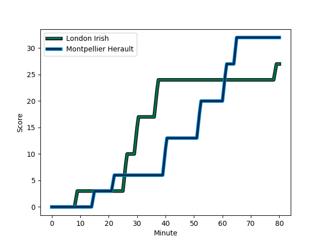
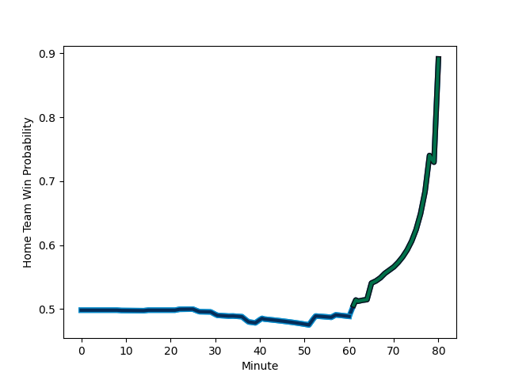

---  
layout: page  
title: Montpellier Herault at London Irish; 32-27  
date: 2022-12-09 21:00:00 18:00:00 -0500  
categories: match review  
---
# Montpellier Herault (1601.78) at London Irish (1598.82); 32-27

# Prediction: London Irish by 2.7

Montpellier Herault by 0.3 on a neutral field
## Scores over Time

## Win Probability over Time

# Pre-Match Prediction: Montpellier Herault by 3.9

London Irish by 0.9 on a neutral pitch

|   Away Minutes | Away Player                                                             |   Away elo |   Away Percentile |   Number |   Home Percentile |   Home elo | Home Player                                                                       |   Home Minutes |
|---------------:|:------------------------------------------------------------------------|-----------:|------------------:|---------:|------------------:|-----------:|:----------------------------------------------------------------------------------|---------------:|
|             70 | [Enzo Forletta](..//playerfiles//EnzoForletta_cleaned.md)               |     107.91 |                87 |        1 |                39 |      93.41 | [Facundo Gigena](..//playerfiles//FacundoGigena_cleaned.md)                       |             54 |
|             63 | [Brandon Paenga-Amosa](..//playerfiles//BrandonPaenga-Amosa_cleaned.md) |      90.39 |                29 |        2 |                87 |     107.82 | [Agustin Creevy](..//playerfiles//AgustinCreevy_cleaned.md)                       |             80 |
|             53 | [Mohamed Haouas](..//playerfiles//MohamedHaouas_cleaned.md)             |      93.16 |                37 |        3 |                54 |      96.76 | [Lovejoy Chawatama](..//playerfiles//LovejoyChawatama_cleaned.md)                 |             62 |
|             80 | [Florian Verhaeghe](..//playerfiles//FlorianVerhaeghe_cleaned.md)       |     113.49 |                91 |        4 |                97 |     123.33 | [Rob Simmons](..//playerfiles//RobSimmons_cleaned.md)                             |             80 |
|             77 | [Bastien Chalureau](..//playerfiles//BastienChalureau_cleaned.md)       |     120.22 |                95 |        5 |                96 |     122.62 | [Adam Coleman](..//playerfiles//AdamColeman_cleaned.md)                           |             68 |
|             41 | [Yacouba Camara](..//playerfiles//YacoubaCamara_cleaned.md)             |     117.23 |                93 |        6 |                95 |     117.77 | [Matt Rogerson](..//playerfiles//MattRogerson_cleaned.md)                         |             80 |
|             70 | [Alexandre Becognee](..//playerfiles//AlexandreBecognee_cleaned.md)     |      94.44 |                45 |        7 |                91 |     113.46 | [Juan Martin Gonzalez](..//playerfiles//JuanMartinGonzalez_cleaned.md)            |             57 |
|             57 | [Zach Mercer](..//playerfiles//ZachMercer_cleaned.md)                   |     101.63 |                66 |        8 |                91 |     117.6  | [So'otala Fa'aso'o](..//playerfiles//So'otalaFa'aso'o_cleaned.md)                 |             67 |
|             80 | [Cobus Reinach](..//playerfiles//CobusReinach_cleaned.md)               |     112.86 |                90 |        9 |                88 |     110.34 | [Ben White](..//playerfiles//BenWhite_cleaned.md)                                 |             54 |
|             80 | [Louis Carbonel](..//playerfiles//LouisCarbonel_cleaned.md)             |     103.62 |                75 |       10 |                87 |     111.57 | [Paddy Jackson](..//playerfiles//PaddyJackson_cleaned.md)                         |             67 |
|             80 | [George Bridge](..//playerfiles//GeorgeBridge_cleaned.md)               |     118.62 |                94 |       11 |                61 |      98.2  | [Ollie Hassell-Collins](..//playerfiles//OllieHassell-Collins_cleaned.md)         |             80 |
|             80 | [Paolo Garbisi](..//playerfiles//PaoloGarbisi_cleaned.md)               |     108.18 |                83 |       12 |                49 |      96.15 | [Benhard Janse van Rensburg](..//playerfiles//BenhardJansevanRensburg_cleaned.md) |             80 |
|             80 | [Thomas Darmon](..//playerfiles//ThomasDarmon_cleaned.md)               |      88.69 |                24 |       13 |                58 |      98.12 | [Will Joseph](..//playerfiles//WillJoseph_cleaned.md)                             |             80 |
|             80 | [Ben Lam](..//playerfiles//BenLam_cleaned.md)                           |     118.84 |                94 |       14 |                39 |      93.7  | [Lucio Cinti](..//playerfiles//LucioCinti_cleaned.md)                             |             80 |
|             34 | [Anthony Bouthier](..//playerfiles//AnthonyBouthier_cleaned.md)         |     109.45 |                82 |       15 |                89 |     111.8  | [Ben Loader](..//playerfiles//BenLoader_cleaned.md)                               |             46 |
|             10 | [Karl Tu'inukuafe](..//playerfiles//KarlTu'inukuafe_cleaned.md)         |     111.61 |               nan |       16 |                27 |      92.51 | [Danilo Fischetti](..//playerfiles//DaniloFischetti_cleaned.md)                   |             26 |
|             17 | [Curtis Langdon](..//playerfiles//CurtisLangdon_cleaned.md)             |      96    |                53 |       17 |                94 |     115.44 | [Oli Hoskins](..//playerfiles//OliHoskins_cleaned.md)                             |             18 |
|             27 | [Titi Lamositele](..//playerfiles//TitiLamositele_cleaned.md)           |      93.03 |                39 |       18 |                71 |     100.93 | [Chunya Munga](..//playerfiles//ChunyaMunga_cleaned.md)                           |             12 |
|              3 | [Masivesi Dakuwaqa](..//playerfiles//MasivesiDakuwaqa_cleaned.md)       |     106.27 |                80 |       19 |                49 |      95.52 | [Chandler Cunningham-South](..//playerfiles//ChandlerCunningham-South_cleaned.md) |             23 |
|             39 | [Clément Doumenc](..//playerfiles//ClémentDoumenc_cleaned.md)           |     111.16 |                89 |       20 |                94 |     118.82 | [Luca Morisi](..//playerfiles//LucaMorisi_cleaned.md)                             |             13 |
|             10 | [Marco Tauleigne](..//playerfiles//MarcoTauleigne_cleaned.md)           |     101.09 |                71 |       21 |                50 |      95.91 | [Joe Powell](..//playerfiles//JoePowell_cleaned.md)                               |             26 |
|             23 | [Léo Coly](..//playerfiles//LéoColy_cleaned.md)                         |     106.22 |                81 |       22 |                67 |     100.76 | [Rory Jennings](..//playerfiles//RoryJennings_cleaned.md)                         |             13 |
|             46 | [Julien Tisseron](..//playerfiles//JulienTisseron_cleaned.md)           |     114.26 |                91 |       23 |                74 |     104.56 | [Mike Willemse](..//playerfiles//MikeWillemse_cleaned.md)                         |             34 |

