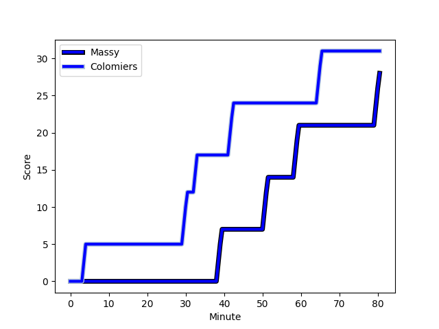
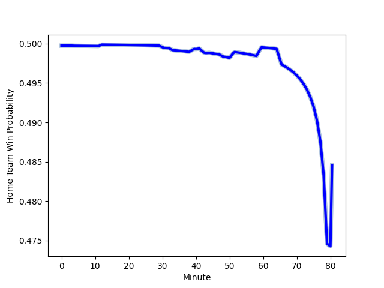

---  
layout: page  
title: Colomiers at Massy; 31-28  
date: 2022-12-09 19:30:00 18:00:00 -0500  
categories: match review  
---
# Colomiers (1374.48) at Massy (1374.06); 31-28

# Prediction: Massy by 3.0

Colomiers by 0.0 on a neutral field
## Scores over Time

## Win Probability over Time

# Pre-Match Prediction: Colomiers by 0.2

Colomiers by 2.8 on a neutral pitch

|   Away Minutes | Away Player                                                               |   Away elo |   Away Percentile |   Number |   Home Percentile |   Home elo | Home Player                                                                     |   Home Minutes |
|---------------:|:--------------------------------------------------------------------------|-----------:|------------------:|---------:|------------------:|-----------:|:--------------------------------------------------------------------------------|---------------:|
|             51 | [Guillaume Tartas](..//playerfiles//GuillaumeTartas_cleaned.md)           |     109.71 |                90 |        1 |                78 |     104.08 | [Robin Poipy](..//playerfiles//RobinPoipy_cleaned.md)                           |             53 |
|             51 | [Andrew Ready](..//playerfiles//AndrewReady_cleaned.md)                   |      86.61 |                13 |        2 |                25 |      90.04 | [Pierre-Alexandre Duclieu](..//playerfiles//Pierre-AlexandreDuclieu_cleaned.md) |             41 |
|             63 | [Marco Fepulea'i](..//playerfiles//MarcoFepulea'i_cleaned.md)             |     104.17 |                79 |        3 |                13 |      86.39 | [Tijde Visser](..//playerfiles//TijdeVisser_cleaned.md)                         |             69 |
|             44 | [Jean Thomas](..//playerfiles//JeanThomas_cleaned.md)                     |      98.84 |                63 |        4 |                 4 |      74.97 | [Andrew Chauveau](..//playerfiles//AndrewChauveau_cleaned.md)                   |             80 |
|             80 | [Alexandre Ricard](..//playerfiles//AlexandreRicard_cleaned.md)           |      96.78 |                55 |        5 |                 3 |      76.45 | [Ewan Coetzee](..//playerfiles//EwanCoetzee_cleaned.md)                         |             41 |
|             80 | [Pierre-Samuel Pacheco](..//playerfiles//Pierre-SamuelPacheco_cleaned.md) |      87.93 |                19 |        6 |                53 |      97.59 | [Samuel Nollet](..//playerfiles//SamuelNollet_cleaned.md)                       |             80 |
|             56 | [Waël Ponpon](..//playerfiles//WaëlPonpon_cleaned.md)                     |      86.09 |                14 |        7 |                48 |      95.19 | [Abongile Nonkontwana](..//playerfiles//AbongileNonkontwana_cleaned.md)         |             41 |
|             56 | [Aldric Lescure](..//playerfiles//AldricLescure_cleaned.md)               |      97.44 |                52 |        8 |               nan |      95.96 | [Andy Timo](..//playerfiles//AndyTimo_cleaned.md)                               |             80 |
|             66 | [Ugo Seguela](..//playerfiles//UgoSeguela_cleaned.md)                     |     101.9  |                72 |        9 |                58 |      97.92 | [Gaetan Pichon](..//playerfiles//GaetanPichon_cleaned.md)                       |             39 |
|             80 | [Romuald Séguy](..//playerfiles//RomualdSéguy_cleaned.md)                 |      90.64 |                26 |       10 |                45 |      95.25 | [Massimo Ortolan](..//playerfiles//MassimoOrtolan_cleaned.md)                   |             80 |
|             80 | [Valentin Saurs](..//playerfiles//ValentinSaurs_cleaned.md)               |      83.31 |                 9 |       11 |                40 |      93.52 | [Nathan Farissier](..//playerfiles//NathanFarissier_cleaned.md)                 |             80 |
|             12 | [Paul Pimienta](..//playerfiles//PaulPimienta_cleaned.md)                 |     110.05 |                87 |       12 |                25 |      89.51 | [Victorien Jacomme](..//playerfiles//VictorienJacomme_cleaned.md)               |             80 |
|             80 | [Fabien Perrin](..//playerfiles//FabienPerrin_cleaned.md)                 |     103.38 |                74 |       13 |                71 |     102.48 | [Arthur Seigneuret](..//playerfiles//ArthurSeigneuret_cleaned.md)               |             48 |
|             80 | [Victor Moro](..//playerfiles//VictorMoro_cleaned.md)                     |      71.44 |                 1 |       14 |                22 |      89.36 | [Yanis Dit Robaglia](..//playerfiles//YanisDitRobaglia_cleaned.md)              |             80 |
|             80 | [Max Auriac](..//playerfiles//MaxAuriac_cleaned.md)                       |      90.62 |                32 |       15 |                39 |      92.59 | [Romain Clouté](..//playerfiles//RomainClouté_cleaned.md)                       |             56 |
|             68 | [Maxime Javaux](..//playerfiles//MaximeJavaux_cleaned.md)                 |      81.32 |                 6 |       16 |                68 |     100.11 | [Alex Preira](..//playerfiles//AlexPreira_cleaned.md)                           |             41 |
|             36 | [Maxime Granouillet](..//playerfiles//MaximeGranouillet_cleaned.md)       |      84.75 |                16 |       17 |                 4 |      79.73 | [Corentin Chabeaudie](..//playerfiles//CorentinChabeaudie_cleaned.md)           |             39 |
|             29 | [Thomas Dubois](..//playerfiles//ThomasDubois_cleaned.md)                 |      71.56 |                 1 |       18 |                43 |      94.45 | [Yohann Gbizie](..//playerfiles//YohannGbizie_cleaned.md)                       |             39 |
|             29 | [Hika Elliot](..//playerfiles//HikaElliot_cleaned.md)                     |     112.19 |                92 |       19 |                76 |     102.97 | [Marco Fuser](..//playerfiles//MarcoFuser_cleaned.md)                           |             39 |
|             24 | [Yann Peysson](..//playerfiles//YannPeysson_cleaned.md)                   |      89.64 |                25 |       20 |                 4 |      76.83 | [Mathieu Guillomot](..//playerfiles//MathieuGuillomot_cleaned.md)               |             32 |
|             24 | [Anthony Coletta](..//playerfiles//AnthonyColetta_cleaned.md)             |      58.57 |                 0 |       21 |                 5 |      80.63 | [Fernandez Correa](..//playerfiles//FernandezCorrea_cleaned.md)                 |             27 |
|             17 | [Beka Sheklashvili](..//playerfiles//BekaSheklashvili_cleaned.md)         |     116.91 |                96 |       22 |                36 |      93.04 | [Tom Deleuze](..//playerfiles//TomDeleuze_cleaned.md)                           |             24 |
|             14 | [Mathis Galthié](..//playerfiles//MathisGalthié_cleaned.md)               |      94.9  |               nan |       23 |                70 |     102.03 | [Guiterembi Vickos](..//playerfiles//GuiterembiVickos_cleaned.md)               |             11 |

