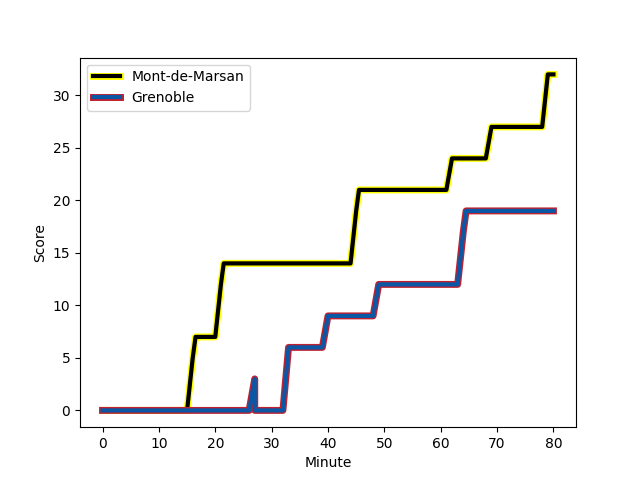
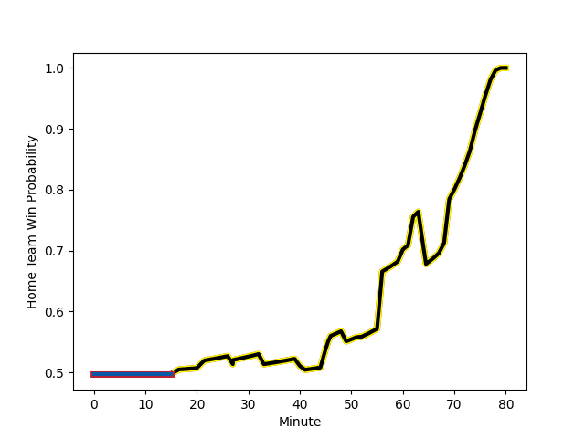

---  
layout: page  
title: Grenoble at Mont-de-Marsan; 19-32  
date: 2022-12-09 21:00:00 18:00:00 -0500  
categories: match review  
---
# Grenoble (1442.94) at Mont-de-Marsan (1437.18); 19-32

# Prediction: Mont-de-Marsan by 2.4

Grenoble by 0.6 on a neutral field
## Scores over Time

## Win Probability over Time

# Pre-Match Prediction: Grenoble by 0.7

Grenoble by 2.3 on a neutral pitch

|   Away Minutes | Away Player                                                                         |   Away elo |   Away Percentile |   Number |   Home Percentile |   Home elo | Home Player                                                             |   Home Minutes |
|---------------:|:------------------------------------------------------------------------------------|-----------:|------------------:|---------:|------------------:|-----------:|:------------------------------------------------------------------------|---------------:|
|             62 | [Zack Gauthier](..//playerfiles//ZackGauthier_cleaned.md)                           |     107.53 |                86 |        1 |                34 |      93.49 | [Max Curie](..//playerfiles//MaxCurie_cleaned.md)                       |             52 |
|             46 | [Lilian Rossi](..//playerfiles//LilianRossi_cleaned.md)                             |     105.9  |                88 |        2 |                81 |     105.27 | [Jose Luis Gonzalez](..//playerfiles//JoseLuisGonzalez_cleaned.md)      |             41 |
|             62 | [Irakli Aptsiauri](..//playerfiles//IrakliAptsiauri_cleaned.md)                     |      93.24 |                37 |        3 |                 8 |      83.11 | [Gheorge Gajion](..//playerfiles//GheorgeGajion_cleaned.md)             |             68 |
|             80 | [Jose Madeira](..//playerfiles//JoseMadeira_cleaned.md)                             |     100.9  |                73 |        4 |                15 |      84.83 | [Aston Fortuin](..//playerfiles//AstonFortuin_cleaned.md)               |             80 |
|             56 | [Pio Muarua](..//playerfiles//PioMuarua_cleaned.md)                                 |     102.75 |                75 |        5 |                58 |      99.09 | [Leandro Cedaro](..//playerfiles//LeandroCedaro_cleaned.md)             |             53 |
|             80 | [Tanginoa Halaifonua](..//playerfiles//TanginoaHalaifonua_cleaned.md)               |     101.15 |                69 |        6 |                 7 |      82.58 | [Léo Banos](..//playerfiles//LéoBanos_cleaned.md)                       |             80 |
|             80 | [Thibaut Martel](..//playerfiles//ThibautMartel_cleaned.md)                         |      78.27 |                 6 |        7 |                86 |     108.56 | [Nicolas Garrault](..//playerfiles//NicolasGarrault_cleaned.md)         |             80 |
|             56 | [Talalelei Gray](..//playerfiles//TalaleleiGray_cleaned.md)                         |      90.6  |                30 |        8 |                94 |     124.04 | [William Wavrin](..//playerfiles//WilliamWavrin_cleaned.md)             |             27 |
|             60 | [Felipe Ezcurra](..//playerfiles//FelipeEzcurra_cleaned.md)                         |     130.5  |                99 |        9 |                 1 |      73.73 | [Christophe Loustalot](..//playerfiles//ChristopheLoustalot_cleaned.md) |             74 |
|             63 | [Thomas Fortunel](..//playerfiles//ThomasFortunel_cleaned.md)                       |      90.64 |                26 |       10 |                90 |     114.2  | [Willie du Plessis](..//playerfiles//WillieduPlessis_cleaned.md)        |             80 |
|             80 | [Lucas Dupont](..//playerfiles//LucasDupont_cleaned.md)                             |      97.36 |                56 |       11 |                51 |      96.46 | [Kaminieli Rasaku](..//playerfiles//KaminieliRasaku_cleaned.md)         |             80 |
|             80 | [Terrence Hepetema](..//playerfiles//TerrenceHepetema_cleaned.md)                   |      88.58 |                23 |       12 |                72 |     102.77 | [Lucas Mensa](..//playerfiles//LucasMensa_cleaned.md)                   |             80 |
|             60 | [Romain Trouilloud](..//playerfiles//RomainTrouilloud_cleaned.md)                   |      93.16 |                42 |       13 |                86 |     111.51 | [Nacani Wakaya](..//playerfiles//NacaniWakaya_cleaned.md)               |             80 |
|             80 | [Atunaisa Taulanga Vaka Manu](..//playerfiles//AtunaisaTaulangaVakaManu_cleaned.md) |      81.6  |                 8 |       14 |                30 |      91.38 | [Julien Cabannes](..//playerfiles//JulienCabannes_cleaned.md)           |             65 |
|             80 | [Julien Farnoux](..//playerfiles//JulienFarnoux_cleaned.md)                         |     100.91 |                68 |       15 |                 9 |      84.82 | [Alexandre de Nardi](..//playerfiles//AlexandredeNardi_cleaned.md)      |             80 |
|             34 | [Enzo Camilleri](..//playerfiles//EnzoCamilleri_cleaned.md)                         |      89.57 |                23 |       16 |                17 |      88.83 | [Romain Laterrade](..//playerfiles//RomainLaterrade_cleaned.md)         |             39 |
|             24 | [Levi Douglas](..//playerfiles//LeviDouglas_cleaned.md)                             |      81.58 |                 8 |       17 |                13 |      86.69 | [Jean-Luc Innocente](..//playerfiles//Jean-LucInnocente_cleaned.md)     |             28 |
|             24 | [Antonin Berruyer](..//playerfiles//AntoninBerruyer_cleaned.md)                     |      93.24 |                40 |       18 |                42 |      93.55 | [Andrei Ostrikov](..//playerfiles//AndreiOstrikov_cleaned.md)           |             27 |
|             20 | [Romain Fusier](..//playerfiles//RomainFusier_cleaned.md)                           |      96.9  |                52 |       19 |                36 |      91.83 | [Simon Renda](..//playerfiles//SimonRenda_cleaned.md)                   |             15 |
|             20 | [Eric Escande](..//playerfiles//EricEscande_cleaned.md)                             |      98.55 |                62 |       20 |                80 |     102.98 | [Lasha Macharashvili](..//playerfiles//LashaMacharashvili_cleaned.md)   |             12 |
|             18 | [Luka Goginava](..//playerfiles//LukaGoginava_cleaned.md)                           |      98.59 |                62 |       21 |                78 |     105.69 | [Martin Doan](..//playerfiles//MartinDoan_cleaned.md)                   |              6 |
|             18 | [Vincent Vial](..//playerfiles//VincentVial_cleaned.md)                             |      94.31 |                45 |       22 |                82 |     106.16 | [Aurélien Lisena](..//playerfiles//AurélienLisena_cleaned.md)           |             53 |
|             17 | [Corentin Glenat](..//playerfiles//CorentinGlenat_cleaned.md)                       |      96.08 |                41 |       23 |               nan |     nan    | nan                                                                     |            nan |

