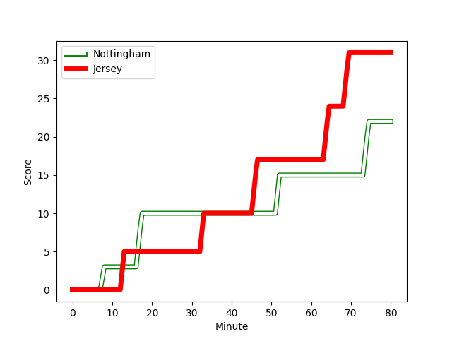
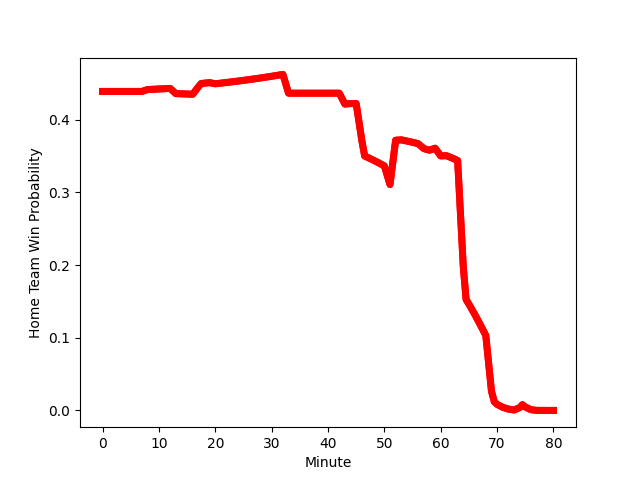

---  
layout: page  
title: Jersey at Nottingham; 31-22  
date: 2022-12-09 20:45:00 18:00:00 -0500  
categories: match review  
---
# Jersey (1551.7) at Nottingham (1444.86); 31-22

# Prediction: Jersey by 7.7

Jersey by 10.7 on a neutral field
## Scores over Time

## Win Probability over Time

# Pre-Match Prediction: Jersey by 5.4

Jersey by 8.4 on a neutral pitch

|   Away Minutes | Away Player                                                                          |   Away elo |   Away Percentile |   Number |   Home Percentile |   Home elo | Home Player                                                                     |   Home Minutes |
|---------------:|:-------------------------------------------------------------------------------------|-----------:|------------------:|---------:|------------------:|-----------:|:--------------------------------------------------------------------------------|---------------:|
|             59 | [Samuel Alexander Grahamslaw](..//playerfiles//SamuelAlexanderGrahamslaw_cleaned.md) |      96.37 |                52 |        1 |                51 |      96.3  | [Aniseko Sio](..//playerfiles//AnisekoSio_cleaned.md)                           |             51 |
|             60 | [Antonio TJ Harris](..//playerfiles//AntonioTJHarris_cleaned.md)                     |      87.07 |                19 |        2 |                60 |      97.39 | [Harry Clayton](..//playerfiles//HarryClayton_cleaned.md)                       |             61 |
|             44 | [Monty Weatherby](..//playerfiles//MontyWeatherby_cleaned.md)                        |      95.59 |               nan |        3 |               nan |      94.09 | [Xavier Valentine](..//playerfiles//XavierValentine_cleaned.md)                 |             57 |
|             44 | [Tom Everard](..//playerfiles//TomEverard_cleaned.md)                                |     108.19 |                85 |        4 |                82 |     105.8  | [Thomas Manz](..//playerfiles//ThomasManz_cleaned.md)                           |             80 |
|             80 | [Sean O'Connor](..//playerfiles//SeanO'Connor_cleaned.md)                            |     105.33 |                81 |        5 |                43 |      94.41 | [Lewis Chessum](..//playerfiles//LewisChessum_cleaned.md)                       |             80 |
|             80 | [Macauley Cook](..//playerfiles//MacauleyCook_cleaned.md)                            |     143.56 |                99 |        6 |                73 |     101.87 | [Iosefa Danny Wayne Fiaola](..//playerfiles//IosefaDannyWayneFiaola_cleaned.md) |             80 |
|             80 | [Max Argyle](..//playerfiles//MaxArgyle_cleaned.md)                                  |     102.53 |                73 |        7 |                84 |     107.86 | [Nathan Tweedy](..//playerfiles//NathanTweedy_cleaned.md)                       |             64 |
|             53 | [Josh Gray](..//playerfiles//JoshGray_cleaned.md)                                    |      95.6  |                48 |        8 |                79 |     106.03 | [Josh Poullet](..//playerfiles//JoshPoullet_cleaned.md)                         |             20 |
|             67 | [James Mitchell](..//playerfiles//JamesMitchell_cleaned.md)                          |      90.44 |                22 |        9 |                25 |      89.65 | [Micheal Stronge](..//playerfiles//MichealStronge_cleaned.md)                   |             72 |
|             80 | [Russell Bennett](..//playerfiles//RussellBennett_cleaned.md)                        |      87.89 |                20 |       10 |                45 |      95.03 | [Morgan Bunting](..//playerfiles//MorganBunting_cleaned.md)                     |             57 |
|             43 | [Ryan Hutler](..//playerfiles//RyanHutler_cleaned.md)                                |      92.42 |                44 |       11 |                85 |     108.93 | [Ryan Olowofela](..//playerfiles//RyanOlowofela_cleaned.md)                     |             80 |
|             70 | [Jordan Holgate](..//playerfiles//JordanHolgate_cleaned.md)                          |     100.01 |                64 |       12 |                12 |      83.75 | [Javiah Pohe](..//playerfiles//JaviahPohe_cleaned.md)                           |             80 |
|             80 | [Charlie Powell](..//playerfiles//CharliePowell_cleaned.md)                          |     111.62 |                87 |       13 |                72 |     102.66 | [Charlie Thacker](..//playerfiles//CharlieThacker_cleaned.md)                   |             44 |
|             80 | [Ben Woollett](..//playerfiles//BenWoollett_cleaned.md)                              |      96.87 |                54 |       14 |                 8 |      81.79 | [David Williams](..//playerfiles//DavidWilliams_cleaned.md)                     |             80 |
|             80 | [Scott Van Breda](..//playerfiles//ScottVanBreda_cleaned.md)                         |     127.02 |                97 |       15 |                57 |      98.02 | [Jack Neville](..//playerfiles//JackNeville_cleaned.md)                         |             80 |
|             37 | [Will Brown](..//playerfiles//WillBrown_cleaned.md)                                  |     111.41 |                88 |       16 |                74 |     102.93 | [George Cox](..//playerfiles//GeorgeCox_cleaned.md)                             |             60 |
|             36 | [Hamish Bain](..//playerfiles//HamishBain_cleaned.md)                                |      94.72 |                47 |       17 |                75 |     103.86 | [Marcus Alexander Ramage](..//playerfiles//MarcusAlexanderRamage_cleaned.md)    |             36 |
|             36 | [Steven Longwell](..//playerfiles//StevenLongwell_cleaned.md)                        |     109.44 |                89 |       18 |                 0 |      66.72 | [Toby Williams](..//playerfiles//TobyWilliams_cleaned.md)                       |             29 |
|             27 | [Hallam Chapman](..//playerfiles//HallamChapman_cleaned.md)                          |      92.91 |                38 |       19 |                63 |      98.95 | [Ben Betts](..//playerfiles//BenBetts_cleaned.md)                               |             23 |
|             21 | [Greg McGrath](..//playerfiles//GregMcGrath_cleaned.md)                              |      89.49 |                22 |       20 |                10 |      83.86 | [Sam Hollingsworth](..//playerfiles//SamHollingsworth_cleaned.md)               |             23 |
|             20 | [Eoghan Clarke](..//playerfiles//EoghanClarke_cleaned.md)                            |      97.88 |                62 |       21 |                75 |     101.75 | [Jack Dickinson](..//playerfiles//JackDickinson_cleaned.md)                     |             19 |
|             10 | [Dan Barnes](..//playerfiles//DanBarnes_cleaned.md)                                  |     117.52 |                94 |       22 |                 4 |      78.16 | [Scott Hall](..//playerfiles//ScottHall_cleaned.md)                             |             16 |
|             13 | [Jonny Law](..//playerfiles//JonnyLaw_cleaned.md)                                    |      90.8  |               nan |       23 |               nan |      94.78 | [Josh Goodwin](..//playerfiles//JoshGoodwin_cleaned.md)                         |              8 |

