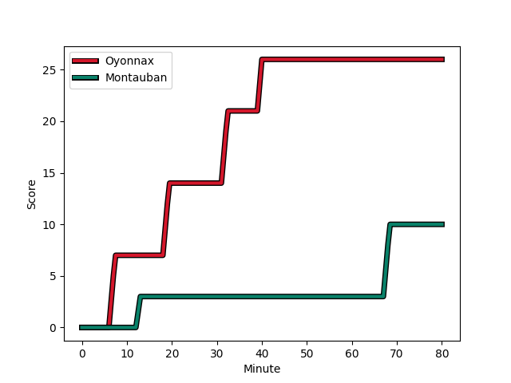
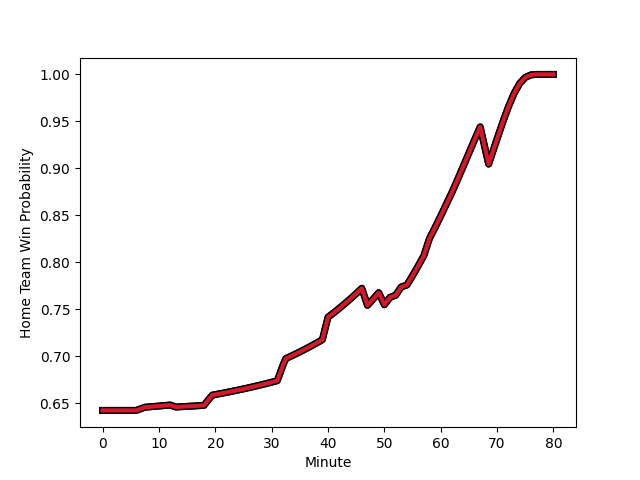

---  
layout: page  
title: Montauban at Oyonnax; 10-26  
date: 2022-12-09 19:30:00 18:00:00 -0500  
categories: match review  
---
# Montauban (1360.01) at Oyonnax (1614.9); 10-26

# Prediction: Oyonnax by 28.5

Oyonnax by 25.5 on a neutral field
## Scores over Time

## Win Probability over Time

# Pre-Match Prediction: Oyonnax by 30.7

Oyonnax by 27.7 on a neutral pitch

|   Away Minutes | Away Player                                                                    |   Away elo |   Away Percentile |   Number |   Home Percentile |   Home elo | Home Player                                                                  |   Home Minutes |
|---------------:|:-------------------------------------------------------------------------------|-----------:|------------------:|---------:|------------------:|-----------:|:-----------------------------------------------------------------------------|---------------:|
|             58 | [Thomas Bue](..//playerfiles//ThomasBue_cleaned.md)                            |      95.74 |               nan |        1 |                18 |      91.4  | [Antoine Abraham](..//playerfiles//AntoineAbraham_cleaned.md)                |             58 |
|             47 | [Cyril Deligny](..//playerfiles//CyrilDeligny_cleaned.md)                      |      65.78 |                 0 |        2 |                83 |     105.9  | [Benjamin Geledan](..//playerfiles//BenjaminGeledan_cleaned.md)              |             50 |
|             47 | [Simon Renaud](..//playerfiles//SimonRenaud_cleaned.md)                        |      81.28 |                 7 |        3 |                86 |     106.05 | [Thomas Laclayat](..//playerfiles//ThomasLaclayat_cleaned.md)                |             50 |
|             80 | [Tjuee Uanivi](..//playerfiles//TjueeUanivi_cleaned.md)                        |      91.84 |                33 |        4 |                99 |     146.21 | [Phoenix Battye](..//playerfiles//PhoenixBattye_cleaned.md)                  |             50 |
|             47 | [Maselino Paulino](..//playerfiles//MaselinoPaulino_cleaned.md)                |      89.68 |                25 |        5 |                93 |     115.75 | [Hugo Fabregue](..//playerfiles//HugoFabregue_cleaned.md)                    |             80 |
|             47 | [Louis Vincent](..//playerfiles//LouisVincent_cleaned.md)                      |      88.62 |                25 |        6 |                94 |     115.72 | [Kevin Lebreton](..//playerfiles//KevinLebreton_cleaned.md)                  |             80 |
|             52 | [Stéphane Munoz](..//playerfiles//StéphaneMunoz_cleaned.md)                    |      79.55 |                 6 |        7 |                38 |      93    | [Loïc Credoz](..//playerfiles//LoïcCredoz_cleaned.md)                        |             50 |
|             80 | [Epeli Momo](..//playerfiles//EpeliMomo_cleaned.md)                            |      79.46 |                 6 |        8 |                99 |     139.05 | [Rory Grice](..//playerfiles//RoryGrice_cleaned.md)                          |             80 |
|             47 | [Anthony Meric](..//playerfiles//AnthonyMeric_cleaned.md)                      |      72.24 |                 1 |        9 |                94 |     116.68 | [Charlie Cassang](..//playerfiles//CharlieCassang_cleaned.md)                |             54 |
|             62 | [Romain Riguet](..//playerfiles//RomainRiguet_cleaned.md)                      |      92.77 |                35 |       10 |                78 |     105.59 | [Justin Bouraux](..//playerfiles//JustinBouraux_cleaned.md)                  |             58 |
|             80 | [Lucas Poirson](..//playerfiles//LucasPoirson_cleaned.md)                      |      78    |               nan |       11 |                19 |      88.57 | [Gavin Stark](..//playerfiles//GavinStark_cleaned.md)                        |             80 |
|             80 | [Benjamin Puntous](..//playerfiles//BenjaminPuntous_cleaned.md)                |     109.8  |                85 |       12 |                 9 |      81.32 | [Gaby Lovobalavu](..//playerfiles//GabyLovobalavu_cleaned.md)                |             54 |
|             80 | [Raphael Sanchez](..//playerfiles//RaphaelSanchez_cleaned.md)                  |      93.05 |                43 |       13 |                95 |     121.83 | [Theo Millet](..//playerfiles//TheoMillet_cleaned.md)                        |             80 |
|             80 | [Jean-Bernard Pujol](..//playerfiles//Jean-BernardPujol_cleaned.md)            |      98.08 |                60 |       14 |                91 |     113.47 | [Joe Ravouvou](..//playerfiles//JoeRavouvou_cleaned.md)                      |             80 |
|             80 | [Maxime Salles](..//playerfiles//MaximeSalles_cleaned.md)                      |     116.36 |                92 |       15 |                10 |      81.28 | [Tony Ensor](..//playerfiles//TonyEnsor_cleaned.md)                          |             80 |
|             33 | [Kevin Yameogo](..//playerfiles//KevinYameogo_cleaned.md)                      |      79.75 |                 3 |       16 |                51 |      97.25 | [Steve Mafi](..//playerfiles//SteveMafi_cleaned.md)                          |             30 |
|             33 | [David Marotel](..//playerfiles//DavidMarotel_cleaned.md)                      |      95    |               nan |       17 |                66 |      98.82 | [Teddy Durand](..//playerfiles//TeddyDurand_cleaned.md)                      |             30 |
|             33 | [Alexis Bernadet](..//playerfiles//AlexisBernadet_cleaned.md)                  |      99.04 |                68 |       18 |               nan |     108.45 | [Victor Delmas](..//playerfiles//VictorDelmas_cleaned.md)                    |             30 |
|             33 | [Dimitri Vaotoa](..//playerfiles//DimitriVaotoa_cleaned.md)                    |      76.51 |                 6 |       19 |                42 |      95.01 | [Hugo Hermet](..//playerfiles//HugoHermet_cleaned.md)                        |             30 |
|             33 | [Rodrigo Fernandez Criado](..//playerfiles//RodrigoFernandezCriado_cleaned.md) |     109.49 |                87 |       20 |                99 |     133.12 | [Jeremy Gondrand](..//playerfiles//JeremyGondrand_cleaned.md)                |             26 |
|             28 | [Kyllian Ringuet](..//playerfiles//KyllianRinguet_cleaned.md)                  |      95.1  |               nan |       21 |                52 |      97.56 | [Pedro Bettencourt Avila](..//playerfiles//PedroBettencourtAvila_cleaned.md) |             26 |
|             22 | [Victor Laval](..//playerfiles//VictorLaval_cleaned.md)                        |      81.75 |                 6 |       22 |                30 |      91.56 | [Tommy Raynaud](..//playerfiles//TommyRaynaud_cleaned.md)                    |             22 |
|             18 | [Lucas Chaudanson](..//playerfiles//LucasChaudanson_cleaned.md)                |      95    |               nan |       23 |                88 |     112.05 | [Jules Soulan](..//playerfiles//JulesSoulan_cleaned.md)                      |             22 |

