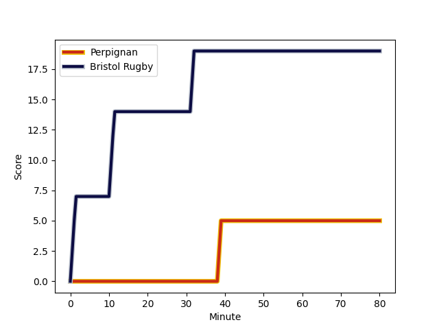
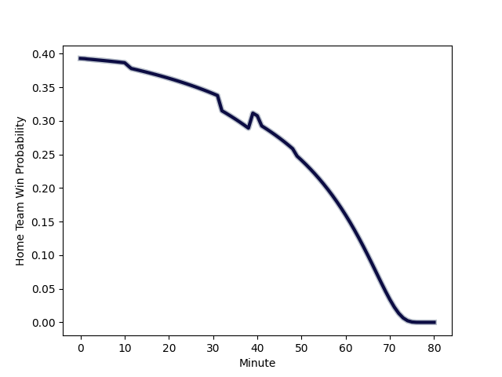

---  
layout: page  
title: Bristol Rugby at Perpignan; 19-5  
date: 2022-12-09 21:00:00 18:00:00 -0500  
categories: match review  
---
# Bristol Rugby (1565.69) at Perpignan (1376.73); 19-5

# Prediction: Bristol Rugby by 15.9

Bristol Rugby by 18.9 on a neutral field
## Scores over Time

## Win Probability over Time

# Pre-Match Prediction: Bristol Rugby by 13.1

Bristol Rugby by 16.1 on a neutral pitch

|   Away Minutes | Away Player                                                   |   Away elo |   Away Percentile |   Number |   Home Percentile |   Home elo | Home Player                                                           |   Home Minutes |
|---------------:|:--------------------------------------------------------------|-----------:|------------------:|---------:|------------------:|-----------:|:----------------------------------------------------------------------|---------------:|
|             49 | [Yann Thomas](..//playerfiles//YannThomas_cleaned.md)         |      98.53 |                62 |        1 |                76 |     102.98 | [Sacha Lotrian](..//playerfiles//SachaLotrian_cleaned.md)             |             41 |
|             76 | [Harry Thacker](..//playerfiles//HarryThacker_cleaned.md)     |      98.25 |                55 |        2 |                30 |      88.56 | [Lucas Velarte](..//playerfiles//LucasVelarte_cleaned.md)             |             80 |
|             61 | [Max Lahiff](..//playerfiles//MaxLahiff_cleaned.md)           |      90.99 |                27 |        3 |                82 |     106.15 | [Ma'afu Fia](..//playerfiles//Ma'afuFia_cleaned.md)                   |             49 |
|             80 | [Joe Batley](..//playerfiles//JoeBatley_cleaned.md)           |     107.41 |                84 |        4 |                 5 |      75.55 | [Tristan Labouteley](..//playerfiles//TristanLabouteley_cleaned.md)   |             80 |
|             80 | [Chris Vui](..//playerfiles//ChrisVui_cleaned.md)             |     109.47 |                87 |        5 |                13 |      83.24 | [Shahn Eru](..//playerfiles//ShahnEru_cleaned.md)                     |             49 |
|             66 | [Steven Luatua](..//playerfiles//StevenLuatua_cleaned.md)     |     115.8  |                93 |        6 |                89 |     111.08 | [Lucas Bachelier](..//playerfiles//LucasBachelier_cleaned.md)         |             49 |
|             66 | [Jake Heenan](..//playerfiles//JakeHeenan_cleaned.md)         |      84.01 |                12 |        7 |                90 |     112.6  | [Brad Shields](..//playerfiles//BradShields_cleaned.md)               |             80 |
|             80 | [Fitz Harding](..//playerfiles//FitzHarding_cleaned.md)       |     101.62 |                70 |        8 |                82 |     108.01 | [Joaquin Oviedo](..//playerfiles//JoaquinOviedo_cleaned.md)           |             53 |
|             72 | [Will Porter](..//playerfiles//WillPorter_cleaned.md)         |      96.12 |                52 |        9 |                40 |      93.54 | [Matteo Rodor](..//playerfiles//MatteoRodor_cleaned.md)               |             65 |
|             76 | [AJ MacGinty](..//playerfiles//AJMacGinty_cleaned.md)         |      98.57 |                52 |       10 |                71 |     101.17 | [Patricio Fernandez](..//playerfiles//PatricioFernandez_cleaned.md)   |             80 |
|             80 | [Gabriel Ibitoye](..//playerfiles//GabrielIbitoye_cleaned.md) |      99.23 |                65 |       11 |                37 |      92.79 | [Lucas Dubois](..//playerfiles//LucasDubois_cleaned.md)               |             80 |
|             80 | [Joe Jenkins](..//playerfiles//JoeJenkins_cleaned.md)         |      92.16 |                33 |       12 |                21 |      89    | [Alivereti Duguivalu](..//playerfiles//AliveretiDuguivalu_cleaned.md) |             49 |
|             80 | [Semi Radradra](..//playerfiles//SemiRadradra_cleaned.md)     |     104.9  |                77 |       13 |                 1 |      71.11 | [Edward Sawailau](..//playerfiles//EdwardSawailau_cleaned.md)         |             80 |
|             80 | [Luke Morahan](..//playerfiles//LukeMorahan_cleaned.md)       |     145.48 |                99 |       14 |                51 |      95.75 | [Ali Crossdale](..//playerfiles//AliCrossdale_cleaned.md)             |             49 |
|             70 | [Charles Piutau](..//playerfiles//CharlesPiutau_cleaned.md)   |     112.38 |                88 |       15 |                 0 |      62.77 | [Boris Goutard](..//playerfiles//BorisGoutard_cleaned.md)             |             80 |
|             31 | [Jake Woolmore](..//playerfiles//JakeWoolmore_cleaned.md)     |     108.18 |                88 |       16 |                 9 |      84.29 | [Xavier Chiocci](..//playerfiles//XavierChiocci_cleaned.md)           |             39 |
|              4 | [Jake Kerr](..//playerfiles//JakeKerr_cleaned.md)             |      86.7  |                15 |       17 |               nan |      92.12 | [Akato Fakatika](..//playerfiles//AkatoFakatika_cleaned.md)           |             31 |
|             19 | [Jay Tyack](..//playerfiles//JayTyack_cleaned.md)             |     119.61 |                97 |       18 |               nan |      93.77 | [Posolo Tuilagi](..//playerfiles//PosoloTuilagi_cleaned.md)           |             31 |
|             14 | [Elliott Stooke](..//playerfiles//ElliottStooke_cleaned.md)   |     102.39 |                75 |       19 |                23 |      89.01 | [Victor Montgaillard](..//playerfiles//VictorMontgaillard_cleaned.md) |             31 |
|             14 | [Daniel Thomas](..//playerfiles//DanielThomas_cleaned.md)     |     108.37 |                83 |       20 |               nan |      94.37 | [Valentin Moro](..//playerfiles//ValentinMoro_cleaned.md)             |             27 |
|              8 | [Tom Whiteley](..//playerfiles//TomWhiteley_cleaned.md)       |     102.42 |                73 |       21 |               nan |      95    | [Lenny Viola](..//playerfiles//LennyViola_cleaned.md)                 |             15 |
|              4 | [Callum Sheedy](..//playerfiles//CallumSheedy_cleaned.md)     |     113.42 |                90 |       22 |                86 |     111.05 | [Dorian Laborde](..//playerfiles//DorianLaborde_cleaned.md)           |             31 |
|             10 | [Ioan Lloyd](..//playerfiles//IoanLloyd_cleaned.md)           |      92.65 |                40 |       23 |                20 |      88.62 | [Théo Forner](..//playerfiles//ThéoForner_cleaned.md)                 |             31 |

