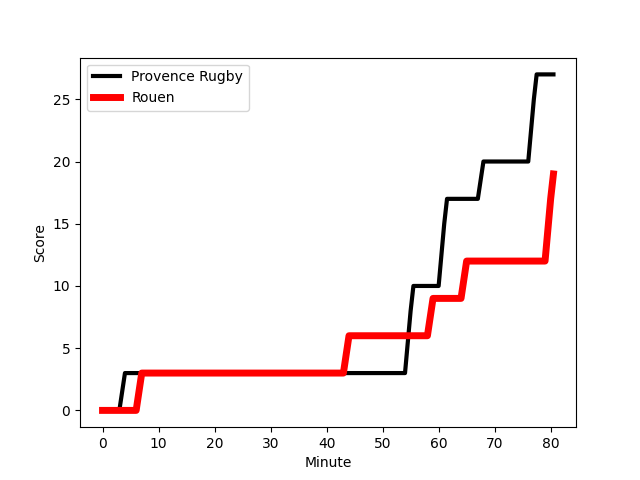
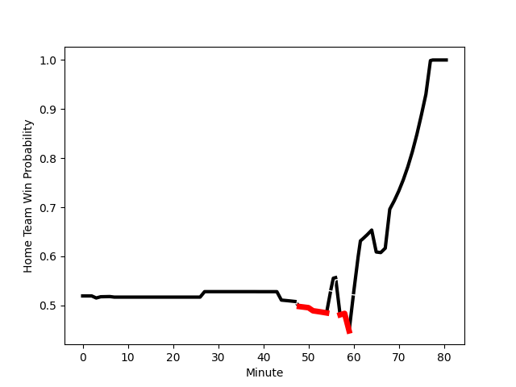

---  
layout: page  
title: Rouen at Provence Rugby; 19-27  
date: 2022-12-09 19:00:00 18:00:00 -0500  
categories: match review  
---
# Rouen (1417.73) at Provence Rugby (1451.28); 19-27

# Prediction: Provence Rugby by 6.4

Provence Rugby by 3.4 on a neutral field
## Scores over Time

## Win Probability over Time

# Pre-Match Prediction: Provence Rugby by 6.3

Provence Rugby by 3.3 on a neutral pitch

|   Away Minutes | Away Player                                                       |   Away elo |   Away Percentile |   Number |   Home Percentile |   Home elo | Home Player                                                       |   Home Minutes |
|---------------:|:------------------------------------------------------------------|-----------:|------------------:|---------:|------------------:|-----------:|:------------------------------------------------------------------|---------------:|
|              4 | [Dylan Jacquot](..//playerfiles//DylanJacquot_cleaned.md)         |     106.48 |                84 |        1 |                94 |     114.1  | [Federico Wegrzyn](..//playerfiles//FedericoWegrzyn_cleaned.md)   |             51 |
|             27 | [Mathieu Bonnot](..//playerfiles//MathieuBonnot_cleaned.md)       |     110.66 |                90 |        2 |                 5 |      80.8  | [Loick Jammes](..//playerfiles//LoickJammes_cleaned.md)           |             47 |
|              3 | [Mohamed Boughanmi](..//playerfiles//MohamedBoughanmi_cleaned.md) |      92.94 |                39 |        3 |                42 |      94.13 | [Luke Tagi](..//playerfiles//LukeTagi_cleaned.md)                 |             39 |
|             80 | [Tienie Burger](..//playerfiles//TienieBurger_cleaned.md)         |      98.61 |                62 |        4 |                66 |     100.17 | [Jérôme Dufour](..//playerfiles//JérômeDufour_cleaned.md)         |             80 |
|             60 | [Shay Kerry](..//playerfiles//ShayKerry_cleaned.md)               |      77.16 |                 6 |        5 |                 4 |      74.69 | [Hans N'kinsi](..//playerfiles//HansN'kinsi_cleaned.md)           |             48 |
|             80 | [Willy N'Diaye](..//playerfiles//WillyN'Diaye_cleaned.md)         |     104.23 |                77 |        6 |                22 |      88.48 | [Nicolas Mousties](..//playerfiles//NicolasMousties_cleaned.md)   |             57 |
|             60 | [Samuel Maximin](..//playerfiles//SamuelMaximin_cleaned.md)       |      83.4  |                 9 |        7 |                 8 |      83.07 | [Bilel Taieb](..//playerfiles//BilelTaieb_cleaned.md)             |             80 |
|             80 | [Abdelkarim Fofana](..//playerfiles//AbdelkarimFofana_cleaned.md) |      64.35 |                 0 |        8 |                15 |      86.4  | [Carl Axtens](..//playerfiles//CarlAxtens_cleaned.md)             |             80 |
|             56 | [Theo Nanette](..//playerfiles//TheoNanette_cleaned.md)           |      77.66 |               nan |        9 |                55 |      97.28 | [Simon Tarel](..//playerfiles//SimonTarel_cleaned.md)             |             79 |
|             80 | [Thibault Olender](..//playerfiles//ThibaultOlender_cleaned.md)   |      97.23 |                52 |       10 |                91 |     117.34 | [Enzo Selponi](..//playerfiles//EnzoSelponi_cleaned.md)           |             48 |
|             80 | [Benito Masilevu](..//playerfiles//BenitoMasilevu_cleaned.md)     |     115.76 |                93 |       11 |                84 |     108.27 | [Kevin Bly](..//playerfiles//KevinBly_cleaned.md)                 |             57 |
|             80 | [JT Jackson](..//playerfiles//JTJackson_cleaned.md)               |      80.55 |                 8 |       12 |                91 |     115.37 | [Louis Marrou](..//playerfiles//LouisMarrou_cleaned.md)           |             80 |
|             51 | [Opetera Peleseuma](..//playerfiles//OpeteraPeleseuma_cleaned.md) |      95.35 |                47 |       13 |                20 |      88.89 | [Dorian Lavernhe](..//playerfiles//DorianLavernhe_cleaned.md)     |             80 |
|             66 | [Paul Surano](..//playerfiles//PaulSurano_cleaned.md)             |      87.29 |                15 |       14 |                80 |     105.55 | [Léo Drouet](..//playerfiles//LéoDrouet_cleaned.md)               |             80 |
|             80 | [Pete Lydon](..//playerfiles//PeteLydon_cleaned.md)               |     121.18 |                94 |       15 |                60 |      98.37 | [Florent Massip](..//playerfiles//FlorentMassip_cleaned.md)       |             80 |
|             77 | [Cody Thomas](..//playerfiles//CodyThomas_cleaned.md)             |     101.61 |                70 |       16 |                42 |      94.02 | [Mohammed Loukia](..//playerfiles//MohammedLoukia_cleaned.md)     |             41 |
|             76 | [Soulemane Camara](..//playerfiles//SoulemaneCamara_cleaned.md)   |     102.83 |                75 |       17 |                58 |      97.94 | [Lucas Martin](..//playerfiles//LucasMartin_cleaned.md)           |             33 |
|             53 | [Efitusi Ma'afu](..//playerfiles//EfitusiMa'afu_cleaned.md)       |      87.46 |                17 |       18 |                30 |      91.69 | [Johnny McPhillips](..//playerfiles//JohnnyMcPhillips_cleaned.md) |             32 |
|             29 | [Alex Luatua](..//playerfiles//AlexLuatua_cleaned.md)             |      98.02 |                56 |       19 |                82 |     106.32 | [Clément Chartier](..//playerfiles//ClémentChartier_cleaned.md)   |             32 |
|             24 | [Florent Campeggia](..//playerfiles//FlorentCampeggia_cleaned.md) |      81.39 |                 6 |       20 |                 1 |      71.61 | [Dave Lolohea](..//playerfiles//DaveLolohea_cleaned.md)           |             29 |
|             20 | [Toby Salmon](..//playerfiles//TobySalmon_cleaned.md)             |      97.24 |                57 |       21 |                91 |     115.09 | [Peter Betham](..//playerfiles//PeterBetham_cleaned.md)           |             23 |
|             20 | [Fabien Vincent](..//playerfiles//FabienVincent_cleaned.md)       |     106.66 |                83 |       22 |                49 |      96.91 | [Malohi Suta](..//playerfiles//MalohiSuta_cleaned.md)             |             23 |
|             14 | [Malcolm Bertschy](..//playerfiles//MalcolmBertschy_cleaned.md)   |     101.23 |                71 |       23 |               nan |      95.12 | [Jeremie Martin](..//playerfiles//JeremieMartin_cleaned.md)       |              1 |

