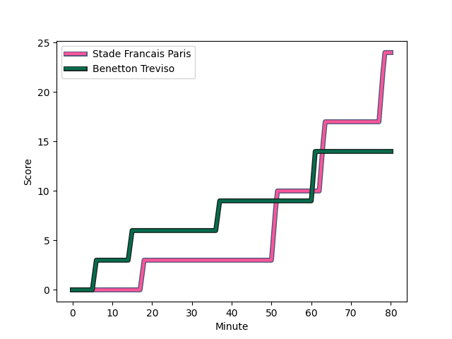
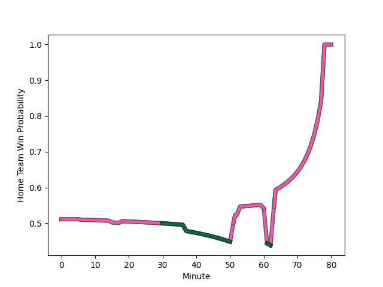

---  
layout: page  
title: Benetton Treviso at Stade Francais Paris; 14-24  
date: 2022-12-09 21:00:00 18:00:00 -0500  
categories: match review  
---
# Benetton Treviso (1454.9) at Stade Francais Paris (1474.38); 14-24

# Prediction: Stade Francais Paris by 4.9

Stade Francais Paris by 1.9 on a neutral field
## Scores over Time

## Win Probability over Time

# Pre-Match Prediction: Stade Francais Paris by 4.5

Stade Francais Paris by 1.5 on a neutral pitch

|   Away Minutes | Away Player                                                              |   Away elo |   Away Percentile |   Number |   Home Percentile |   Home elo | Home Player                                                                   |   Home Minutes |
|---------------:|:-------------------------------------------------------------------------|-----------:|------------------:|---------:|------------------:|-----------:|:------------------------------------------------------------------------------|---------------:|
|             60 | [Nahuel Tetaz Chaparro](..//playerfiles//NahuelTetazChaparro_cleaned.md) |     105.12 |                84 |        1 |               nan |      97.31 | [Sergo Abramishvili](..//playerfiles//SergoAbramishvili_cleaned.md)           |             60 |
|             53 | [Gianmarco Lucchesi](..//playerfiles//GianmarcoLucchesi_cleaned.md)      |      90.91 |                29 |        2 |                83 |     105.33 | [Lucas Peyresblanques](..//playerfiles//LucasPeyresblanques_cleaned.md)       |             60 |
|             60 | [Simone Ferrari](..//playerfiles//SimoneFerrari_cleaned.md)              |     100.35 |                69 |        3 |                50 |      94.35 | [Vincent Koch](..//playerfiles//VincentKoch_cleaned.md)                       |             60 |
|             67 | [Marco Lazzaroni](..//playerfiles//MarcoLazzaroni_cleaned.md)            |      63.45 |                 0 |        4 |                33 |      91.35 | [Mathieu de Giovanni](..//playerfiles//MathieudeGiovanni_cleaned.md)          |             67 |
|             80 | [Federico Ruzza](..//playerfiles//FedericoRuzza_cleaned.md)              |     100.33 |                70 |        5 |                83 |     106.44 | [JJ van der Mescht](..//playerfiles//JJvanderMescht_cleaned.md)               |             53 |
|             80 | [Sebastian Negri](..//playerfiles//SebastianNegri_cleaned.md)            |      84.73 |                10 |        6 |                88 |     110.01 | [Giorgi Tsutskeridze](..//playerfiles//GiorgiTsutskeridze_cleaned.md)         |             53 |
|             80 | [Michele Lamaro](..//playerfiles//MicheleLamaro_cleaned.md)              |     108.4  |                85 |        7 |                 4 |      79.55 | [Mathieu Hirigoyen](..//playerfiles//MathieuHirigoyen_cleaned.md)             |             80 |
|             80 | [Lorenzo Cannone](..//playerfiles//LorenzoCannone_cleaned.md)            |     109.11 |                83 |        8 |               nan |      95.08 | [Juan Martin Scelzo](..//playerfiles//JuanMartinScelzo_cleaned.md)            |             80 |
|             60 | [Alessandro Garbisi](..//playerfiles//AlessandroGarbisi_cleaned.md)      |      97.89 |                67 |        9 |                26 |      90.67 | [Arthur Coville](..//playerfiles//ArthurCoville_cleaned.md)                   |             53 |
|             80 | [Jacob Umaga](..//playerfiles//JacobUmaga_cleaned.md)                    |     103.24 |                73 |       10 |                69 |     102.88 | [Leo Barre](..//playerfiles//LeoBarre_cleaned.md)                             |             80 |
|             80 | [Onisi Ratave](..//playerfiles//OnisiRatave_cleaned.md)                  |      89.57 |                22 |       11 |                96 |     119.8  | [Lester Etien](..//playerfiles//LesterEtien_cleaned.md)                       |             80 |
|             68 | [Joaquin Riera](..//playerfiles//JoaquinRiera_cleaned.md)                |      90.03 |                29 |       12 |                10 |      82.94 | [Alex Arrate](..//playerfiles//AlexArrate_cleaned.md)                         |             53 |
|             72 | [Tommaso Menoncello](..//playerfiles//TommasoMenoncello_cleaned.md)      |     101.36 |                68 |       13 |                62 |      98.46 | [Paolo Odogwu](..//playerfiles//PaoloOdogwu_cleaned.md)                       |             80 |
|             80 | [Marcus Watson](..//playerfiles//MarcusWatson_cleaned.md)                |      93.43 |                40 |       14 |                31 |      91.53 | [Nadir Megdoud](..//playerfiles//NadirMegdoud_cleaned.md)                     |             80 |
|             65 | [Edoardo Padovani](..//playerfiles//EdoardoPadovani_cleaned.md)          |     104.4  |                79 |       15 |                44 |      93.8  | [Sione Tui](..//playerfiles//SioneTui_cleaned.md)                             |             80 |
|             20 | [Cherif Traore](..//playerfiles//CherifTraore_cleaned.md)                |      93.81 |               nan |       16 |                43 |      94.05 | [Vasil Kakovin](..//playerfiles//VasilKakovin_cleaned.md)                     |             20 |
|             27 | [Siua Maile](..//playerfiles//SiuaMaile_cleaned.md)                      |      94.59 |                48 |       17 |                12 |      86.52 | [Laurent Panis](..//playerfiles//LaurentPanis_cleaned.md)                     |             20 |
|             20 | [Tiziano Pasquali](..//playerfiles//TizianoPasquali_cleaned.md)          |      99.57 |                63 |       18 |                59 |      97.14 | [Moses Alo-Emile](..//playerfiles//MosesAlo-Emile_cleaned.md)                 |             20 |
|             13 | [Giovanni Pettinelli](..//playerfiles//GiovanniPettinelli_cleaned.md)    |     108.06 |                82 |       19 |               nan |      95    | [Nathan Huguen](..//playerfiles//NathanHuguen_cleaned.md)                     |             13 |
|             20 | [Sam Hidalgo-Clyne](..//playerfiles//SamHidalgo-Clyne_cleaned.md)        |     115.33 |                93 |       20 |                43 |      93.7  | [Baptiste Pesenti](..//playerfiles//BaptistePesenti_cleaned.md)               |             27 |
|             12 | [Marco Zanon](..//playerfiles//MarcoZanon_cleaned.md)                    |     105.78 |                79 |       21 |                96 |     127.47 | [Giovanni Habel-Kueffner](..//playerfiles//GiovanniHabel-Kueffner_cleaned.md) |             27 |
|              8 | [Henry Time-Stowers](..//playerfiles//HenryTime-Stowers_cleaned.md)      |      88.39 |                23 |       22 |                94 |     119.13 | [James Hall](..//playerfiles//JamesHall_cleaned.md)                           |             27 |
|             15 | [Tomas Albornoz](..//playerfiles//TomasAlbornoz_cleaned.md)              |     113.35 |                89 |       23 |                80 |     106.39 | [Jeremy Ward](..//playerfiles//JeremyWard_cleaned.md)                         |             27 |

