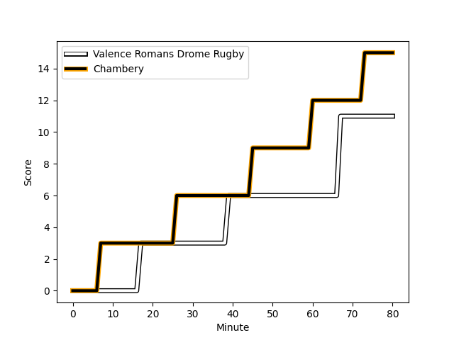
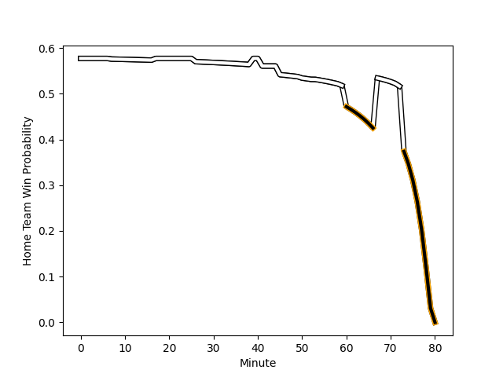

---  
layout: page  
title: Chambery at Valence Romans Drome Rugby; 15-11  
date: 2022-12-09 19:00:00 18:00:00 -0500  
categories: match review  
---
# Chambery (1335.33) at Valence Romans Drome Rugby (1470.46); 15-11

# Prediction: Valence Romans Drome Rugby by 16.5

Valence Romans Drome Rugby by 13.5 on a neutral field
## Scores over Time

## Win Probability over Time

# Pre-Match Prediction: Valence Romans Drome Rugby by 20.9

Valence Romans Drome Rugby by 17.9 on a neutral pitch

|   Away Minutes | Away Player                                                                 |   Away elo |   Away Percentile |   Number |   Home Percentile |   Home elo | Home Player                                                            |   Home Minutes |
|---------------:|:----------------------------------------------------------------------------|-----------:|------------------:|---------:|------------------:|-----------:|:-----------------------------------------------------------------------|---------------:|
|             59 | [Géraud Clermont](..//playerfiles//GéraudClermont_cleaned.md)               |      92.1  |                32 |        1 |                91 |     110.26 | [Anthony Aléo](..//playerfiles//AnthonyAléo_cleaned.md)                |             53 |
|             50 | [Gauthier Brute de Remur](..//playerfiles//GauthierBrutedeRemur_cleaned.md) |      86.36 |                17 |        2 |                12 |      85.3  | [Dorian Marco Pena](..//playerfiles//DorianMarcoPena_cleaned.md)       |             53 |
|             50 | [Lautaro Caro Saisi](..//playerfiles//LautaroCaroSaisi_cleaned.md)          |      93.21 |                41 |        3 |                56 |      97.29 | [John Henry Fincham](..//playerfiles//JohnHenryFincham_cleaned.md)     |             72 |
|             80 | [Fabien Witz](..//playerfiles//FabienWitz_cleaned.md)                       |      88.07 |                22 |        4 |                87 |     111.32 | [Francois Uys](..//playerfiles//FrancoisUys_cleaned.md)                |             80 |
|             80 | [Romain Guyot](..//playerfiles//RomainGuyot_cleaned.md)                     |      77.34 |                 6 |        5 |                27 |      90.27 | [Florian Goumat](..//playerfiles//FlorianGoumat_cleaned.md)            |             80 |
|             80 | [Matheo Triki](..//playerfiles//MatheoTriki_cleaned.md)                     |      93.6  |               nan |        6 |                 2 |      70.56 | [Axel Bruchet](..//playerfiles//AxelBruchet_cleaned.md)                |             80 |
|             80 | [Colin Lebian](..//playerfiles//ColinLebian_cleaned.md)                     |      85.11 |                12 |        7 |                80 |     105.22 | [Sven Bernat Girlando](..//playerfiles//SvenBernatGirlando_cleaned.md) |             41 |
|             80 | [Thomas Coignat](..//playerfiles//ThomasCoignat_cleaned.md)                 |      94.21 |                43 |        8 |                81 |     107.42 | [Ioane Iashagashvili](..//playerfiles//IoaneIashagashvili_cleaned.md)  |             41 |
|             80 | [Thibault Dufau](..//playerfiles//ThibaultDufau_cleaned.md)                 |      87.03 |                16 |        9 |                43 |      93.75 | [Léopold Dupas](..//playerfiles//LéopoldDupas_cleaned.md)              |             80 |
|             80 | [Mattéo Faucher](..//playerfiles//MattéoFaucher_cleaned.md)                 |      89.86 |                23 |       10 |                32 |      92.49 | [Lucas Meret](..//playerfiles//LucasMeret_cleaned.md)                  |             80 |
|             80 | [Mosese Mawalu](..//playerfiles//MoseseMawalu_cleaned.md)                   |     101.94 |                73 |       11 |                70 |     101    | [Mason Emerson](..//playerfiles//MasonEmerson_cleaned.md)              |             80 |
|             80 | [Bastien Reymond](..//playerfiles//BastienReymond_cleaned.md)               |      91.88 |                36 |       12 |                66 |     100.74 | [Ben Neiceru](..//playerfiles//BenNeiceru_cleaned.md)                  |             80 |
|             80 | [Victor Pisano](..//playerfiles//VictorPisano_cleaned.md)                   |      74.77 |                 4 |       13 |                89 |     113.94 | [Charles Bouldoire](..//playerfiles//CharlesBouldoire_cleaned.md)      |             80 |
|             80 | [Arthur Nennig](..//playerfiles//ArthurNennig_cleaned.md)                   |      89.7  |                24 |       14 |                85 |     108.63 | [Adam Vargas](..//playerfiles//AdamVargas_cleaned.md)                  |             80 |
|             80 | [Jules Dorrival](..//playerfiles//JulesDorrival_cleaned.md)                 |      87.85 |                27 |       15 |                53 |      97.89 | [Joris Moura](..//playerfiles//JorisMoura_cleaned.md)                  |             80 |
|             30 | [Giorgi Pertaia](..//playerfiles//GiorgiPertaia_cleaned.md)                 |      91.44 |                29 |       16 |                38 |      93.02 | [Dylan Hayes](..//playerfiles//DylanHayes_cleaned.md)                  |             39 |
|             30 | [Julien Primault](..//playerfiles//JulienPrimault_cleaned.md)               |      92.03 |                35 |       17 |                12 |      86.33 | [Matthew Gicquel](..//playerfiles//MatthewGicquel_cleaned.md)          |             39 |
|             21 | [Enzo Segui](..//playerfiles//EnzoSegui_cleaned.md)                         |      95.27 |               nan |       18 |                37 |      94.28 | [Andrea Pontanier](..//playerfiles//AndreaPontanier_cleaned.md)        |             27 |
|            nan | nan                                                                         |     nan    |               nan |       19 |                77 |     104.06 | [Mehdi Boundjema](..//playerfiles//MehdiBoundjema_cleaned.md)          |             27 |
|            nan | nan                                                                         |     nan    |               nan |       20 |                42 |      93.98 | [Cyril Balust](..//playerfiles//CyrilBalust_cleaned.md)                |              8 |

