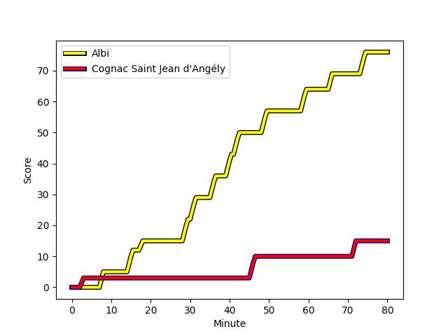
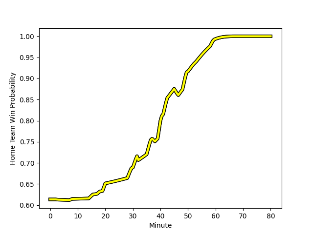

---  
layout: page  
title: Cognac Saint Jean d'Angély at Albi; 15-76  
date: 2022-12-10 18:00:00 18:00:00 -0500  
categories: match review  
---
# Cognac Saint Jean d'Angély (1215.9) at Albi (1396.0); 15-76

# Prediction: Albi by 21.0

Albi by 18.0 on a neutral field
## Scores over Time

## Win Probability over Time

# Pre-Match Prediction: Albi by 18.4

Albi by 15.4 on a neutral pitch

|   Away Minutes | Away Player                                                             |   Away elo |   Away Percentile |   Number |   Home Percentile |   Home elo | Home Player                                                                 |   Home Minutes |
|---------------:|:------------------------------------------------------------------------|-----------:|------------------:|---------:|------------------:|-----------:|:----------------------------------------------------------------------------|---------------:|
|             80 | [Kevin Tougne](..//playerfiles//KevinTougne_cleaned.md)                 |      82.08 |                 6 |        1 |                 6 |      81.75 | [Maxime Escur](..//playerfiles//MaximeEscur_cleaned.md)                     |             47 |
|             53 | [Maxime Gau](..//playerfiles//MaximeGau_cleaned.md)                     |      77.69 |                 3 |        2 |                19 |      88.3  | [Arthur Castant](..//playerfiles//ArthurCastant_cleaned.md)                 |             47 |
|             80 | [Alico Kaikatsishvili](..//playerfiles//AlicoKaikatsishvili_cleaned.md) |      90.84 |               nan |        3 |                38 |      93.38 | [Dimitri Tchapnga](..//playerfiles//DimitriTchapnga_cleaned.md)             |             61 |
|             80 | [Utu Maninoa](..//playerfiles//UtuManinoa_cleaned.md)                   |      68.61 |                 2 |        4 |                79 |     104.04 | [Charles Foures](..//playerfiles//CharlesFoures_cleaned.md)                 |             74 |
|             80 | [Clément Praud](..//playerfiles//ClémentPraud_cleaned.md)               |      84.59 |                14 |        5 |                74 |     101.65 | [Mohsen Essid](..//playerfiles//MohsenEssid_cleaned.md)                     |             80 |
|             80 | [Lucas Gulizzi](..//playerfiles//LucasGulizzi_cleaned.md)               |      69.26 |                 1 |        6 |                34 |      92.36 | [Gael Ekpe](..//playerfiles//GaelEkpe_cleaned.md)                           |             80 |
|             20 | [Gio Sordia](..//playerfiles//GioSordia_cleaned.md)                     |     113.45 |                91 |        7 |                54 |      96.75 | [Lucas Guillaume](..//playerfiles//LucasGuillaume_cleaned.md)               |             38 |
|             70 | [Filipe Manu](..//playerfiles//FilipeManu_cleaned.md)                   |      97.52 |                53 |        8 |                63 |     100.43 | [Sandrick Maciotta](..//playerfiles//SandrickMaciotta_cleaned.md)           |             80 |
|             50 | [William Beaudon](..//playerfiles//WilliamBeaudon_cleaned.md)           |      83.78 |                10 |        9 |                13 |      85.62 | [Titouan Pouzoullic](..//playerfiles//TitouanPouzoullic_cleaned.md)         |             40 |
|             50 | [Jordan Cremoux](..//playerfiles//JordanCremoux_cleaned.md)             |      92.47 |                35 |       10 |                22 |      89.81 | [Théo Vidal](..//playerfiles//ThéoVidal_cleaned.md)                         |             80 |
|             80 | [Paul Boitard](..//playerfiles//PaulBoitard_cleaned.md)                 |      91.6  |                31 |       11 |                18 |      87.66 | [Gautier Lacointa](..//playerfiles//GautierLacointa_cleaned.md)             |             80 |
|             32 | [Eneri Lotawa](..//playerfiles//EneriLotawa_cleaned.md)                 |      69.85 |                 2 |       12 |                20 |      87.5  | [François Fontaine](..//playerfiles//FrançoisFontaine_cleaned.md)           |             80 |
|             80 | [Jone Tuva](..//playerfiles//JoneTuva_cleaned.md)                       |      63.06 |                 0 |       13 |                89 |     112.51 | [Baptiste Couchinave](..//playerfiles//BaptisteCouchinave_cleaned.md)       |             50 |
|             80 | [Vincent Pageneau](..//playerfiles//VincentPageneau_cleaned.md)         |      72.81 |                 1 |       14 |                14 |      86.86 | [Charly Trussardi](..//playerfiles//CharlyTrussardi_cleaned.md)             |             80 |
|             80 | [Nils Guyon](..//playerfiles//NilsGuyon_cleaned.md)                     |      85.91 |                18 |       15 |                46 |      95    | [Téo Dospital](..//playerfiles//TéoDospital_cleaned.md)                     |             80 |
|             27 | [Bryan Bruno](..//playerfiles//BryanBruno_cleaned.md)                   |      92.32 |               nan |       16 |               nan |      94.26 | [Thibaud Sebire](..//playerfiles//ThibaudSebire_cleaned.md)                 |             33 |
|             20 | [Daniel Faleafa](..//playerfiles//DanielFaleafa_cleaned.md)             |      82.21 |                 9 |       17 |               nan |      94.32 | [Romain Maurice](..//playerfiles//RomainMaurice_cleaned.md)                 |             33 |
|             40 | [Thomas Toevalu](..//playerfiles//ThomasToevalu_cleaned.md)             |      52.35 |                 0 |       18 |                31 |      92.28 | [Jean Baptiste De Clercq](..//playerfiles//JeanBaptisteDeClercq_cleaned.md) |             19 |
|             30 | [Dany Antunes](..//playerfiles//DanyAntunes_cleaned.md)                 |      82.98 |                10 |       19 |                18 |      86.26 | [Jacques Engelbrecht](..//playerfiles//JacquesEngelbrecht_cleaned.md)       |              6 |
|             48 | [Isimeli Kuruibua](..//playerfiles//IsimeliKuruibua_cleaned.md)         |      89.86 |                30 |       20 |                 5 |      79.56 | [Hugo Boutin](..//playerfiles//HugoBoutin_cleaned.md)                       |             42 |
|             30 | [Mathieu Billou](..//playerfiles//MathieuBillou_cleaned.md)             |      77.59 |                 3 |       21 |                37 |      92.17 | [Gilen Queheille](..//playerfiles//GilenQueheille_cleaned.md)               |             40 |
|             10 | [Lucas Sicard](..//playerfiles//LucasSicard_cleaned.md)                 |      95    |               nan |       22 |                34 |      91.37 | [Paul Clergue](..//playerfiles//PaulClergue_cleaned.md)                     |             30 |

