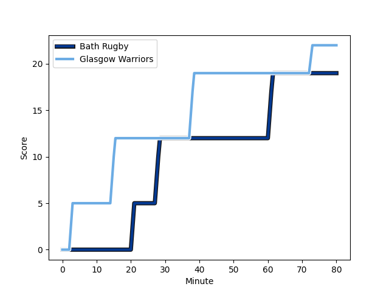

---  
layout: page  
title: Glasgow Warriors at Bath Rugby; 22-19  
date: 2022-12-10 14:00:00 18:00:00 -0500  
categories: match review  
---
# Glasgow Warriors (1444.15) at Bath Rugby (1501.73); 22-19

# Prediction: Bath Rugby by 8.8

Bath Rugby by 5.8 on a neutral field
## Scores over Time

## Win Probability over Time

# Pre-Match Prediction: Bath Rugby by 7.5

Bath Rugby by 4.5 on a neutral pitch

|   Away Minutes | Away Player                                                       |   Away elo |   Away Percentile |   Number |   Home Percentile |   Home elo | Home Player                                                              |   Home Minutes |
|---------------:|:------------------------------------------------------------------|-----------:|------------------:|---------:|------------------:|-----------:|:-------------------------------------------------------------------------|---------------:|
|             76 | [Jamie Bhatti](..//playerfiles//JamieBhatti_cleaned.md)           |     104.97 |                83 |        1 |                33 |      90.6  | [Arthur Cordwell](..//playerfiles//ArthurCordwell_cleaned.md)            |             26 |
|             79 | [George Turner](..//playerfiles//GeorgeTurner_cleaned.md)         |     119.29 |                96 |        2 |                94 |     113.81 | [Tom Dunn](..//playerfiles//TomDunn_cleaned.md)                          |             71 |
|             63 | [Simon Berghan](..//playerfiles//SimonBerghan_cleaned.md)         |      91.19 |                35 |        3 |                 5 |      81.31 | [D'Arcy Rae](..//playerfiles//D'ArcyRae_cleaned.md)                      |             71 |
|             80 | [Lewis Bean](..//playerfiles//LewisBean_cleaned.md)               |      87.51 |                15 |        4 |                98 |     132.04 | [Dave Attwood](..//playerfiles//DaveAttwood_cleaned.md)                  |             64 |
|             63 | [JP du Preez](..//playerfiles//JPduPreez_cleaned.md)              |      90.66 |                33 |        5 |                30 |      90.9  | [Fergus Lee-Warner](..//playerfiles//FergusLee-Warner_cleaned.md)        |             64 |
|             80 | [Ryan Wilson](..//playerfiles//RyanWilson_cleaned.md)             |      86.71 |                16 |        6 |                49 |      95.82 | [Ted Hill](..//playerfiles//TedHill_cleaned.md)                          |             80 |
|             79 | [Cameron Neild](..//playerfiles//CameronNeild_cleaned.md)         |      85.25 |                12 |        7 |                41 |      96.6  | [Wesley White](..//playerfiles//WesleyWhite_cleaned.md)                  |             71 |
|             56 | [Jack Mann](..//playerfiles//JackMann_cleaned.md)                 |      95    |               nan |        8 |                17 |      86.19 | [Josh Bayliss](..//playerfiles//JoshBayliss_cleaned.md)                  |             80 |
|             56 | [Jamie Dobie](..//playerfiles//JamieDobie_cleaned.md)             |      94.68 |                43 |        9 |                76 |     102.7  | [Ben Spencer](..//playerfiles//BenSpencer_cleaned.md)                    |             80 |
|             56 | [Domingo Miotti](..//playerfiles//DomingoMiotti_cleaned.md)       |     103.33 |                71 |       10 |                82 |     108.04 | [Piers Francis](..//playerfiles//PiersFrancis_cleaned.md)                |             80 |
|             80 | [Rufus McLean](..//playerfiles//RufusMcLean_cleaned.md)           |      99.84 |                66 |       11 |                98 |     127.2  | [Matt Gallagher](..//playerfiles//MattGallagher_cleaned.md)              |             63 |
|             80 | [Stafford McDowall](..//playerfiles//StaffordMcDowall_cleaned.md) |     107.52 |                81 |       12 |                77 |     104.9  | [Cameron Redpath](..//playerfiles//CameronRedpath_cleaned.md)            |             80 |
|             80 | [Huw Jones](..//playerfiles//HuwJones_cleaned.md)                 |      88.11 |                22 |       13 |                32 |      91.48 | [Ollie Lawrence](..//playerfiles//OllieLawrence_cleaned.md)              |             80 |
|             80 | [Kyle Steyn](..//playerfiles//KyleSteyn_cleaned.md)               |      97.18 |                55 |       14 |                80 |     105.13 | [Joe Cokanasiga](..//playerfiles//JoeCokanasiga_cleaned.md)              |             80 |
|             80 | [Ollie Smith](..//playerfiles//OllieSmith_cleaned.md)             |      91.18 |                35 |       15 |                23 |      88.12 | [Tom de Glanville](..//playerfiles//TomdeGlanville_cleaned.md)           |             80 |
|              4 | [Nathan McBeth](..//playerfiles//NathanMcBeth_cleaned.md)         |      91.83 |               nan |       16 |                31 |      93.4  | [Lewis Boyce](..//playerfiles//LewisBoyce_cleaned.md)                    |             54 |
|              1 | [Angus Fraser](..//playerfiles//AngusFraser_cleaned.md)           |      95    |               nan |       17 |                60 |      96.88 | [Niall Annett](..//playerfiles//NiallAnnett_cleaned.md)                  |              9 |
|             17 | [Lucio Sordoni](..//playerfiles//LucioSordoni_cleaned.md)         |     105.18 |                81 |       18 |               nan |      90.58 | [Johannes Jonker](..//playerfiles//JohannesJonker_cleaned.md)            |              9 |
|             17 | [Richie Gray](..//playerfiles//RichieGray_cleaned.md)             |      97.49 |                60 |       19 |                68 |      99.69 | [Will Spencer](..//playerfiles//WillSpencer_cleaned.md)                  |             16 |
|              1 | [Walter Fifita](..//playerfiles//WalterFifita_cleaned.md)         |      65.77 |                 0 |       20 |                19 |      87.13 | [Tom Ellis](..//playerfiles//TomEllis_cleaned.md)                        |             16 |
|             24 | [Euan Ferrie](..//playerfiles//EuanFerrie_cleaned.md)             |     107.13 |               nan |       21 |                82 |     106.74 | [Richard de Carpentier](..//playerfiles//RicharddeCarpentier_cleaned.md) |              9 |
|             24 | [Sean Kennedy](..//playerfiles//SeanKennedy_cleaned.md)           |      86.24 |               nan |       22 |                22 |      89.28 | [Orlando Bailey](..//playerfiles//OrlandoBailey_cleaned.md)              |             17 |
|             24 | [Duncan Weir](..//playerfiles//DuncanWeir_cleaned.md)             |      94.65 |                43 |       23 |               nan |     nan    | nan                                                                      |            nan |

