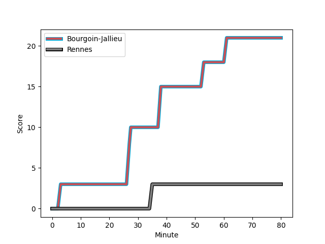
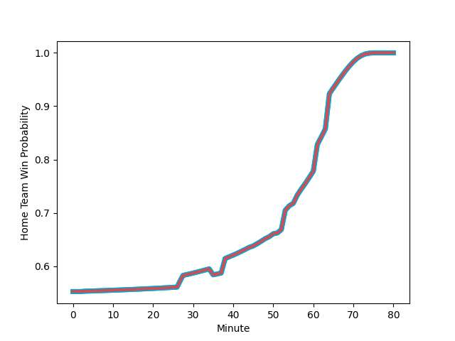

---  
layout: page  
title: Rennes at Bourgoin-Jallieu; 3-21  
date: 2022-12-10 18:30:00 18:00:00 -0500  
categories: match review  
---
# Rennes (1327.69) at Bourgoin-Jallieu (1418.21); 3-21

# Prediction: Bourgoin-Jallieu by 12.1

Bourgoin-Jallieu by 9.1 on a neutral field
## Scores over Time

## Win Probability over Time

# Pre-Match Prediction: Bourgoin-Jallieu by 12.0

Bourgoin-Jallieu by 9.0 on a neutral pitch

|   Away Minutes | Away Player                                                             |   Away elo |   Away Percentile |   Number |   Home Percentile |   Home elo | Home Player                                                               |   Home Minutes |
|---------------:|:------------------------------------------------------------------------|-----------:|------------------:|---------:|------------------:|-----------:|:--------------------------------------------------------------------------|---------------:|
|             49 | [Grégory Querin](..//playerfiles//GrégoryQuerin_cleaned.md)             |      89.71 |                23 |        1 |                23 |      89.73 | [Romain Favaretto](..//playerfiles//RomainFavaretto_cleaned.md)           |             51 |
|             55 | [Patrick Tu'ugahala](..//playerfiles//PatrickTu'ugahala_cleaned.md)     |      90.15 |                27 |        2 |                48 |      94.46 | [Mohamed Khribache](..//playerfiles//MohamedKhribache_cleaned.md)         |             51 |
|             55 | [Atonio Ulutuipalelei](..//playerfiles//AtonioUlutuipalelei_cleaned.md) |      94.27 |                41 |        3 |                67 |      99.8  | [Oktay Yilmaz](..//playerfiles//OktayYilmaz_cleaned.md)                   |             51 |
|             80 | [Guillaume Cazette](..//playerfiles//GuillaumeCazette_cleaned.md)       |      85.82 |                13 |        4 |                67 |      99.39 | [Léandre Cotte](..//playerfiles//LéandreCotte_cleaned.md)                 |             80 |
|             49 | [Victor Fromenteze](..//playerfiles//VictorFromenteze_cleaned.md)       |      66.94 |                 1 |        5 |                71 |     102.33 | [Kemueli Lavetanakoroi](..//playerfiles//KemueliLavetanakoroi_cleaned.md) |             80 |
|             49 | [Victor Danielli](..//playerfiles//VictorDanielli_cleaned.md)           |      95    |               nan |        6 |                 6 |      80.88 | [Theophile Cotte](..//playerfiles//TheophileCotte_cleaned.md)             |             59 |
|             80 | [Pedro Ortega](..//playerfiles//PedroOrtega_cleaned.md)                 |      90.79 |                30 |        7 |                51 |      95.74 | [Bynjamin Rabatel](..//playerfiles//BynjaminRabatel_cleaned.md)           |             80 |
|             80 | [Baptiste Beaujouan](..//playerfiles//BaptisteBeaujouan_cleaned.md)     |      91.85 |                40 |        8 |                50 |      96.74 | [Poutasi Luafutu](..//playerfiles//PoutasiLuafutu_cleaned.md)             |             45 |
|             80 | [Matéo Jeune-Joly](..//playerfiles//MatéoJeune-Joly_cleaned.md)         |      87.39 |                16 |        9 |                65 |      99.33 | [Tomas Munilla lo Duca](..//playerfiles//TomasMunillaloDuca_cleaned.md)   |             55 |
|             80 | [Yvan Leroyer](..//playerfiles//YvanLeroyer_cleaned.md)                 |      81.82 |                10 |       10 |                21 |      88.53 | [Nicolas Vuillemin](..//playerfiles//NicolasVuillemin_cleaned.md)         |             80 |
|             80 | [Enzo Salvai](..//playerfiles//EnzoSalvai_cleaned.md)                   |      89.03 |                27 |       11 |               nan |      95    | [Naibuka Rokua](..//playerfiles//NaibukaRokua_cleaned.md)                 |             80 |
|             80 | [Hypolite Cornu](..//playerfiles//HypoliteCornu_cleaned.md)             |      90.5  |                28 |       12 |                63 |      99.46 | [Christopher Bosch](..//playerfiles//ChristopherBosch_cleaned.md)         |             80 |
|             57 | [Clément Lepresle](..//playerfiles//ClémentLepresle_cleaned.md)         |      89.41 |                25 |       13 |                44 |      94.76 | [Makalea Foliaki](..//playerfiles//MakaleaFoliaki_cleaned.md)             |             55 |
|             64 | [Mateo Carrere](..//playerfiles//MateoCarrere_cleaned.md)               |      90.44 |                30 |       14 |                14 |      86.47 | [Matthieu Nicolas](..//playerfiles//MatthieuNicolas_cleaned.md)           |             56 |
|             57 | [Théo Platon](..//playerfiles//ThéoPlaton_cleaned.md)                   |      89.15 |                22 |       15 |                31 |      91    | [Romain Sola](..//playerfiles//RomainSola_cleaned.md)                     |             80 |
|             31 | [Baptiste Le Jallé](..//playerfiles//BaptisteLeJallé_cleaned.md)        |      82.95 |                 7 |       16 |                41 |      94.09 | [Lakisipone Lee](..//playerfiles//LakisiponeLee_cleaned.md)               |             35 |
|             31 | [Vincent Wenger](..//playerfiles//VincentWenger_cleaned.md)             |      88.61 |                21 |       17 |                21 |      88.9  | [Pablo Patilla](..//playerfiles//PabloPatilla_cleaned.md)                 |             24 |
|             31 | [Gabriel Quesmel](..//playerfiles//GabrielQuesmel_cleaned.md)           |      95.04 |                49 |       18 |                33 |      92.37 | [Nugzar Somkhishvili](..//playerfiles//NugzarSomkhishvili_cleaned.md)     |             29 |
|             23 | [Pedro Soto](..//playerfiles//PedroSoto_cleaned.md)                     |      88.57 |                26 |       19 |                27 |      90.33 | [Maxime Castant](..//playerfiles//MaximeCastant_cleaned.md)               |             29 |
|             23 | [Alexis François](..//playerfiles//AlexisFrançois_cleaned.md)           |      89.27 |                25 |       20 |                52 |      98.4  | [Michael Simutoga](..//playerfiles//MichaelSimutoga_cleaned.md)           |             29 |
|             16 | [Vaha Ma'afu](..//playerfiles//VahaMa'afu_cleaned.md)                   |      91.11 |                29 |       21 |                67 |     100.61 | [Kevin Chaudouard](..//playerfiles//KevinChaudouard_cleaned.md)           |             21 |
|             25 | [Pierre Strippoli](..//playerfiles//PierreStrippoli_cleaned.md)         |      93.87 |                48 |       22 |                68 |     101.33 | [Pieter Morton](..//playerfiles//PieterMorton_cleaned.md)                 |             25 |
|             25 | [Luvuyo Pupuma](..//playerfiles//LuvuyoPupuma_cleaned.md)               |      89.54 |                22 |       23 |                44 |      95.58 | [Adrien Pontarollo](..//playerfiles//AdrienPontarollo_cleaned.md)         |             25 |

