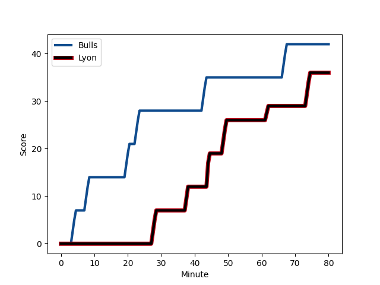
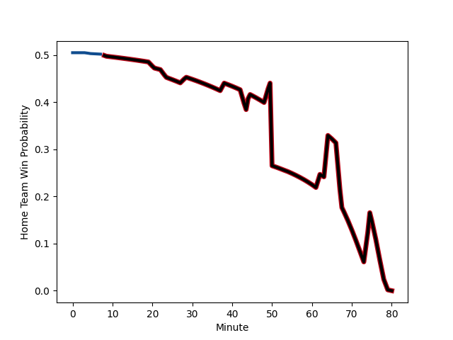

---  
layout: page  
title: Lyon at Bulls; 36-42  
date: 2022-12-10 18:30:00 18:00:00 -0500  
categories: match review  
---
# Lyon (1492.5) at Bulls (1501.51); 36-42

# Prediction: Bulls by 3.9

Bulls by 0.9 on a neutral field
## Scores over Time

## Win Probability over Time

# Pre-Match Prediction: Bulls by 0.3

Lyon by 3.3 on a neutral pitch

|   Away Minutes | Away Player                                                                            |   Away elo |   Away Percentile |   Number |   Home Percentile |   Home elo | Home Player                                                                  |   Home Minutes |
|---------------:|:---------------------------------------------------------------------------------------|-----------:|------------------:|---------:|------------------:|-----------:|:-----------------------------------------------------------------------------|---------------:|
|             50 | [Jerome Rey](..//playerfiles//JeromeRey_cleaned.md)                                    |      58.22 |                 0 |        1 |                39 |      96.7  | [Dylan Smith](..//playerfiles//DylanSmith_cleaned.md)                        |             64 |
|             50 | [Liam Coltman](..//playerfiles//LiamColtman_cleaned.md)                                |     108.15 |                89 |        2 |                95 |     117.43 | [Bismarck du Plessis](..//playerfiles//BismarckduPlessis_cleaned.md)         |             64 |
|             50 | [Paulo Tafili](..//playerfiles//PauloTafili_cleaned.md)                                |      90.39 |                21 |        3 |                95 |     114.41 | [Jacques van Rooyen](..//playerfiles//JacquesvanRooyen_cleaned.md)           |             64 |
|             61 | [Felix Lambey](..//playerfiles//FelixLambey_cleaned.md)                                |     121.15 |                96 |        4 |               nan |      98.4  | [Jacques du Plessis](..//playerfiles//JacquesduPlessis_cleaned.md)           |             41 |
|             54 | [Romain Taofifenua](..//playerfiles//RomainTaofifenua_cleaned.md)                      |     110.53 |                88 |        5 |                39 |      91.52 | [Reinhardt Ludwig](..//playerfiles//ReinhardtLudwig_cleaned.md)              |             80 |
|             80 | [Dylan Cretin](..//playerfiles//DylanCretin_cleaned.md)                                |     103.92 |                74 |        6 |                74 |     103.73 | [Nizaam Carr](..//playerfiles//NizaamCarr_cleaned.md)                        |             80 |
|             80 | [Mickael Guillard](..//playerfiles//MickaelGuillard_cleaned.md)                        |      97.46 |                62 |        7 |                41 |      93.46 | [WJ Steenkamp](..//playerfiles//WJSteenkamp_cleaned.md)                      |             80 |
|             80 | [Arno Botha](..//playerfiles//ArnoBotha_cleaned.md)                                    |     118.21 |                91 |        8 |                64 |     101.04 | [Muller Uys](..//playerfiles//MullerUys_cleaned.md)                          |             67 |
|             49 | [Jean-Marc Doussain](..//playerfiles//Jean-MarcDoussain_cleaned.md)                    |     119.56 |                95 |        9 |                57 |      98.42 | [Bernard van der Linde](..//playerfiles//BernardvanderLinde_cleaned.md)      |             80 |
|             80 | [Fletcher Smith](..//playerfiles//FletcherSmith_cleaned.md)                            |      82.3  |                11 |       10 |                59 |      99.06 | [Morne Steyn](..//playerfiles//MorneSteyn_cleaned.md)                        |             80 |
|             54 | [Noa Nakaitaci](..//playerfiles//NoaNakaitaci_cleaned.md)                              |      93.71 |                41 |       11 |                14 |      86.43 | [Stravino Jacobs](..//playerfiles//StravinoJacobs_cleaned.md)                |             47 |
|             80 | [Kyle Godwin](..//playerfiles//KyleGodwin_cleaned.md)                                  |     112.81 |                87 |       12 |                11 |      81.73 | [Marco Jansen van Vuren](..//playerfiles//MarcoJansenvanVuren_cleaned.md)    |             12 |
|             61 | [Tavite Veredamu](..//playerfiles//TaviteVeredamu_cleaned.md)                          |      93.74 |                44 |       13 |                80 |     106.48 | [Stedman-Gee Rivett Gans](..//playerfiles//Stedman-GeeRivettGans_cleaned.md) |             80 |
|             80 | [Ethan Dumortier](..//playerfiles//EthanDumortier_cleaned.md)                          |      99.95 |                67 |       14 |                53 |      96.59 | [Sibongile Vukile Novuka](..//playerfiles//SibongileVukileNovuka_cleaned.md) |             80 |
|             80 | [Leo Berdeu](..//playerfiles//LeoBerdeu_cleaned.md)                                    |      89.04 |                22 |       15 |                70 |     102.43 | [Wandisile Simelane](..//playerfiles//WandisileSimelane_cleaned.md)          |             80 |
|             30 | [Hamza Kaabeche](..//playerfiles//HamzaKaabeche_cleaned.md)                            |      92.18 |                33 |       16 |                42 |      94.17 | [Lizo Gqoboka](..//playerfiles//LizoGqoboka_cleaned.md)                      |             16 |
|             30 | [Guillaume Marchand](..//playerfiles//GuillaumeMarchand_cleaned.md)                    |      84.68 |                11 |       17 |                 7 |      83.21 | [Jan Hendrik Wessels](..//playerfiles//JanHendrikWessels_cleaned.md)         |             16 |
|             30 | [Francisco Gomez Kodela](..//playerfiles//FranciscoGomezKodela_cleaned.md)             |     112.44 |                93 |       18 |               nan |      94.36 | [Sebastian Lombard](..//playerfiles//SebastianLombard_cleaned.md)            |             16 |
|             19 | [Theo William](..//playerfiles//TheoWilliam_cleaned.md)                                |      95    |                48 |       19 |                36 |      93.09 | [Janko Swanepoel](..//playerfiles//JankoSwanepoel_cleaned.md)                |             39 |
|             26 | [Loann Goujon](..//playerfiles//LoannGoujon_cleaned.md)                                |      92.69 |                40 |       20 |                49 |      95.42 | [Phumzile Maqondwana](..//playerfiles//PhumzileMaqondwana_cleaned.md)        |             13 |
|             31 | [Jonathan Pelissie](..//playerfiles//JonathanPelissie_cleaned.md)                      |     102.45 |                74 |       21 |                42 |      94.1  | [Keagan Johannes](..//playerfiles//KeaganJohannes_cleaned.md)                |             33 |
|             26 | [Xavier Mignot](..//playerfiles//XavierMignot_cleaned.md)                              |      93.56 |                41 |       22 |                86 |     111.59 | [Chris Smith](..//playerfiles//ChrisSmith_cleaned.md)                        |             68 |
|             19 | [Alexandre Tchaptchet Noutcha](..//playerfiles//AlexandreTchaptchetNoutcha_cleaned.md) |      93.1  |                40 |       23 |               nan |     nan    | nan                                                                          |            nan |

