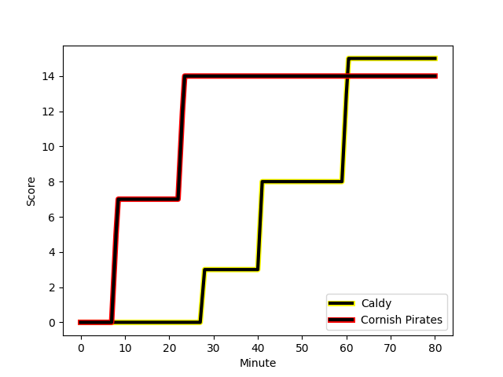
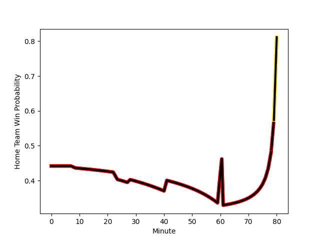

---  
layout: page  
title: Cornish Pirates at Caldy; 14-15  
date: 2022-12-10 15:00:00 18:00:00 -0500  
categories: match review  
---
# Cornish Pirates (1442.63) at Caldy (1341.0); 14-15

# Prediction: Cornish Pirates by 7.2

Cornish Pirates by 10.2 on a neutral field
## Scores over Time

## Win Probability over Time

# Pre-Match Prediction: Cornish Pirates by 16.6

Cornish Pirates by 19.6 on a neutral pitch

|   Away Minutes | Away Player                                                      |   Away elo |   Away Percentile |   Number |   Home Percentile |   Home elo | Home Player                                                          |   Home Minutes |
|---------------:|:-----------------------------------------------------------------|-----------:|------------------:|---------:|------------------:|-----------:|:---------------------------------------------------------------------|---------------:|
|             61 | [Ollie Adkins](..//playerfiles//OllieAdkins_cleaned.md)          |      86.56 |               nan |        1 |                23 |      89.94 | [Nathan Rushton](..//playerfiles//NathanRushton_cleaned.md)          |             50 |
|             70 | [William Crane](..//playerfiles//WilliamCrane_cleaned.md)        |      94.67 |                49 |        2 |                18 |      87.85 | [Oliver Hearn](..//playerfiles//OliverHearn_cleaned.md)              |             80 |
|             70 | [Matt Johnson](..//playerfiles//MattJohnson_cleaned.md)          |     101.93 |                73 |        3 |                40 |      92.09 | [Ryan Higginson](..//playerfiles//RyanHigginson_cleaned.md)          |             50 |
|             80 | [Cory Teague](..//playerfiles//CoryTeague_cleaned.md)            |      83.66 |                13 |        4 |                79 |     105.86 | [Sam Dickinson](..//playerfiles//SamDickinson_cleaned.md)            |             80 |
|             65 | [Will Britton](..//playerfiles//WillBritton_cleaned.md)          |      87.43 |                20 |        5 |                15 |      84.89 | [Thomas Sanders](..//playerfiles//ThomasSanders_cleaned.md)          |             80 |
|             68 | [Alex Everett](..//playerfiles//AlexEverett_cleaned.md)          |      94.89 |                47 |        6 |                53 |      95.35 | [Martin Gerrard](..//playerfiles//MartinGerrard_cleaned.md)          |             80 |
|             80 | [John Stevens](..//playerfiles//JohnStevens_cleaned.md)          |     116.01 |                93 |        7 |                12 |      85.34 | [Callum Ridgway](..//playerfiles//CallumRidgway_cleaned.md)          |             80 |
|             80 | [Rusiate Tuima](..//playerfiles//RusiateTuima_cleaned.md)        |      83.85 |                12 |        8 |                17 |      86.13 | [Josiah Dickinson](..//playerfiles//JosiahDickinson_cleaned.md)      |             80 |
|             70 | [Ruaridh Dawson](..//playerfiles//RuaridhDawson_cleaned.md)      |      92.79 |                36 |        9 |                46 |      94.82 | [Chris Pilgrim](..//playerfiles//ChrisPilgrim_cleaned.md)            |             50 |
|             57 | [Arwel Robson](..//playerfiles//ArwelRobson_cleaned.md)          |      93.11 |                37 |       10 |                24 |      89.95 | [Ezra Hinchcliffe](..//playerfiles//EzraHinchcliffe_cleaned.md)      |             80 |
|             80 | [Alexander AJ Cant](..//playerfiles//AlexanderAJCant_cleaned.md) |     132.23 |                99 |       11 |                20 |      87.87 | [Benjamin Jones](..//playerfiles//BenjaminJones_cleaned.md)          |             80 |
|             80 | [Joe Elderkin](..//playerfiles//JoeElderkin_cleaned.md)          |     103.57 |                74 |       12 |                19 |      88.22 | [Michael Cartmill](..//playerfiles//MichaelCartmill_cleaned.md)      |             80 |
|             56 | [Shae Tucker](..//playerfiles//ShaeTucker_cleaned.md)            |      97.99 |                60 |       13 |                15 |      85.53 | [Dan Bibby](..//playerfiles//DanBibby_cleaned.md)                    |             80 |
|             80 | [Callum Sirker](..//playerfiles//CallumSirker_cleaned.md)        |      69.08 |                 0 |       14 |                15 |      86.79 | [Nick Royle](..//playerfiles//NickRoyle_cleaned.md)                  |             80 |
|             80 | [Carwyn Penny](..//playerfiles//CarwynPenny_cleaned.md)          |      97.8  |                42 |       15 |                29 |      89.92 | [Elliott Gourlay](..//playerfiles//ElliottGourlay_cleaned.md)        |             80 |
|             24 | [Rory Parata](..//playerfiles//RoryParata_cleaned.md)            |     106.41 |                80 |       16 |                 0 |      64.55 | [Andy Darlington](..//playerfiles//AndyDarlington_cleaned.md)        |             30 |
|             23 | [Harry Bazalgette](..//playerfiles//HarryBazalgette_cleaned.md)  |      99.91 |                64 |       17 |                52 |      96.46 | [Anerin (Nye) Thomas](..//playerfiles//Anerin(Nye)Thomas_cleaned.md) |             30 |
|             19 | [Marlen Walker](..//playerfiles//MarlenWalker_cleaned.md)        |      96.95 |                55 |       18 |                25 |      90.43 | [Adam Aigbokhae](..//playerfiles//AdamAigbokhae_cleaned.md)          |             30 |
|             15 | [Josh Williams](..//playerfiles//JoshWilliams_cleaned.md)        |      96.15 |               nan |       19 |               nan |     nan    | nan                                                                  |            nan |
|             12 | [Will Gibson](..//playerfiles//WillGibson_cleaned.md)            |      90.05 |                17 |       20 |               nan |     nan    | nan                                                                  |            nan |
|             10 | [Max Norey](..//playerfiles//MaxNorey_cleaned.md)                |      94.59 |               nan |       21 |               nan |     nan    | nan                                                                  |            nan |
|             10 | [Tom Kessell](..//playerfiles//TomKessell_cleaned.md)            |      97.04 |                43 |       22 |               nan |     nan    | nan                                                                  |            nan |
|             10 | [Harvey Beaton](..//playerfiles//HarveyBeaton_cleaned.md)        |      91.45 |                26 |       23 |               nan |     nan    | nan                                                                  |            nan |

