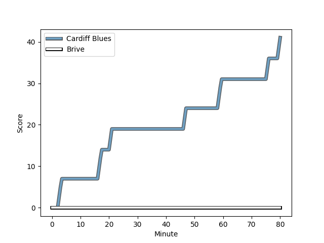
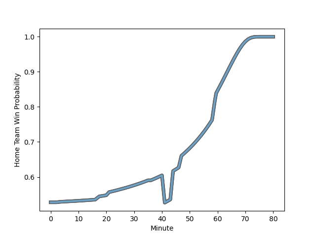

---  
layout: page  
title: Brive at Cardiff Blues; 0-41  
date: 2022-12-10 18:30:00 18:00:00 -0500  
categories: match review  
---
# Brive (1436.23) at Cardiff Blues (1491.38); 0-41

# Prediction: Cardiff Blues by 8.5

Cardiff Blues by 5.5 on a neutral field
## Scores over Time

## Win Probability over Time

# Pre-Match Prediction: Cardiff Blues by 7.2

Cardiff Blues by 4.2 on a neutral pitch

|   Away Minutes | Away Player                                                                      |   Away elo |   Away Percentile |   Number |   Home Percentile |   Home elo | Home Player                                                   |   Home Minutes |
|---------------:|:---------------------------------------------------------------------------------|-----------:|------------------:|---------:|------------------:|-----------:|:--------------------------------------------------------------|---------------:|
|             44 | [Wesley Tapueluelu](..//playerfiles//WesleyTapueluelu_cleaned.md)                |      93.12 |                46 |        1 |                32 |      92.09 | [Rhys Carré](..//playerfiles//RhysCarré_cleaned.md)           |             55 |
|             17 | [Lucas da Silva](..//playerfiles//LucasdaSilva_cleaned.md)                       |      96.28 |                54 |        2 |                90 |     109.29 | [Kristian Dacey](..//playerfiles//KristianDacey_cleaned.md)   |             48 |
|             44 | [Tietie Tuimauga](..//playerfiles//TietieTuimauga_cleaned.md)                    |     100.62 |                68 |        3 |                52 |      96.5  | [Dimitri Arhip](..//playerfiles//DimitriArhip_cleaned.md)     |             48 |
|             80 | [Renger Van Eerten](..//playerfiles//RengerVanEerten_cleaned.md)                 |      92.08 |                45 |        4 |                37 |      92.37 | [Lopeti Timani](..//playerfiles//LopetiTimani_cleaned.md)     |             48 |
|             55 | [Andres Zafra Tarazona](..//playerfiles//AndresZafraTarazona_cleaned.md)         |      81.24 |                 8 |        5 |                22 |      88.11 | [Seb Davies](..//playerfiles//SebDavies_cleaned.md)           |             80 |
|             80 | [Matthieu Voisin](..//playerfiles//MatthieuVoisin_cleaned.md)                    |      93    |                38 |        6 |                52 |      96.12 | [Josh Turnbull](..//playerfiles//JoshTurnbull_cleaned.md)     |             80 |
|             80 | [Joeli Matalaweru](..//playerfiles//JoeliMatalaweru_cleaned.md)                  |      95    |               nan |        7 |                78 |     105.02 | [Thomas Young](..//playerfiles//ThomasYoung_cleaned.md)       |             41 |
|             55 | [Abraham Papali'i](..//playerfiles//AbrahamPapali'i_cleaned.md)                  |     104.06 |                73 |        8 |                50 |      97.02 | [James Ratti](..//playerfiles//JamesRatti_cleaned.md)         |             80 |
|             41 | [Enzo Sanga](..//playerfiles//EnzoSanga_cleaned.md)                              |      87.33 |                17 |        9 |                85 |     108.68 | [Lloyd Williams](..//playerfiles//LloydWilliams_cleaned.md)   |             80 |
|             80 | [Enzo Herve](..//playerfiles//EnzoHerve_cleaned.md)                              |     113.25 |                89 |       10 |                83 |     109.04 | [Jarrod Evans](..//playerfiles//JarrodEvans_cleaned.md)       |             80 |
|             36 | [Joris Jurand](..//playerfiles//JorisJurand_cleaned.md)                          |     101.43 |                71 |       11 |                25 |      90.14 | [Theo Cabango](..//playerfiles//TheoCabango_cleaned.md)       |             80 |
|             80 | [Thomas Laranjeira](..//playerfiles//ThomasLaranjeira_cleaned.md)                |     122.88 |                96 |       12 |                61 |      98.91 | [Max Llewellyn](..//playerfiles//MaxLlewellyn_cleaned.md)     |             55 |
|             80 | [Wesley Douglas](..//playerfiles//WesleyDouglas_cleaned.md)                      |      78.64 |                 8 |       13 |                98 |     129.28 | [Rey Lee-Lo](..//playerfiles//ReyLee-Lo_cleaned.md)           |             80 |
|             80 | [Valentin Tirefort](..//playerfiles//ValentinTirefort_cleaned.md)                |      91.86 |                33 |       14 |                65 |     100.2  | [Josh Adams](..//playerfiles//JoshAdams_cleaned.md)           |             55 |
|             60 | [Mathis Ferté](..//playerfiles//MathisFerté_cleaned.md)                          |      79.13 |                 7 |       15 |                27 |      89.88 | [Ben Thomas](..//playerfiles//BenThomas_cleaned.md)           |             80 |
|             36 | [Hayden Thompson-Stringer](..//playerfiles//HaydenThompson-Stringer_cleaned.md)  |      95.17 |                48 |       16 |                72 |     101.7  | [Bradley Thyer](..//playerfiles//BradleyThyer_cleaned.md)     |             25 |
|             36 | [Francisco Coria Marchetti](..//playerfiles//FranciscoCoriaMarchetti_cleaned.md) |      95    |               nan |       17 |                28 |      90.01 | [Kirby Myhill](..//playerfiles//KirbyMyhill_cleaned.md)       |             32 |
|             63 | [Florian Dufour](..//playerfiles//FlorianDufour_cleaned.md)                      |     106.11 |                84 |       18 |                88 |     108.9  | [Dillon Lewis](..//playerfiles//DillonLewis_cleaned.md)       |             32 |
|             25 | [Tevita Ratuva](..//playerfiles//TevitaRatuva_cleaned.md)                        |      99.41 |                67 |       19 |               nan |      95.16 | [Teddy Williams](..//playerfiles//TeddyWilliams_cleaned.md)   |             32 |
|             25 | [Noe Bedou](..//playerfiles//NoeBedou_cleaned.md)                                |      91.82 |                34 |       20 |                44 |      94.84 | [Taulupe Faletau](..//playerfiles//TaulupeFaletau_cleaned.md) |             39 |
|             39 | [Paul Abadie](..//playerfiles//PaulAbadie_cleaned.md)                            |      88.12 |                18 |       21 |                23 |      88.43 | [Rhys Priestland](..//playerfiles//RhysPriestland_cleaned.md) |             25 |
|             44 | [Tom Danovaro](..//playerfiles//TomDanovaro_cleaned.md)                          |      95    |               nan |       22 |                16 |      86.1  | [Mason Grady](..//playerfiles//MasonGrady_cleaned.md)         |             25 |
|             20 | [Tanguy Lacoste](..//playerfiles//TanguyLacoste_cleaned.md)                      |      85.07 |               nan |       23 |               nan |     nan    | nan                                                           |            nan |

