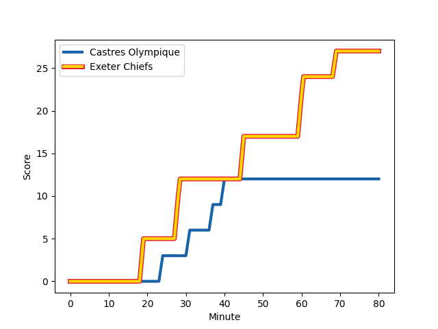
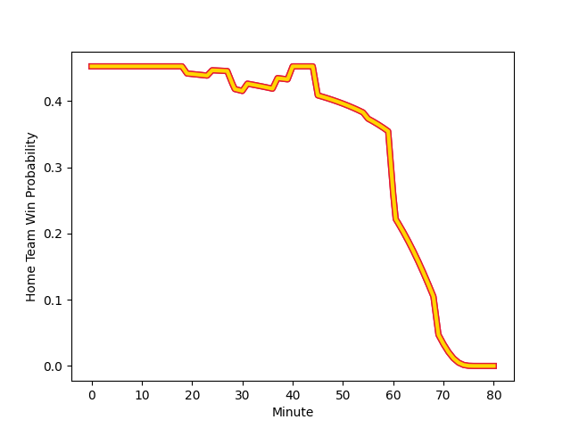

---  
layout: page  
title: Exeter Chiefs at Castres Olympique; 27-12  
date: 2022-12-10 21:00:00 18:00:00 -0500  
categories: match review  
---
# Exeter Chiefs (1623.67) at Castres Olympique (1540.71); 27-12

# Prediction: Exeter Chiefs by 5.3

Exeter Chiefs by 8.3 on a neutral field
## Scores over Time

## Win Probability over Time

# Pre-Match Prediction: Exeter Chiefs by 4.2

Exeter Chiefs by 7.2 on a neutral pitch

|   Away Minutes | Away Player                                                       |   Away elo |   Away Percentile |   Number |   Home Percentile |   Home elo | Home Player                                                                       |   Home Minutes |
|---------------:|:------------------------------------------------------------------|-----------:|------------------:|---------:|------------------:|-----------:|:----------------------------------------------------------------------------------|---------------:|
|             64 | [Scott Sio](..//playerfiles//ScottSio_cleaned.md)                 |      90.45 |                24 |        1 |                85 |     103.89 | [Antoine Tichit](..//playerfiles//AntoineTichit_cleaned.md)                       |             55 |
|             64 | [Jack Yeandle](..//playerfiles//JackYeandle_cleaned.md)           |     124.72 |                98 |        2 |                80 |     104.59 | [Gaetan Barlot](..//playerfiles//GaetanBarlot_cleaned.md)                         |             55 |
|             64 | [Harry Williams](..//playerfiles//HarryWilliams_cleaned.md)       |     113.15 |                93 |        3 |                83 |     105.8  | [Wilfrid Hounkpatin](..//playerfiles//WilfridHounkpatin_cleaned.md)               |             55 |
|             63 | [Dafydd Jenkins](..//playerfiles//DafyddJenkins_cleaned.md)       |     100.46 |                70 |        4 |                91 |     118.49 | [Leone Nakarawa](..//playerfiles//LeoneNakarawa_cleaned.md)                       |             60 |
|             80 | [Jonny Gray](..//playerfiles//JonnyGray_cleaned.md)               |     107.61 |                85 |        5 |                24 |      88.96 | [Tom Staniforth](..//playerfiles//TomStaniforth_cleaned.md)                       |             72 |
|             80 | [Dave Ewers](..//playerfiles//DaveEwers_cleaned.md)               |     123.82 |                96 |        6 |                67 |     100.43 | [Mathieu Babillot](..//playerfiles//MathieuBabillot_cleaned.md)                   |             80 |
|             63 | [Christ Tshiunza](..//playerfiles//ChristTshiunza_cleaned.md)     |      91.3  |                31 |        7 |                60 |      98.39 | [Nick Champion de Crespigny](..//playerfiles//NickChampiondeCrespigny_cleaned.md) |             60 |
|             80 | [Sam Simmonds](..//playerfiles//SamSimmonds_cleaned.md)           |     118.17 |                95 |        8 |                73 |     103.37 | [Tyler Ardron](..//playerfiles//TylerArdron_cleaned.md)                           |             80 |
|             64 | [Sam Maunder](..//playerfiles//SamMaunder_cleaned.md)             |      87.88 |                15 |        9 |                57 |      97.73 | [Gauthier Doubrere](..//playerfiles//GauthierDoubrere_cleaned.md)                 |             60 |
|             80 | [Joe Simmonds](..//playerfiles//JoeSimmonds_cleaned.md)           |     115.2  |                91 |       10 |                29 |      88.87 | [Louis Le Brun](..//playerfiles//LouisLeBrun_cleaned.md)                          |             80 |
|             80 | [Olly Woodburn](..//playerfiles//OllyWoodburn_cleaned.md)         |     116.8  |                93 |       11 |                87 |     110.19 | [Filipo Nakosi](..//playerfiles//FilipoNakosi_cleaned.md)                         |             80 |
|             80 | [Rory O'Loughlin](..//playerfiles//RoryO'Loughlin_cleaned.md)     |      99.19 |                61 |       12 |                35 |      90.91 | [Antoine Zeghdar](..//playerfiles//AntoineZeghdar_cleaned.md)                     |             80 |
|             80 | [Henry Slade](..//playerfiles//HenrySlade_cleaned.md)             |     116.79 |                94 |       13 |                99 |     134.61 | [Thomas Combezou](..//playerfiles//ThomasCombezou_cleaned.md)                     |             80 |
|             80 | [Jack Nowell](..//playerfiles//JackNowell_cleaned.md)             |     109.68 |                88 |       14 |                90 |     112.95 | [Geoffrey Palis](..//playerfiles//GeoffreyPalis_cleaned.md)                       |             80 |
|             61 | [Stuart Hogg](..//playerfiles//StuartHogg_cleaned.md)             |     110.22 |                84 |       15 |                64 |      99.21 | [Julien Dumora](..//playerfiles//JulienDumora_cleaned.md)                         |             80 |
|             16 | [Alec Hepburn](..//playerfiles//AlecHepburn_cleaned.md)           |      99.37 |                65 |       16 |               nan |      95.71 | [Loïs Guerois](..//playerfiles//LoïsGuerois_cleaned.md)                           |             25 |
|             16 | [Dan Frost](..//playerfiles//DanFrost_cleaned.md)                 |     125.53 |                99 |       17 |               nan |      94.23 | [Pierre Colonna](..//playerfiles//PierreColonna_cleaned.md)                       |             25 |
|             16 | [Josh Iosefa-Scott](..//playerfiles//JoshIosefa-Scott_cleaned.md) |      99.75 |                69 |       18 |                51 |      97.39 | [Antoine Guillamon](..//playerfiles//AntoineGuillamon_cleaned.md)                 |             25 |
|             17 | [Ruben van Heerden](..//playerfiles//RubenvanHeerden_cleaned.md)  |     108.32 |                85 |       19 |                11 |      82.58 | [Theo Hannoyer](..//playerfiles//TheoHannoyer_cleaned.md)                         |             20 |
|             17 | [Santiago Grondona](..//playerfiles//SantiagoGrondona_cleaned.md) |      99.69 |                65 |       20 |                21 |      89.88 | [Kevin Kornath](..//playerfiles//KevinKornath_cleaned.md)                         |              8 |
|             16 | [Will Becconsall](..//playerfiles//WillBecconsall_cleaned.md)     |      95    |               nan |       21 |                26 |      88.75 | [Josaia Raisuqe](..//playerfiles//JosaiaRaisuqe_cleaned.md)                       |             20 |
|             19 | [Josh Hodge](..//playerfiles//JoshHodge_cleaned.md)               |      85.33 |                16 |       22 |                79 |     105.81 | [Rory Kockott](..//playerfiles//RoryKockott_cleaned.md)                           |             20 |

