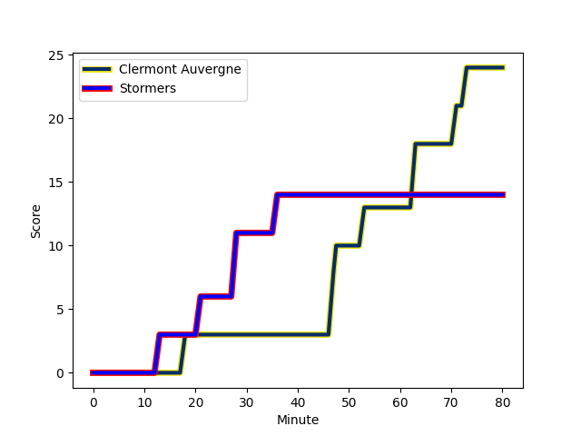
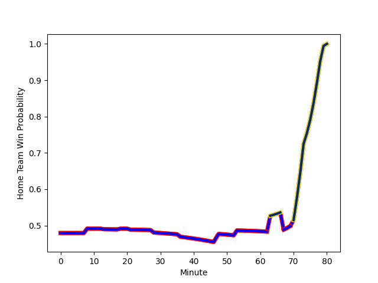

---  
layout: page  
title: Stormers at Clermont Auvergne; 14-24  
date: 2022-12-10 16:15:00 18:00:00 -0500  
categories: match review  
---
# Stormers (1642.35) at Clermont Auvergne (1594.9); 14-24

# Prediction: Stormers by 1.7

Stormers by 4.7 on a neutral field
## Scores over Time

## Win Probability over Time

# Pre-Match Prediction: Stormers by 3.9

Stormers by 6.9 on a neutral pitch

|   Away Minutes | Away Player                                                           |   Away elo |   Away Percentile |   Number |   Home Percentile |   Home elo | Home Player                                                               |   Home Minutes |
|---------------:|:----------------------------------------------------------------------|-----------:|------------------:|---------:|------------------:|-----------:|:--------------------------------------------------------------------------|---------------:|
|             72 | [Steven Kitshoff](..//playerfiles//StevenKitshoff_cleaned.md)         |     123.84 |                97 |        1 |                87 |     107.58 | [Etienne Falgoux](..//playerfiles//EtienneFalgoux_cleaned.md)             |             65 |
|             70 | [Joseph Dweba](..//playerfiles//JosephDweba_cleaned.md)               |      96.7  |                56 |        2 |                46 |      94.11 | [Yohan Beheregaray](..//playerfiles//YohanBeheregaray_cleaned.md)         |             80 |
|             64 | [Neethling Fouche](..//playerfiles//NeethlingFouche_cleaned.md)       |     102.41 |                74 |        3 |                61 |      98.44 | [Cristian Ojovan](..//playerfiles//CristianOjovan_cleaned.md)             |              8 |
|             80 | [Salmaan Moerat](..//playerfiles//SalmaanMoerat_cleaned.md)           |     100.15 |                69 |        4 |                87 |     109.61 | [Tomas Lavanini](..//playerfiles//TomasLavanini_cleaned.md)               |             51 |
|             41 | [Gary Porter](..//playerfiles//GaryPorter_cleaned.md)                 |      92.68 |                38 |        5 |                90 |     112.66 | [Sebastien Vahaamahina](..//playerfiles//SebastienVahaamahina_cleaned.md) |             71 |
|             70 | [Deon Fourie](..//playerfiles//DeonFourie_cleaned.md)                 |     144.42 |                99 |        6 |                76 |     104.07 | [Arthur Iturria](..//playerfiles//ArthurIturria_cleaned.md)               |             80 |
|              8 | [Ernst van Rhyn](..//playerfiles//ErnstvanRhyn_cleaned.md)            |     118.62 |                94 |        7 |                97 |     124.81 | [Alexandre Fischer](..//playerfiles//AlexandreFischer_cleaned.md)         |             80 |
|             80 | [Hacjivah Dayimani](..//playerfiles//HacjivahDayimani_cleaned.md)     |     110.74 |                85 |        8 |                13 |      85.92 | [Jacobus van Tonder](..//playerfiles//JacobusvanTonder_cleaned.md)        |              9 |
|             67 | [Herschel Jantjies](..//playerfiles//HerschelJantjies_cleaned.md)     |     115.1  |                93 |        9 |                92 |     114.52 | [Sebastien Bezy](..//playerfiles//SebastienBezy_cleaned.md)               |             77 |
|             80 | [Manie Libbok](..//playerfiles//ManieLibbok_cleaned.md)               |     107.24 |                81 |       10 |                82 |     108.57 | [Jules Plisson](..//playerfiles//JulesPlisson_cleaned.md)                 |             74 |
|             80 | [Leolin Zas](..//playerfiles//LeolinZas_cleaned.md)                   |     105.82 |                80 |       11 |                84 |     108.16 | [Alivereti Raka](..//playerfiles//AliveretiRaka_cleaned.md)               |             80 |
|             80 | [Damian Willemse](..//playerfiles//DamianWillemse_cleaned.md)         |     123.94 |                95 |       12 |                81 |     107.21 | [Apisai Naqalevu](..//playerfiles//ApisaiNaqalevu_cleaned.md)             |             52 |
|             80 | [Ruhan Nel](..//playerfiles//RuhanNel_cleaned.md)                     |     115.96 |                92 |       13 |                30 |      91.35 | [Cheikh Tiberghien](..//playerfiles//CheikhTiberghien_cleaned.md)         |             80 |
|             53 | [Alapati Leiua](..//playerfiles//AlapatiLeiua_cleaned.md)             |      96.62 |                53 |       14 |                75 |     103.02 | [Damian Penaud](..//playerfiles//DamianPenaud_cleaned.md)                 |             80 |
|             80 | [Clayton Blommetjies](..//playerfiles//ClaytonBlommetjies_cleaned.md) |     111.54 |                87 |       15 |                80 |     107.97 | [Alex Newsome](..//playerfiles//AlexNewsome_cleaned.md)                   |             80 |
|             72 | [Ben-Jason Dixon](..//playerfiles//Ben-JasonDixon_cleaned.md)         |     102.56 |                78 |       16 |                96 |     117.72 | [Davit Kubriashvili](..//playerfiles//DavitKubriashvili_cleaned.md)       |             72 |
|             39 | [Junior Pokomela](..//playerfiles//JuniorPokomela_cleaned.md)         |      96.25 |                53 |       17 |                35 |      92.36 | [Killian Tixeront](..//playerfiles//KillianTixeront_cleaned.md)           |             71 |
|             16 | [Sazi Sandi](..//playerfiles//SaziSandi_cleaned.md)                   |      86.84 |                11 |       18 |                60 |      98.77 | [Thibaud Lanen](..//playerfiles//ThibaudLanen_cleaned.md)                 |             29 |
|             27 | [Angelo Davids](..//playerfiles//AngeloDavids_cleaned.md)             |     109.53 |                86 |       19 |                60 |      98.34 | [Giorgi Beria](..//playerfiles//GiorgiBeria_cleaned.md)                   |             15 |
|             13 | [Albertus Paul de Wet](..//playerfiles//AlbertusPauldeWet_cleaned.md) |      91.84 |                36 |       20 |                90 |     114.95 | [George Moala](..//playerfiles//GeorgeMoala_cleaned.md)                   |             28 |
|             10 | [Marcel Theunissen](..//playerfiles//MarcelTheunissen_cleaned.md)     |      87.99 |                19 |       21 |                22 |      89.96 | [Benjamin Boudou](..//playerfiles//BenjaminBoudou_cleaned.md)             |              9 |
|             10 | [Andre-Hugo Venter](..//playerfiles//Andre-HugoVenter_cleaned.md)     |      97.51 |                64 |       22 |                84 |     109.6  | [Anthony Belleau](..//playerfiles//AnthonyBelleau_cleaned.md)             |              6 |
|              8 | [Alistair Vermaak](..//playerfiles//AlistairVermaak_cleaned.md)       |     111.63 |                92 |       23 |                50 |      95.14 | [Baptiste Jauneau](..//playerfiles//BaptisteJauneau_cleaned.md)           |              3 |

