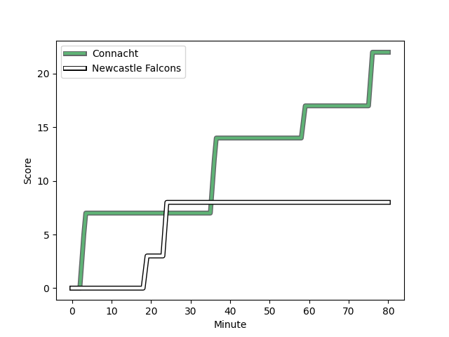

---  
layout: page  
title: Newcastle Falcons at Connacht; 8-22  
date: 2022-12-10 18:30:00 18:00:00 -0500  
categories: match review  
---
# Newcastle Falcons (1465.4) at Connacht (1506.02); 8-22

# Prediction: Connacht by 7.1

Connacht by 4.1 on a neutral field
## Scores over Time

## Win Probability over Time

# Pre-Match Prediction: Connacht by 9.9

Connacht by 6.9 on a neutral pitch

|   Away Minutes | Away Player                                                          |   Away elo |   Away Percentile |   Number |   Home Percentile |   Home elo | Home Player                                                               |   Home Minutes |
|---------------:|:---------------------------------------------------------------------|-----------:|------------------:|---------:|------------------:|-----------:|:--------------------------------------------------------------------------|---------------:|
|             52 | [Conrad Cade](..//playerfiles//ConradCade_cleaned.md)                |      92.3  |               nan |        1 |                97 |     119.79 | [Peter Dooley](..//playerfiles//PeterDooley_cleaned.md)                   |             59 |
|             52 | [Jamie Blamire](..//playerfiles//JamieBlamire_cleaned.md)            |      93.12 |                39 |        2 |                28 |      91.87 | [Dylan Tierney-Martin](..//playerfiles//DylanTierney-Martin_cleaned.md)   |             59 |
|             59 | [Mark Tampin](..//playerfiles//MarkTampin_cleaned.md)                |      91.78 |                22 |        3 |                57 |      99.5  | [Jack Aungier](..//playerfiles//JackAungier_cleaned.md)                   |             59 |
|             52 | [Greg Peterson](..//playerfiles//GregPeterson_cleaned.md)            |      74.77 |                 3 |        4 |                92 |     115.31 | [Josh Murphy](..//playerfiles//JoshMurphy_cleaned.md)                     |             41 |
|             80 | [Sebastian de Chaves](..//playerfiles//SebastiandeChaves_cleaned.md) |      92.13 |                35 |        5 |                58 |      97.26 | [Niall Murray](..//playerfiles//NiallMurray_cleaned.md)                   |             80 |
|             80 | [Matthew Dalton](..//playerfiles//MatthewDalton_cleaned.md)          |      92    |                42 |        6 |                73 |     104.47 | [Jarrad Butler](..//playerfiles//JarradButler_cleaned.md)                 |             80 |
|             80 | [Tom Marshall](..//playerfiles//TomMarshall_cleaned.md)              |      93.24 |               nan |        7 |                35 |      92.28 | [Shamus Hurley-Langton](..//playerfiles//ShamusHurley-Langton_cleaned.md) |             63 |
|             63 | [Callum Chick](..//playerfiles//CallumChick_cleaned.md)              |      96.32 |                51 |        8 |                70 |     102.3  | [Paul Boyle](..//playerfiles//PaulBoyle_cleaned.md)                       |             80 |
|             80 | [Sam Stuart](..//playerfiles//SamStuart_cleaned.md)                  |      74.71 |                 3 |        9 |                69 |     100.63 | [Caolin Blade](..//playerfiles//CaolinBlade_cleaned.md)                   |             68 |
|             59 | [Tian Schoeman](..//playerfiles//TianSchoeman_cleaned.md)            |     105.38 |                77 |       10 |                61 |      98.67 | [David Hawkshaw](..//playerfiles//DavidHawkshaw_cleaned.md)               |             80 |
|             80 | [Nathan Earle](..//playerfiles//NathanEarle_cleaned.md)              |     122.19 |                96 |       11 |                40 |      93.42 | [Diarmuid Kilgallen](..//playerfiles//DiarmuidKilgallen_cleaned.md)       |             80 |
|             80 | [Tom Penny](..//playerfiles//TomPenny_cleaned.md)                    |     115.34 |                92 |       12 |               nan |      95.71 | [Cathal Forde](..//playerfiles//CathalForde_cleaned.md)                   |             63 |
|             80 | [Matias Moroni](..//playerfiles//MatiasMoroni_cleaned.md)            |     111.25 |                87 |       13 |                12 |      84.68 | [Tom Daly](..//playerfiles//TomDaly_cleaned.md)                           |             63 |
|             68 | [Adam Radwan](..//playerfiles//AdamRadwan_cleaned.md)                |     115.11 |                91 |       14 |                88 |     110.59 | [Adam Byrne](..//playerfiles//AdamByrne_cleaned.md)                       |             80 |
|             80 | [Alex Tait](..//playerfiles//AlexTait_cleaned.md)                    |      96.99 |                53 |       15 |                57 |      98.11 | [Tiernan O'Halloran](..//playerfiles//TiernanO'Halloran_cleaned.md)       |             80 |
|             28 | [Adam Brocklebank](..//playerfiles//AdamBrocklebank_cleaned.md)      |      87.36 |                14 |       16 |                91 |     109.35 | [Denis Buckley](..//playerfiles//DenisBuckley_cleaned.md)                 |             21 |
|             28 | [Charlie Maddison](..//playerfiles//CharlieMaddison_cleaned.md)      |      91.69 |                36 |       17 |                95 |     114.52 | [Shane Delahunt](..//playerfiles//ShaneDelahunt_cleaned.md)               |             21 |
|             21 | [Richard Palframan](..//playerfiles//RichardPalframan_cleaned.md)    |      98.39 |                62 |       18 |               nan |      93.43 | [Sam Illo](..//playerfiles//SamIllo_cleaned.md)                           |             21 |
|             28 | [Josh Peters](..//playerfiles//JoshPeters_cleaned.md)                |      95.68 |                51 |       19 |                93 |     117.08 | [Leva Fifita](..//playerfiles//LevaFifita_cleaned.md)                     |             39 |
|             17 | [Marcus Tiffen](..//playerfiles//MarcusTiffen_cleaned.md)            |      95    |               nan |       20 |               nan |      95    | [Oisin McCormack](..//playerfiles//OisinMcCormack_cleaned.md)             |             17 |
|             21 | [Josh Thomas](..//playerfiles//JoshThomas_cleaned.md)                |      87.27 |                17 |       21 |                53 |      97.83 | [Colm Reilly](..//playerfiles//ColmReilly_cleaned.md)                     |             12 |
|             12 | [Ewan Greenlaw](..//playerfiles//EwanGreenlaw_cleaned.md)            |      95    |               nan |       22 |                 6 |      80.37 | [Conor Fitzgerald](..//playerfiles//ConorFitzgerald_cleaned.md)           |             17 |
|            nan | nan                                                                  |     nan    |               nan |       23 |                46 |      94.38 | [Tom Farrell](..//playerfiles//TomFarrell_cleaned.md)                     |             17 |

