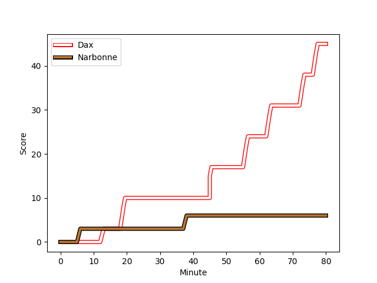
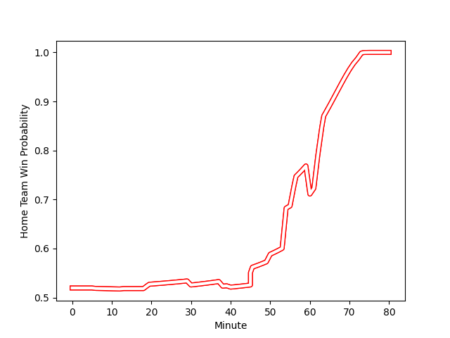

---  
layout: page  
title: Narbonne at Dax; 6-45  
date: 2022-12-10 19:00:00 18:00:00 -0500  
categories: match review  
---
# Narbonne (1436.74) at Dax (1470.64); 6-45

# Prediction: Dax by 6.4

Dax by 3.4 on a neutral field
## Scores over Time

## Win Probability over Time

# Pre-Match Prediction: Dax by 7.1

Dax by 4.1 on a neutral pitch

|   Away Minutes | Away Player                                                         |   Away elo |   Away Percentile |   Number |   Home Percentile |   Home elo | Home Player                                                                |   Home Minutes |
|---------------:|:--------------------------------------------------------------------|-----------:|------------------:|---------:|------------------:|-----------:|:---------------------------------------------------------------------------|---------------:|
|             54 | [Geoffrey Moise](..//playerfiles//GeoffreyMoise_cleaned.md)         |      98.22 |                57 |        1 |                66 |      99.45 | [Louis Mary](..//playerfiles//LouisMary_cleaned.md)                        |             56 |
|             62 | [Jordan Rochier](..//playerfiles//JordanRochier_cleaned.md)         |      93.28 |                36 |        2 |                28 |      90.78 | [Maxime Delonca](..//playerfiles//MaximeDelonca_cleaned.md)                |             50 |
|             62 | [Matthieu Loudet](..//playerfiles//MatthieuLoudet_cleaned.md)       |      86.65 |                13 |        3 |                 2 |      73.22 | [Diogo Hasse Ferreira](..//playerfiles//DiogoHasseFerreira_cleaned.md)     |             56 |
|             56 | [Morgan Maga](..//playerfiles//MorganMaga_cleaned.md)               |      97.49 |                53 |        4 |                60 |      97.93 | [Mattieu Bidau](..//playerfiles//MattieuBidau_cleaned.md)                  |             54 |
|             80 | [Mauro Rebussone](..//playerfiles//MauroRebussone_cleaned.md)       |     103.54 |                77 |        5 |                29 |      90.53 | [Mat Luamanu](..//playerfiles//MatLuamanu_cleaned.md)                      |             80 |
|             80 | [Guillem Montagne](..//playerfiles//GuillemMontagne_cleaned.md)     |      97.14 |                56 |        6 |                87 |     109.62 | [Arnaud Aletti](..//playerfiles//ArnaudAletti_cleaned.md)                  |             80 |
|             80 | [Paul Belzons](..//playerfiles//PaulBelzons_cleaned.md)             |      72.76 |                 2 |        7 |                75 |     104.75 | [Paul Arnaud Ausset](..//playerfiles//PaulArnaudAusset_cleaned.md)         |             60 |
|             40 | [Miller Pelesasa](..//playerfiles//MillerPelesasa_cleaned.md)       |      95    |               nan |        8 |                71 |     102.89 | [Brice Ferrer](..//playerfiles//BriceFerrer_cleaned.md)                    |             80 |
|             56 | [Christopher Kaiser](..//playerfiles//ChristopherKaiser_cleaned.md) |      91.32 |                23 |        9 |                 7 |      82.08 | [Adrien Ayestaran](..//playerfiles//AdrienAyestaran_cleaned.md)            |             50 |
|             13 | [Paul Auradou](..//playerfiles//PaulAuradou_cleaned.md)             |      94.97 |                44 |       10 |                57 |      98.37 | [Felipe Berchesi Pisano](..//playerfiles//FelipeBerchesiPisano_cleaned.md) |             50 |
|             80 | [Baptiste Tsague](..//playerfiles//BaptisteTsague_cleaned.md)       |      97.18 |                56 |       11 |                36 |      92.47 | [Julien Dechavanne](..//playerfiles//JulienDechavanne_cleaned.md)          |             80 |
|             30 | [Lucas Lebraud](..//playerfiles//LucasLebraud_cleaned.md)           |      75    |                 4 |       12 |                56 |      97.7  | [Ilikena Bolakoro](..//playerfiles//IlikenaBolakoro_cleaned.md)            |             80 |
|             80 | [Pierre-Hugo Ducom](..//playerfiles//Pierre-HugoDucom_cleaned.md)   |     108.07 |                84 |       13 |                86 |     109.76 | [Rodrigo Marta](..//playerfiles//RodrigoMarta_cleaned.md)                  |             80 |
|             80 | [Étienne Ducom](..//playerfiles//ÉtienneDucom_cleaned.md)           |     103.17 |                76 |       14 |                62 |      98.34 | [Guillaume Bouche](..//playerfiles//GuillaumeBouche_cleaned.md)            |             80 |
|             80 | [Tom Homer](..//playerfiles//TomHomer_cleaned.md)                   |      93.24 |                41 |       15 |                80 |     107.75 | [Théo Duprat](..//playerfiles//ThéoDuprat_cleaned.md)                      |             60 |
|             26 | [Théo Castinel](..//playerfiles//ThéoCastinel_cleaned.md)           |     116.31 |                94 |       16 |               nan |      95.71 | [Joaquin Rodon](..//playerfiles//JoaquinRodon_cleaned.md)                  |             24 |
|             18 | [Christophe David](..//playerfiles//ChristopheDavid_cleaned.md)     |     105.41 |                81 |       17 |                86 |     106.96 | [Elvis Levi](..//playerfiles//ElvisLevi_cleaned.md)                        |             30 |
|             18 | [Levi Tikoipau](..//playerfiles//LeviTikoipau_cleaned.md)           |      95    |               nan |       18 |                10 |      85.06 | [Thibaud Dréan](..//playerfiles//ThibaudDréan_cleaned.md)                  |             24 |
|             24 | [Manuel Plaza](..//playerfiles//ManuelPlaza_cleaned.md)             |      85.45 |                16 |       19 |                67 |      99.53 | [Étienne Loiret](..//playerfiles//ÉtienneLoiret_cleaned.md)                |             26 |
|             40 | [Thibault Clauzade](..//playerfiles//ThibaultClauzade_cleaned.md)   |     103.69 |                72 |       20 |                68 |     101.09 | [Théo Tremeau](..//playerfiles//ThéoTremeau_cleaned.md)                    |             20 |
|             67 | [Thibault Santoro](..//playerfiles//ThibaultSantoro_cleaned.md)     |      98.16 |                52 |       21 |                32 |      92.52 | [Simon Garrouteigt](..//playerfiles//SimonGarrouteigt_cleaned.md)          |             30 |
|             50 | [Sébastien Giorgis](..//playerfiles//SébastienGiorgis_cleaned.md)   |      97.95 |                59 |       22 |                85 |     110.92 | [Hugo Cerisier](..//playerfiles//HugoCerisier_cleaned.md)                  |             30 |
|             24 | [Pablo Barbaste](..//playerfiles//PabloBarbaste_cleaned.md)         |      96.23 |                50 |       23 |                68 |     100.89 | [Théo Gatelier](..//playerfiles//ThéoGatelier_cleaned.md)                  |             20 |

