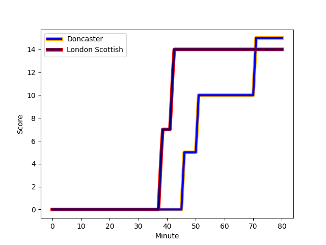
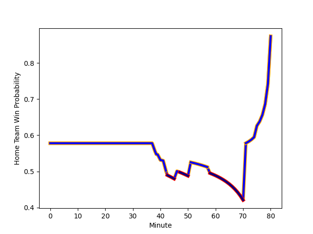

---  
layout: page  
title: London Scottish at Doncaster; 14-15  
date: 2022-12-10 15:30:00 18:00:00 -0500  
categories: match review  
---
# London Scottish (1307.51) at Doncaster (1448.62); 14-15

# Prediction: Doncaster by 17.1

Doncaster by 14.1 on a neutral field
## Scores over Time

## Win Probability over Time

# Pre-Match Prediction: Doncaster by 17.7

Doncaster by 14.7 on a neutral pitch

|   Away Minutes | Away Player                                                            |   Away elo |   Away Percentile |   Number |   Home Percentile |   Home elo | Home Player                                                     |   Home Minutes |
|---------------:|:-----------------------------------------------------------------------|-----------:|------------------:|---------:|------------------:|-----------:|:----------------------------------------------------------------|---------------:|
|             80 | [Maurice Nwakor](..//playerfiles//MauriceNwakor_cleaned.md)            |      86.63 |                17 |        1 |                28 |      91.56 | [Ben Carlile](..//playerfiles//BenCarlile_cleaned.md)           |             58 |
|             80 | [Harri Morris](..//playerfiles//HarriMorris_cleaned.md)                |      95    |               nan |        2 |                43 |      93.63 | [George Roberts](..//playerfiles//GeorgeRoberts_cleaned.md)     |             40 |
|             76 | [William Hobson](..//playerfiles//WilliamHobson_cleaned.md)            |      95.11 |                46 |        3 |                63 |      98.57 | [Jake Armstrong](..//playerfiles//JakeArmstrong_cleaned.md)     |             40 |
|             80 | [David Douglas Bridge](..//playerfiles//DavidDouglasBridge_cleaned.md) |      85.57 |                15 |        4 |                 3 |      75.38 | [Ehize Ehizode](..//playerfiles//EhizeEhizode_cleaned.md)       |             80 |
|             75 | [Matas Jurevicius](..//playerfiles//MatasJurevicius_cleaned.md)        |      90.83 |                30 |        5 |                62 |      98.25 | [Ben Murphy](..//playerfiles//BenMurphy_cleaned.md)             |             80 |
|             75 | [Will Trenholm](..//playerfiles//WillTrenholm_cleaned.md)              |      88.66 |                21 |        6 |                26 |      90.04 | [Sam Daly](..//playerfiles//SamDaly_cleaned.md)                 |             40 |
|             80 | [Jack Ingall](..//playerfiles//JackIngall_cleaned.md)                  |      67.06 |                 0 |        7 |                47 |      94.44 | [Jared Cardew](..//playerfiles//JaredCardew_cleaned.md)         |             58 |
|             80 | [Austin Wallis](..//playerfiles//AustinWallis_cleaned.md)              |      83.25 |                 5 |        8 |                86 |     109.39 | [John Kelly](..//playerfiles//JohnKelly_cleaned.md)             |             80 |
|             75 | [Luca Petrozzi](..//playerfiles//LucaPetrozzi_cleaned.md)              |      79.32 |                 4 |        9 |                90 |     111.99 | [Alex Dolly](..//playerfiles//AlexDolly_cleaned.md)             |             80 |
|             80 | [Harry Sheppard](..//playerfiles//HarrySheppard_cleaned.md)            |      81.58 |                 6 |       10 |                48 |      96.08 | [Sam Olver](..//playerfiles//SamOlver_cleaned.md)               |             80 |
|             76 | [Cassius Cleaves](..//playerfiles//CassiusCleaves_cleaned.md)          |      95.85 |                50 |       11 |               nan |      88.82 | [Tyson Lewis](..//playerfiles//TysonLewis_cleaned.md)           |             80 |
|             80 | [Bryn Bradley](..//playerfiles//BrynBradley_cleaned.md)                |      92.91 |                33 |       12 |                51 |      96.28 | [Connor Edwards](..//playerfiles//ConnorEdwards_cleaned.md)     |             80 |
|             80 | [Cameron Anderson](..//playerfiles//CameronAnderson_cleaned.md)        |      82.94 |                11 |       13 |                66 |     100.56 | [Joe Margetts](..//playerfiles//JoeMargetts_cleaned.md)         |             80 |
|             75 | [Luke Mehson](..//playerfiles//LukeMehson_cleaned.md)                  |      91.22 |                29 |       14 |                97 |     124.03 | [Maliq Holden](..//playerfiles//MaliqHolden_cleaned.md)         |             80 |
|             80 | [Connor Slevin](..//playerfiles//ConnorSlevin_cleaned.md)              |      95    |               nan |       15 |                73 |     102.85 | [Billy McBryde](..//playerfiles//BillyMcBryde_cleaned.md)       |             46 |
|              5 | [Ed Hoadley](..//playerfiles//EdHoadley_cleaned.md)                    |      62.28 |                 0 |       16 |                11 |      86.53 | [Karl Garside](..//playerfiles//KarlGarside_cleaned.md)         |             40 |
|              5 | [Angus Southon](..//playerfiles//AngusSouthon_cleaned.md)              |      91.31 |                31 |       17 |                49 |      93.32 | [Will Holling](..//playerfiles//WillHolling_cleaned.md)         |             40 |
|              5 | [Viliami Taulani](..//playerfiles//ViliamiTaulani_cleaned.md)          |      84.84 |                15 |       18 |                 3 |      75.83 | [Robbie Smith](..//playerfiles//RobbieSmith_cleaned.md)         |             40 |
|              5 | [Noah Ferdinand](..//playerfiles//NoahFerdinand_cleaned.md)            |      57.31 |                 0 |       19 |                47 |      95.04 | [George Simpson](..//playerfiles//GeorgeSimpson_cleaned.md)     |             34 |
|              4 | [Dan Gamble](..//playerfiles//DanGamble_cleaned.md)                    |      95.43 |                42 |       20 |               nan |      68.43 | [Theo Vukasinovic](..//playerfiles//TheoVukasinovic_cleaned.md) |             22 |
|              4 | [Jamie Drummond](..//playerfiles//JamieDrummond_cleaned.md)            |      95    |               nan |       21 |                33 |      93.34 | [Jake Pope](..//playerfiles//JakePope_cleaned.md)               |             22 |

