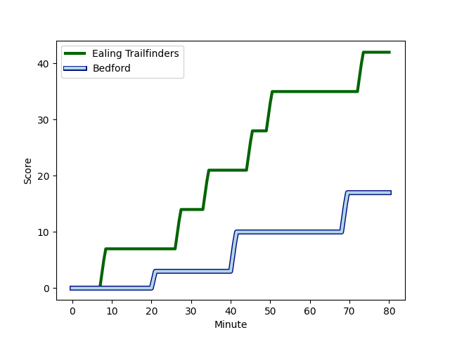
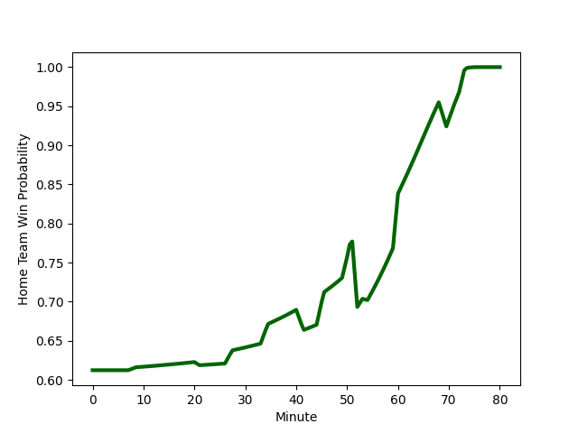

---  
layout: page  
title: Bedford at Ealing Trailfinders; 17-42  
date: 2022-12-10 16:00:00 18:00:00 -0500  
categories: match review  
---
# Bedford (1353.23) at Ealing Trailfinders (1551.66); 17-42

# Prediction: Ealing Trailfinders by 22.8

Ealing Trailfinders by 19.8 on a neutral field
## Scores over Time

## Win Probability over Time

# Pre-Match Prediction: Ealing Trailfinders by 25.1

Ealing Trailfinders by 22.1 on a neutral pitch

|   Away Minutes | Away Player                                                            |   Away elo |   Away Percentile |   Number |   Home Percentile |   Home elo | Home Player                                                           |   Home Minutes |
|---------------:|:-----------------------------------------------------------------------|-----------:|------------------:|---------:|------------------:|-----------:|:----------------------------------------------------------------------|---------------:|
|             50 | [Joey Conway](..//playerfiles//JoeyConway_cleaned.md)                  |      85.15 |                11 |        1 |                95 |     115.5  | [Kyle John Whyte](..//playerfiles//KyleJohnWhyte_cleaned.md)          |             52 |
|             66 | [Jack Hughes](..//playerfiles//JackHughes_cleaned.md)                  |      91.18 |                31 |        2 |                93 |     112.92 | [Shaun Malton](..//playerfiles//ShaunMalton_cleaned.md)               |             50 |
|             54 | [Oisin Heffernan](..//playerfiles//OisinHeffernan_cleaned.md)          |      89.02 |                20 |        3 |                99 |     127.16 | [Lewis Thiede](..//playerfiles//LewisThiede_cleaned.md)               |             52 |
|             50 | [Brandon Nansen](..//playerfiles//BrandonNansen_cleaned.md)            |     106.19 |                83 |        4 |                23 |      88.69 | [David O'Connor](..//playerfiles//DavidO'Connor_cleaned.md)           |             80 |
|             80 | [Jordan Onojaife](..//playerfiles//JordanOnojaife_cleaned.md)          |      81.26 |                10 |        5 |                83 |     105.46 | [Daniel Cutmore](..//playerfiles//DanielCutmore_cleaned.md)           |             74 |
|             80 | [Karl Wilkins](..//playerfiles//KarlWilkins_cleaned.md)                |      75.01 |                 2 |        6 |                78 |     103.12 | [Rob Farrar](..//playerfiles//RobFarrar_cleaned.md)                   |             80 |
|             80 | [Luke Frost](..//playerfiles//LukeFrost_cleaned.md)                    |      89.96 |                26 |        7 |                72 |     100.52 | [Carlo Tizzano](..//playerfiles//CarloTizzano_cleaned.md)             |             80 |
|             54 | [Tui Uru](..//playerfiles//TuiUru_cleaned.md)                          |      83.74 |                12 |        8 |                95 |     125.95 | [Ryan Smid](..//playerfiles//RyanSmid_cleaned.md)                     |             54 |
|             60 | [Alex Day](..//playerfiles//AlexDay_cleaned.md)                        |     105.38 |                79 |        9 |                14 |      86.62 | [Jack Grant](..//playerfiles//JackGrant_cleaned.md)                   |             66 |
|             60 | [Louis Grimoldby](..//playerfiles//LouisGrimoldby_cleaned.md)          |      86.09 |                13 |       10 |                99 |     142.06 | [Craig Willis](..//playerfiles//CraigWillis_cleaned.md)               |             60 |
|             80 | [Dean Adamson](..//playerfiles//DeanAdamson_cleaned.md)                |      77.88 |                 5 |       11 |                 4 |      76.19 | [Reuben Bird-Tulloch](..//playerfiles//ReubenBird-Tulloch_cleaned.md) |             80 |
|             80 | [Michael Le Bourgeois](..//playerfiles//MichaelLeBourgeois_cleaned.md) |      90.06 |                27 |       12 |                81 |     107.34 | [Pat Howard](..//playerfiles//PatHoward_cleaned.md)                   |             64 |
|             60 | [Ethan Grayson](..//playerfiles//EthanGrayson_cleaned.md)              |     104.11 |                79 |       13 |                28 |      90.77 | [Max Bodilly](..//playerfiles//MaxBodilly_cleaned.md)                 |             80 |
|             80 | [Sean French](..//playerfiles//SeanFrench_cleaned.md)                  |      87.03 |                19 |       14 |                21 |      89.34 | [Luke Daniels](..//playerfiles//LukeDaniels_cleaned.md)               |             80 |
|             80 | [Matthew Worley](..//playerfiles//MatthewWorley_cleaned.md)            |      91.61 |                31 |       15 |                86 |     111.35 | [Jonah Holmes](..//playerfiles//JonahHolmes_cleaned.md)               |             80 |
|             30 | [Robin Williams](..//playerfiles//RobinWilliams_cleaned.md)            |      96.42 |                54 |       16 |                83 |     106.73 | [Simon Linsell](..//playerfiles//SimonLinsell_cleaned.md)             |              6 |
|             30 | [Monty Royston](..//playerfiles//MontyRoyston_cleaned.md)              |      95.51 |               nan |       17 |                71 |     101.96 | [Jack Digby](..//playerfiles//JackDigby_cleaned.md)                   |             14 |
|             26 | [Osman Dimen](..//playerfiles//OsmanDimen_cleaned.md)                  |      97.57 |                56 |       18 |                90 |     109.52 | [Jordan Burns](..//playerfiles//JordanBurns_cleaned.md)               |             16 |
|             26 | [Charles Rylands](..//playerfiles//CharlesRylands_cleaned.md)          |      90.58 |                42 |       19 |                95 |     117.96 | [Steve Shingler](..//playerfiles//SteveShingler_cleaned.md)           |             20 |
|             20 | [Jake Garside](..//playerfiles//JakeGarside_cleaned.md)                |      94.67 |                48 |       20 |                80 |     105.66 | [Simon Uzokwe](..//playerfiles//SimonUzokwe_cleaned.md)               |             26 |
|             20 | [Patrick Tapley](..//playerfiles//PatrickTapley_cleaned.md)            |      97.28 |                56 |       21 |                66 |      99.25 | [George Davis](..//playerfiles//GeorgeDavis_cleaned.md)               |             28 |
|             20 | [William Maisey](..//playerfiles//WilliamMaisey_cleaned.md)            |     118.66 |                92 |       22 |                54 |      95.35 | [Ross Kane](..//playerfiles//RossKane_cleaned.md)                     |             28 |
|             14 | [Callum Burns](..//playerfiles//CallumBurns_cleaned.md)                |      94.49 |               nan |       23 |                59 |      99.27 | [Cameron Terry](..//playerfiles//CameronTerry_cleaned.md)             |             30 |

