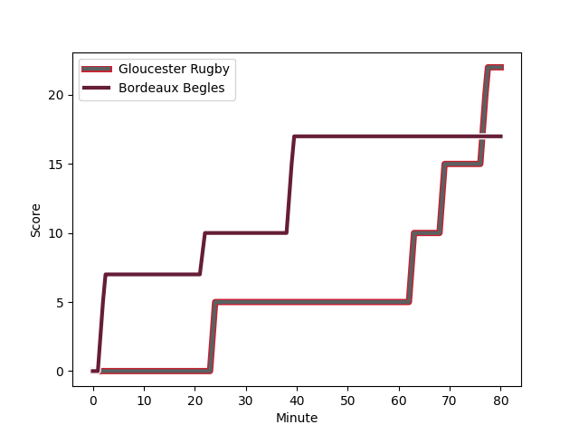
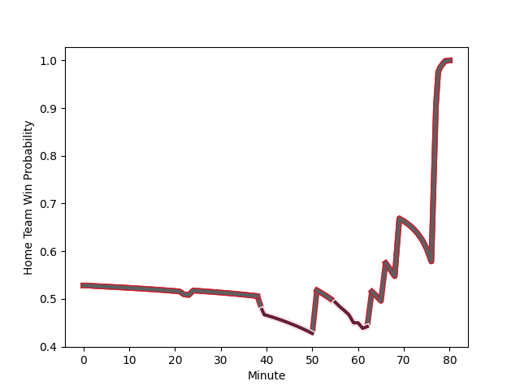

---  
layout: page  
title: Bordeaux Begles at Gloucester Rugby; 17-22  
date: 2022-12-10 16:15:00 18:00:00 -0500  
categories: match review  
---
# Bordeaux Begles (1516.79) at Gloucester Rugby (1587.37); 17-22

# Prediction: Gloucester Rugby by 10.1

Gloucester Rugby by 7.1 on a neutral field
## Scores over Time

## Win Probability over Time

# Pre-Match Prediction: Gloucester Rugby by 7.2

Gloucester Rugby by 4.2 on a neutral pitch

|   Away Minutes | Away Player                                                         |   Away elo |   Away Percentile |   Number |   Home Percentile |   Home elo | Home Player                                                         |   Home Minutes |
|---------------:|:--------------------------------------------------------------------|-----------:|------------------:|---------:|------------------:|-----------:|:--------------------------------------------------------------------|---------------:|
|             80 | [Lekso Kaulashvili](..//playerfiles//LeksoKaulashvili_cleaned.md)   |     112.59 |                93 |        1 |                82 |     105.48 | [Val Rapava-Ruskin](..//playerfiles//ValRapava-Ruskin_cleaned.md)   |             80 |
|             56 | [Maxime Lamothe](..//playerfiles//MaximeLamothe_cleaned.md)         |      87.17 |                16 |        2 |                73 |     102.03 | [Santiago Socino](..//playerfiles//SantiagoSocino_cleaned.md)       |             80 |
|             66 | [Sipili Falatea](..//playerfiles//SipiliFalatea_cleaned.md)         |     100.67 |                82 |        3 |                12 |      86.17 | [Fraser Balmain](..//playerfiles//FraserBalmain_cleaned.md)         |             62 |
|             80 | [Kane Douglas](..//playerfiles//KaneDouglas_cleaned.md)             |      92.25 |                36 |        4 |                91 |     113.4  | [Cameron Jordan](..//playerfiles//CameronJordan_cleaned.md)         |             39 |
|             59 | [Alban Roussel](..//playerfiles//AlbanRoussel_cleaned.md)           |      92.61 |                38 |        5 |                94 |     117.84 | [Matias Alemanno](..//playerfiles//MatiasAlemanno_cleaned.md)       |             80 |
|             59 | [Renato Giammarioli](..//playerfiles//RenatoGiammarioli_cleaned.md) |     103.86 |                72 |        6 |                86 |     109.03 | [Freddie Clarke](..//playerfiles//FreddieClarke_cleaned.md)         |             41 |
|             80 | [Mahamadou Diaby](..//playerfiles//MahamadouDiaby_cleaned.md)       |      89.59 |                24 |        7 |                86 |     108.81 | [Lewis Ludlow](..//playerfiles//LewisLudlow_cleaned.md)             |             80 |
|             80 | [Tom Willis](..//playerfiles//TomWillis_cleaned.md)                 |      93.19 |                40 |        8 |                84 |     109.68 | [Ben Morgan](..//playerfiles//BenMorgan_cleaned.md)                 |             80 |
|             80 | [Maxime Lucu](..//playerfiles//MaximeLucu_cleaned.md)               |     134.35 |                99 |        9 |                 6 |      81.36 | [Stephen Varney](..//playerfiles//StephenVarney_cleaned.md)         |             60 |
|             68 | [Zack Holmes](..//playerfiles//ZackHolmes_cleaned.md)               |     125.83 |                97 |       10 |                96 |     125.68 | [Santiago Carreras](..//playerfiles//SantiagoCarreras_cleaned.md)   |             80 |
|             80 | [Geoffrey Cros](..//playerfiles//GeoffreyCros_cleaned.md)           |      93.8  |                42 |       11 |                83 |     107.21 | [Jonny May](..//playerfiles//JonnyMay_cleaned.md)                   |             80 |
|             80 | [Federico Mori](..//playerfiles//FedericoMori_cleaned.md)           |      77.11 |                 5 |       12 |                34 |      91.54 | [Sebastien Atkinson](..//playerfiles//SebastienAtkinson_cleaned.md) |             60 |
|             51 | [Tani Vili](..//playerfiles//TaniVili_cleaned.md)                   |      95.32 |                46 |       13 |                87 |     112.02 | [Chris Harris](..//playerfiles//ChrisHarris_cleaned.md)             |             80 |
|             80 | [Santiago Cordero](..//playerfiles//SantiagoCordero_cleaned.md)     |     100.2  |                68 |       14 |                56 |      96.81 | [Alex Hearle](..//playerfiles//AlexHearle_cleaned.md)               |             80 |
|             80 | [Romain Buros](..//playerfiles//RomainBuros_cleaned.md)             |     108.34 |                81 |       15 |                96 |     122.32 | [Lloyd Evans](..//playerfiles//LloydEvans_cleaned.md)               |             80 |
|             24 | [Clement Maynadier](..//playerfiles//ClementMaynadier_cleaned.md)   |     118.88 |                96 |       16 |                28 |      88.1  | [Ciaran Knight](..//playerfiles//CiaranKnight_cleaned.md)           |             18 |
|             14 | [Vadim Cobilas](..//playerfiles//VadimCobilas_cleaned.md)           |     125.02 |                98 |       17 |                71 |     102.11 | [Albert Tuisue](..//playerfiles//AlbertTuisue_cleaned.md)           |             41 |
|             21 | [Cyril Cazeaux](..//playerfiles//CyrilCazeaux_cleaned.md)           |     122.34 |                97 |       18 |                45 |      95.01 | [Jack Clement](..//playerfiles//JackClement_cleaned.md)             |             39 |
|             21 | [Caleb Timu](..//playerfiles//CalebTimu_cleaned.md)                 |      87.97 |                21 |       19 |                70 |     100.84 | [Charlie Chapman](..//playerfiles//CharlieChapman_cleaned.md)       |             20 |
|             12 | [Jules Gimbert](..//playerfiles//JulesGimbert_cleaned.md)           |      82.29 |                 7 |       20 |                87 |     112.74 | [Billy Twelvetrees](..//playerfiles//BillyTwelvetrees_cleaned.md)   |             20 |
|             29 | [Gatien Masse](..//playerfiles//GatienMasse_cleaned.md)             |      92.65 |                47 |       21 |               nan |     nan    | nan                                                                 |            nan |

