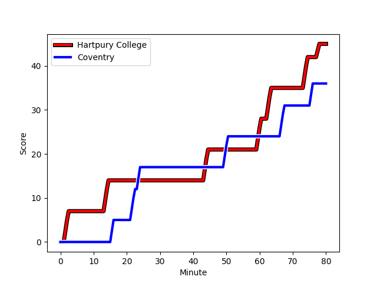
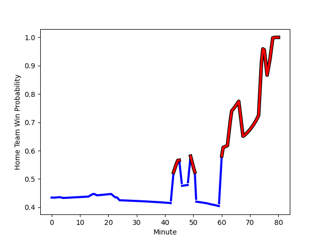

---  
layout: page  
title: Coventry at Hartpury College; 36-45  
date: 2022-12-10 15:30:00 18:00:00 -0500  
categories: match review  
---
# Coventry (1557.48) at Hartpury College (1446.29); 36-45

# Prediction: Coventry by 8.1

Coventry by 11.1 on a neutral field
## Scores over Time

## Win Probability over Time

# Pre-Match Prediction: Coventry by 7.9

Coventry by 10.9 on a neutral pitch

|   Away Minutes | Away Player                                                               |   Away elo |   Away Percentile |   Number |   Home Percentile |   Home elo | Home Player                                                              |   Home Minutes |
|---------------:|:--------------------------------------------------------------------------|-----------:|------------------:|---------:|------------------:|-----------:|:-------------------------------------------------------------------------|---------------:|
|             60 | [Toby Trinder](..//playerfiles//TobyTrinder_cleaned.md)                   |      95.91 |                50 |        1 |               nan |      95.83 | [Joe Wrafter](..//playerfiles//JoeWrafter_cleaned.md)                    |             56 |
|             60 | [Jordon Poole](..//playerfiles//JordonPoole_cleaned.md)                   |     104.85 |                83 |        2 |               nan |     101.46 | [Henry Walker](..//playerfiles//HenryWalker_cleaned.md)                  |             63 |
|             43 | [Harry Seward](..//playerfiles//HarrySeward_cleaned.md)                   |     109.71 |                91 |        3 |                 1 |      72.69 | [Alex Gibson](..//playerfiles//AlexGibson_cleaned.md)                    |             46 |
|             80 | [James Tyas](..//playerfiles//JamesTyas_cleaned.md)                       |      92.35 |                36 |        4 |                43 |      93.81 | [Jack Davies](..//playerfiles//JackDavies_cleaned.md)                    |             80 |
|             80 | [Adam Peters](..//playerfiles//AdamPeters_cleaned.md)                     |     103.31 |                77 |        5 |                63 |      98.48 | [Dale Lemon](..//playerfiles//DaleLemon_cleaned.md)                      |             80 |
|             80 | [Thomas Dodd](..//playerfiles//ThomasDodd_cleaned.md)                     |     119.08 |                95 |        6 |                24 |      89.37 | [Samuel Lewis](..//playerfiles//SamuelLewis_cleaned.md)                  |             80 |
|             68 | [Josh Bainbridge](..//playerfiles//JoshBainbridge_cleaned.md)             |     103.96 |                77 |        7 |                88 |     109.77 | [Harry Short](..//playerfiles//HarryShort_cleaned.md)                    |             51 |
|             49 | [Senitiki Nayalo](..//playerfiles//SenitikiNayalo_cleaned.md)             |     103.93 |                74 |        8 |                29 |      90.32 | [Mitch Eadie](..//playerfiles//MitchEadie_cleaned.md)                    |             57 |
|             75 | [Will Chudley](..//playerfiles//WillChudley_cleaned.md)                   |     130.05 |                99 |        9 |               nan |      98.84 | [Matty Jones](..//playerfiles//MattyJones_cleaned.md)                    |             75 |
|             75 | [Patrick Pellegrini](..//playerfiles//PatrickPellegrini_cleaned.md)       |     106.55 |                79 |       10 |                75 |     105.18 | [Tommy Mathews](..//playerfiles//TommyMathews_cleaned.md)                |             80 |
|             60 | [James Martin](..//playerfiles//JamesMartin_cleaned.md)                   |      94.82 |                46 |       11 |                89 |     112.03 | [Sam Smith](..//playerfiles//SamSmith_cleaned.md)                        |             80 |
|             80 | [Ollie Betteridge](..//playerfiles//OllieBetteridge_cleaned.md)           |      99.48 |                63 |       12 |                11 |      83.57 | [James Williams](..//playerfiles//JamesWilliams_cleaned.md)              |             80 |
|             80 | [Will Rigg](..//playerfiles//WillRigg_cleaned.md)                         |     104.08 |                76 |       13 |                41 |      93.49 | [William Butler](..//playerfiles//WilliamButler_cleaned.md)              |             40 |
|             80 | [William Talbot-Davies](..//playerfiles//WilliamTalbot-Davies_cleaned.md) |      99.98 |                67 |       14 |                61 |      98.46 | [Bradley Denty](..//playerfiles//BradleyDenty_cleaned.md)                |             80 |
|             80 | [Louis Brown](..//playerfiles//LouisBrown_cleaned.md)                     |     107.8  |                82 |       15 |               nan |     103.72 | [Alex Morgan](..//playerfiles//AlexMorgan_cleaned.md)                    |              4 |
|             37 | [Ollie Andrews](..//playerfiles//OllieAndrews_cleaned.md)                 |      96.64 |               nan |       16 |               nan |      96.49 | [Arthur William Lennon](..//playerfiles//ArthurWilliamLennon_cleaned.md) |             76 |
|             31 | [Fred Betteridge](..//playerfiles//FredBetteridge_cleaned.md)             |      95.67 |                46 |       17 |                63 |      99.43 | [Harry Tarling](..//playerfiles//HarryTarling_cleaned.md)                |             40 |
|             20 | [Louis James](..//playerfiles//LouisJames_cleaned.md)                     |      83.56 |                 8 |       18 |               nan |      94.24 | [George Kloska](..//playerfiles//GeorgeKloska_cleaned.md)                |             34 |
|             20 | [Will Biggs](..//playerfiles//WillBiggs_cleaned.md)                       |      95.52 |               nan |       19 |                39 |      93.08 | [Joe Howard](..//playerfiles//JoeHoward_cleaned.md)                      |             29 |
|             20 | [Danny Southworth](..//playerfiles//DannySouthworth_cleaned.md)           |      95.77 |               nan |       20 |                52 |      96.33 | [Martin Mulhall](..//playerfiles//MartinMulhall_cleaned.md)              |             24 |
|             12 | [Tom Ball](..//playerfiles//TomBall_cleaned.md)                           |     100.6  |                62 |       21 |                38 |      93.5  | [Jake Holcombe](..//playerfiles//JakeHolcombe_cleaned.md)                |             23 |
|              5 | [Will Lane](..//playerfiles//WillLane_cleaned.md)                         |      96.53 |                50 |       22 |                65 |      98.42 | [Luke Stratford](..//playerfiles//LukeStratford_cleaned.md)              |             17 |
|              5 | [Evan Mitchell](..//playerfiles//EvanMitchell_cleaned.md)                 |      84.98 |                10 |       23 |                34 |      93.35 | [Oscar Lennon](..//playerfiles//OscarLennon_cleaned.md)                  |              5 |

