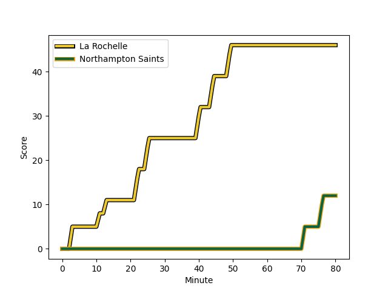
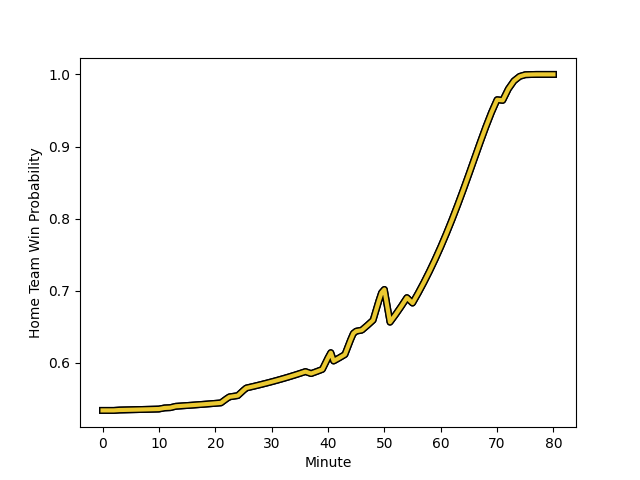

---  
layout: page  
title: Northampton Saints at La Rochelle; 12-46  
date: 2022-12-10 18:30:00 18:00:00 -0500  
categories: match review  
---
# Northampton Saints (1510.77) at La Rochelle (1570.25); 12-46

# Prediction: La Rochelle by 8.9

La Rochelle by 5.9 on a neutral field
## Scores over Time

## Win Probability over Time

# Pre-Match Prediction: La Rochelle by 13.1

La Rochelle by 10.1 on a neutral pitch

|   Away Minutes | Away Player                                                             |   Away elo |   Away Percentile |   Number |   Home Percentile |   Home elo | Home Player                                                            |   Home Minutes |
|---------------:|:------------------------------------------------------------------------|-----------:|------------------:|---------:|------------------:|-----------:|:-----------------------------------------------------------------------|---------------:|
|             55 | [Alex Waller](..//playerfiles//AlexWaller_cleaned.md)                   |     130.24 |                99 |        1 |                90 |     109.9  | [Reda Wardi](..//playerfiles//RedaWardi_cleaned.md)                    |             41 |
|             37 | [Robbie Smith](..//playerfiles//RobbieSmith_cleaned.md)                 |      78.24 |               nan |        2 |                83 |     105.79 | [Pierre Bourgarit](..//playerfiles//PierreBourgarit_cleaned.md)        |             50 |
|             55 | [Paul Hill](..//playerfiles//PaulHill_cleaned.md)                       |     103.71 |                78 |        3 |                95 |     115.73 | [Uini Atonio](..//playerfiles//UiniAtonio_cleaned.md)                  |             41 |
|             80 | [Lukhan Salakaia-Loto](..//playerfiles//LukhanSalakaia-Loto_cleaned.md) |      88.23 |                22 |        4 |                76 |     103.03 | [Thomas Lavault](..//playerfiles//ThomasLavault_cleaned.md)            |             80 |
|             80 | [David Ribbans](..//playerfiles//DavidRibbans_cleaned.md)               |     108.66 |                89 |        5 |                88 |     110.42 | [Will Skelton](..//playerfiles//WillSkelton_cleaned.md)                |             70 |
|             50 | [Alex Coles](..//playerfiles//AlexColes_cleaned.md)                     |      77.31 |                 4 |        6 |                91 |     112.06 | [Remi Bourdeau](..//playerfiles//RemiBourdeau_cleaned.md)              |             80 |
|             46 | [Aaron Hinkley](..//playerfiles//AaronHinkley_cleaned.md)               |      93.12 |                39 |        7 |                65 |     101.43 | [Yoan Tanga](..//playerfiles//YoanTanga_cleaned.md)                    |             80 |
|             61 | [Lewis Ludlam](..//playerfiles//LewisLudlam_cleaned.md)                 |      98.73 |                62 |        8 |                92 |     118.23 | [Gregory Alldritt](..//playerfiles//GregoryAlldritt_cleaned.md)        |             53 |
|             41 | [Tom James](..//playerfiles//TomJames_cleaned.md)                       |      88.01 |                19 |        9 |                98 |     127.28 | [Tawera Kerr-Barlow](..//playerfiles//TaweraKerr-Barlow_cleaned.md)    |             52 |
|             80 | [Fin Smith](..//playerfiles//FinSmith_cleaned.md)                       |      87.72 |                19 |       10 |                11 |      83.95 | [Antoine Hastoy](..//playerfiles//AntoineHastoy_cleaned.md)            |             57 |
|             80 | [Tommy Freeman](..//playerfiles//TommyFreeman_cleaned.md)               |     114.49 |                91 |       11 |                21 |      88.88 | [Pierre Boudehent](..//playerfiles//PierreBoudehent_cleaned.md)        |             52 |
|             51 | [Fraser Dingwall](..//playerfiles//FraserDingwall_cleaned.md)           |      79.85 |                 7 |       12 |                83 |     109.56 | [Jonathan Danty](..//playerfiles//JonathanDanty_cleaned.md)            |             80 |
|             80 | [Matt Proctor](..//playerfiles//MattProctor_cleaned.md)                 |     108.12 |                85 |       13 |                44 |      94.23 | [Ulupano Seuteni](..//playerfiles//UlupanoSeuteni_cleaned.md)          |             80 |
|             80 | [James Ramm](..//playerfiles//JamesRamm_cleaned.md)                     |     106.49 |                82 |       14 |                86 |     109.89 | [Dillyn Leyds](..//playerfiles//DillynLeyds_cleaned.md)                |             80 |
|             80 | [George Furbank](..//playerfiles//GeorgeFurbank_cleaned.md)             |     114.47 |                92 |       15 |                89 |     112.66 | [Brice Dulin](..//playerfiles//BriceDulin_cleaned.md)                  |             80 |
|             25 | [Emmanuel Iyogun](..//playerfiles//EmmanuelIyogun_cleaned.md)           |     103.01 |                81 |       16 |                35 |      91.8  | [Leo Aouf](..//playerfiles//LeoAouf_cleaned.md)                        |             39 |
|             25 | [Ehren Painter](..//playerfiles//EhrenPainter_cleaned.md)               |     101.92 |                73 |       17 |                11 |      85.51 | [Quentin Lespiaucq](..//playerfiles//QuentinLespiaucq_cleaned.md)      |             30 |
|             43 | [Sam Matavesi](..//playerfiles//SamMatavesi_cleaned.md)                 |      98.75 |                65 |       18 |                75 |     103.42 | [Joel Sclavi](..//playerfiles//JoelSclavi_cleaned.md)                  |             39 |
|             30 | [Courtney Lawes](..//playerfiles//CourtneyLawes_cleaned.md)             |     101.73 |                70 |       19 |                44 |      94.5  | [Romain Sazy](..//playerfiles//RomainSazy_cleaned.md)                  |             10 |
|             34 | [Angus Scott-Young](..//playerfiles//AngusScott-Young_cleaned.md)       |     112.53 |                91 |       20 |                36 |      91.83 | [Paul Boudehent](..//playerfiles//PaulBoudehent_cleaned.md)            |             27 |
|             19 | [Juarno Augustus](..//playerfiles//JuarnoAugustus_cleaned.md)           |      89.55 |                27 |       21 |                29 |      91.23 | [Thomas Berjon](..//playerfiles//ThomasBerjon_cleaned.md)              |             28 |
|             39 | [Alex Mitchell](..//playerfiles//AlexMitchell_cleaned.md)               |     109.6  |                87 |       22 |                97 |     127.75 | [Levani Botia Veivuke](..//playerfiles//LevaniBotiaVeivuke_cleaned.md) |             23 |
|             29 | [Rory Hutchinson](..//playerfiles//RoryHutchinson_cleaned.md)           |      95.48 |                47 |       23 |                26 |      90.49 | [Martin Alonso Munoz](..//playerfiles//MartinAlonsoMunoz_cleaned.md)   |             28 |

