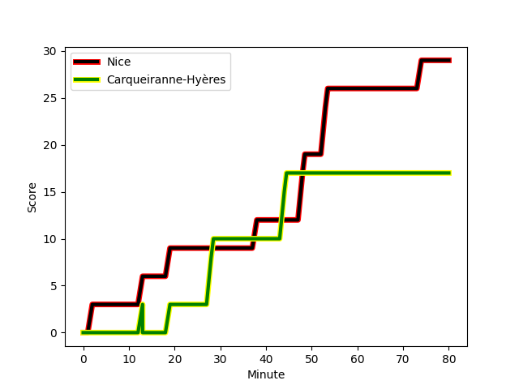
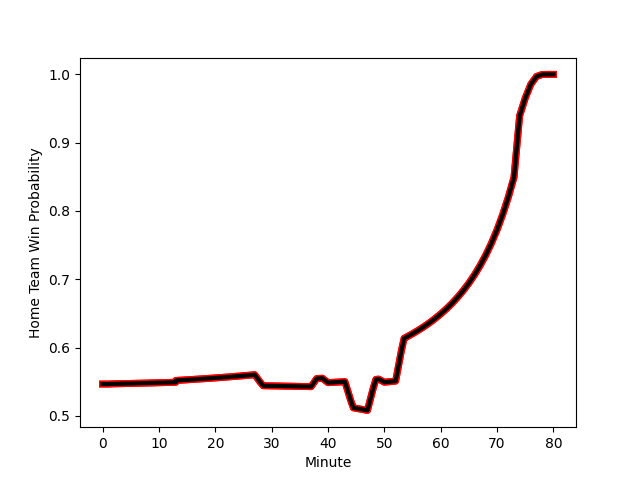

---  
layout: page  
title: Carqueiranne-Hyères at Nice; 17-29  
date: 2022-12-10 18:00:00 18:00:00 -0500  
categories: match review  
---
# Carqueiranne-Hyères (1326.11) at Nice (1407.35); 17-29

# Prediction: Nice by 11.1

Nice by 8.1 on a neutral field
## Scores over Time

## Win Probability over Time

# Pre-Match Prediction: Nice by 12.5

Nice by 9.5 on a neutral pitch

|   Away Minutes | Away Player                                                                 |   Away elo |   Away Percentile |   Number |   Home Percentile |   Home elo | Home Player                                                               |   Home Minutes |
|---------------:|:----------------------------------------------------------------------------|-----------:|------------------:|---------:|------------------:|-----------:|:--------------------------------------------------------------------------|---------------:|
|             61 | [Loni Uhila](..//playerfiles//LoniUhila_cleaned.md)                         |     110.92 |                92 |        1 |                44 |      94.97 | [Sunia Vola](..//playerfiles//SuniaVola_cleaned.md)                       |             50 |
|             61 | [Michael Tyumenev](..//playerfiles//MichaelTyumenev_cleaned.md)             |      80.55 |                 4 |        2 |                14 |      86.92 | [Kurt Haupt](..//playerfiles//KurtHaupt_cleaned.md)                       |             54 |
|             61 | [Lasha Mchelidze](..//playerfiles//LashaMchelidze_cleaned.md)               |      88.06 |                17 |        3 |                 7 |      83.11 | [Jemal Shatirishvili](..//playerfiles//JemalShatirishvili_cleaned.md)     |             61 |
|             64 | [Lucas Cazac](..//playerfiles//LucasCazac_cleaned.md)                       |      72.48 |                 2 |        4 |                65 |      99.09 | [Jérôme Mondoulet](..//playerfiles//JérômeMondoulet_cleaned.md)           |             50 |
|             80 | [Cesar Damiani](..//playerfiles//CesarDamiani_cleaned.md)                   |      78.64 |                 6 |        5 |                74 |     102.32 | [Marvin Woki](..//playerfiles//MarvinWoki_cleaned.md)                     |             69 |
|             80 | [Florian Munoz Rivero](..//playerfiles//FlorianMunozRivero_cleaned.md)      |      91.61 |                32 |        6 |                11 |      83.05 | [Martin Freytes](..//playerfiles//MartinFreytes_cleaned.md)               |             80 |
|             80 | [Joachim Beaumont](..//playerfiles//JoachimBeaumont_cleaned.md)             |      89.95 |                25 |        7 |                45 |      94.49 | [Louis Suaud](..//playerfiles//LouisSuaud_cleaned.md)                     |             80 |
|             71 | [Julien Ormea](..//playerfiles//JulienOrmea_cleaned.md)                     |      85.63 |                16 |        8 |                89 |     114.26 | [Laijiasa Bolenaivalu](..//playerfiles//LaijiasaBolenaivalu_cleaned.md)   |             68 |
|             55 | [Thomas Sonetti](..//playerfiles//ThomasSonetti_cleaned.md)                 |      95.15 |                46 |        9 |                89 |     111.02 | [Mathieu Loree](..//playerfiles//MathieuLoree_cleaned.md)                 |             40 |
|             58 | [Lachie Munro](..//playerfiles//LachieMunro_cleaned.md)                     |      92.84 |                35 |       10 |                 4 |      78.42 | [Hugo Verdu](..//playerfiles//HugoVerdu_cleaned.md)                       |             80 |
|             80 | [Vincent Alessi](..//playerfiles//VincentAlessi_cleaned.md)                 |      74.84 |                 4 |       11 |                12 |      85.29 | [Hugo Martin](..//playerfiles//HugoMartin_cleaned.md)                     |             80 |
|             80 | [Romain Leveque](..//playerfiles//RomainLeveque_cleaned.md)                 |     106.82 |                80 |       12 |                81 |     106.94 | [Julien Fritz](..//playerfiles//JulienFritz_cleaned.md)                   |             40 |
|             64 | [Dylan Sage](..//playerfiles//DylanSage_cleaned.md)                         |      89.83 |                27 |       13 |                79 |     105.88 | [Jens Torfs](..//playerfiles//JensTorfs_cleaned.md)                       |             80 |
|             80 | [Quentin Bourdieu](..//playerfiles//QuentinBourdieu_cleaned.md)             |      82.99 |                 9 |       14 |                15 |      86.58 | [Sakiusa Bureitakiyaca](..//playerfiles//SakiusaBureitakiyaca_cleaned.md) |             80 |
|             80 | [Adrien Amans](..//playerfiles//AdrienAmans_cleaned.md)                     |      89.1  |                27 |       15 |                62 |      98.62 | [David Odiete](..//playerfiles//DavidOdiete_cleaned.md)                   |             80 |
|             25 | [Rémi Dubié](..//playerfiles//RémiDubié_cleaned.md)                         |      85.01 |                12 |       16 |                31 |      91.98 | [Mathis Viard](..//playerfiles//MathisViard_cleaned.md)                   |             40 |
|             19 | [Yan Tabarot](..//playerfiles//YanTabarot_cleaned.md)                       |      83.49 |                 7 |       17 |                11 |      83.77 | [Alban Conduche](..//playerfiles//AlbanConduche_cleaned.md)               |             40 |
|             19 | [Costel Burtila](..//playerfiles//CostelBurtila_cleaned.md)                 |      95.82 |                49 |       18 |                64 |      98.87 | [Nicolas Lemaire](..//playerfiles//NicolasLemaire_cleaned.md)             |             30 |
|             19 | [Liam Chad Hendricks](..//playerfiles//LiamChadHendricks_cleaned.md)        |      83.59 |                 8 |       19 |                36 |      92.36 | [Thibaud Rey](..//playerfiles//ThibaudRey_cleaned.md)                     |             30 |
|             16 | [Sven D'Hooghe](..//playerfiles//SvenD'Hooghe_cleaned.md)                   |      88.53 |                22 |       20 |                15 |      87.16 | [Badri Alkhazashvili](..//playerfiles//BadriAlkhazashvili_cleaned.md)     |             26 |
|             16 | [Charles Brousse](..//playerfiles//CharlesBrousse_cleaned.md)               |      98.09 |                59 |       21 |               nan |      95.12 | [Nicolas Ciancio](..//playerfiles//NicolasCiancio_cleaned.md)             |             19 |
|              9 | [Geoffrey Nouhaillaguet](..//playerfiles//GeoffreyNouhaillaguet_cleaned.md) |      85.94 |                18 |       22 |                58 |      96.93 | [Killian Taofifenua](..//playerfiles//KillianTaofifenua_cleaned.md)       |             12 |
|             22 | [Théo Defrance](..//playerfiles//ThéoDefrance_cleaned.md)                   |      88.95 |                23 |       23 |                20 |      89.45 | [Jeronimo Negrotto](..//playerfiles//JeronimoNegrotto_cleaned.md)         |             11 |

